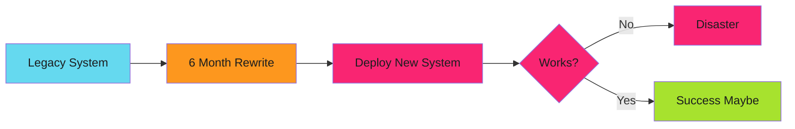
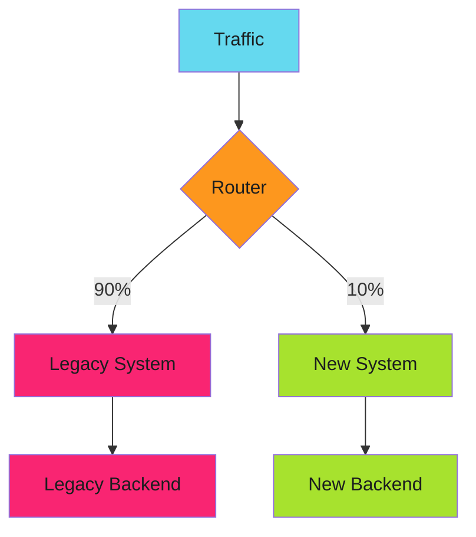

# Strangler Fig

The strangler fig vine grows around a host tree. Eventually the vine takes over completely, and the original tree dies.

!!! tip "Migration Pattern"
    This guide covers the Strangler Fig pattern for incremental system migration. Review all sections for complete implementation strategy.

Your new system gradually replaces the old one. Both run in parallel. Traffic shifts incrementally. When the old system has zero traffic, you remove it.

Zero downtime. Rollback at any point. Migration validated in production.

---

## The Problem with Big Bang Rewrites

Rewriting a monolith all at once:

Six months of development. One deploy. Production traffic hits unknown code. Bugs discovered under real load. No rollback path.

---

## The Strangler Fig Pattern

Incremental replacement:

Router directs traffic. Start with 1% to new system. Monitor. Increase gradually. Eventually 100% on new system. Remove legacy.

---

## Implementation Guides

### Core Patterns

- **[Implementation Strategies](implementation.md)** - Feature flags, parallel run validation, database migration strategies
- **[Traffic Routing](traffic-routing.md)** - Percentage-based, user-based, and canary deployment patterns
- **[Monitoring and Rollback](monitoring.md)** - Track both systems, compare metrics, instant rollback

### Migration Process

- **[Migration Guide](migration-guide.md)** - Eight-phase checklist, common pitfalls, real-world timeline

---

## When to Use This Pattern

**Use when:**

- Replacing critical production systems
- High risk of downtime
- Need gradual validation
- Rollback must be instant

**Don't use when:**

- Small, non-critical systems (just replace)
- No production traffic yet
- Resource cost of running both systems is prohibitive

---

## Related Patterns

- **[Separation of Concerns](../separation-of-concerns/index.md)** - Isolate old and new logic
- **[Graceful Degradation](../../error-handling/graceful-degradation/index.md)** - Fallback to legacy on errors
- **[Environment Progression](../../../blog/posts/2025-12-16-environment-progression-testing.md)** - Test new system in staging first

---

*The new system started at 1% traffic. Mismatches were fixed in shadow mode. Traffic gradually shifted. After 8 weeks, the legacy system handled zero requests. It was decommissioned. The migration completed without a single production incident.*
