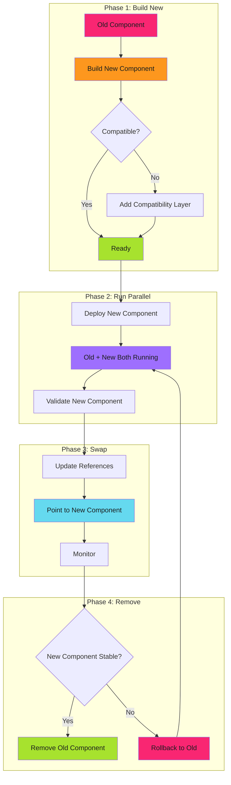

# Platform Component Replacement

In platform engineering, the strangler fig pattern replaces entire components (databases, service meshes, operators, control planes) without routing traffic between old and new systems.

The key difference: **You replace the component, not route around it.**

!!! tip "Component Replacement vs Traffic Routing"
    **Traffic routing**: Gradually shift user traffic from old API to new API
    **Component replacement**: Build new component, ensure compatibility, swap it in, remove old component

This is the strangler fig pattern for infrastructure.

---

## When Component Replacement Applies

| Scenario | Approach | Why |
| -------- | -------- | --- |
| **Migrating databases** | Component replacement | PostgreSQL → PostgreSQL cluster (no app changes) |
| **Replacing service mesh** | Component replacement | Linkerd → Istio (same abstraction) |
| **Upgrading operators** | Component replacement | Old CRD version → New CRD version (API compatibility) |
| **Swapping storage backends** | Component replacement | EBS → EFS (mount point stays same) |
| **Replacing user-facing APIs** | Traffic routing | REST v1 → REST v2 (gradual user migration) |
| **Feature rollout** | Traffic routing | Old checkout → New checkout (A/B testing) |

**Decision rule**: If end users don't directly interact with the component, use component replacement. If they do, use traffic routing.

---

## The Build-Replace-Remove Pattern



**No traffic routing**. No percentage-based rollout. Just: build, deploy, swap, remove.

---

## Real-World Example: Database Migration

### Scenario: PostgreSQL Single Instance → HA Cluster

The application connects to PostgreSQL. You want high availability without changing the application.

#### Traditional Approach (Downtime)

```yaml
# Stop application
# Export database
# Deploy new cluster
# Import database
# Update connection string
# Start application
# Hope nothing broke
```

**Downtime**: 2-4 hours. **Rollback**: Restore from backup.

#### Component Replacement Approach (Zero Downtime)

##### Phase 1: Build

```yaml
# Deploy new PostgreSQL cluster
apiVersion: postgresql.cnpg.io/v1
kind: Cluster
metadata:
  name: postgres-ha
spec:
  instances: 3
  storage:
    size: 100Gi
```

##### Phase 2: Replicate

```bash
# Set up logical replication from old to new
# Old database becomes the source
# New cluster replicates in real-time
pg_basebackup -h old-postgres -D /pgdata
```

##### Phase 3: Compatibility Layer

```yaml
# Create a Service that points to old database
# Application still uses "postgres" hostname
apiVersion: v1
kind: Service
metadata:
  name: postgres
spec:
  selector:
    app: postgres-old  # Still pointing to old
```

##### Phase 4: Validate

```bash
# Monitor replication lag
# Ensure new cluster is in sync
# Run read-only queries against new cluster
# Compare results with old database
```

##### Phase 5: Swap

```yaml
# Update Service to point to new cluster
# Application code doesn't change
# Connection string stays "postgres:5432"
apiVersion: v1
kind: Service
metadata:
  name: postgres
spec:
  selector:
    app: postgres-ha  # Now pointing to new cluster
```

**Swap happens in seconds**. Application reconnects automatically.

##### Phase 6: Monitor

```yaml
# Watch application metrics
# Check database query latency
# Monitor error rates
# If issues: revert Service to old database
```

##### Phase 7: Remove Old

```bash
# After 1-2 weeks of stable operation
# Stop old PostgreSQL instance
# Decommission resources
```

**Downtime**: Zero. **Rollback**: Change Service selector back to old database.

---

## Additional Resources

- **[Platform Component Examples](platform-component-examples.md)** - Service mesh, operator, and storage migrations
- **[Compatibility Layers](compatibility-layers.md)** - Service abstraction, API gateway, conversion webhooks, database views
- **[Validation and Rollback](validation-rollback.md)** - Validation checklists, rollback strategies, monitoring
- **[Edge Cases and Comparison](edge-cases-comparison.md)** - When NOT to use, comparison with traffic routing, gotchas

---

*The new PostgreSQL cluster ran for 3 weeks in parallel. Replication lag stayed under 100ms. The Service selector changed at 2 AM on a Friday. Applications reconnected within 30 seconds. Error rates stayed flat. After 2 weeks of monitoring, the old cluster was decommissioned. Total downtime: zero minutes.*
