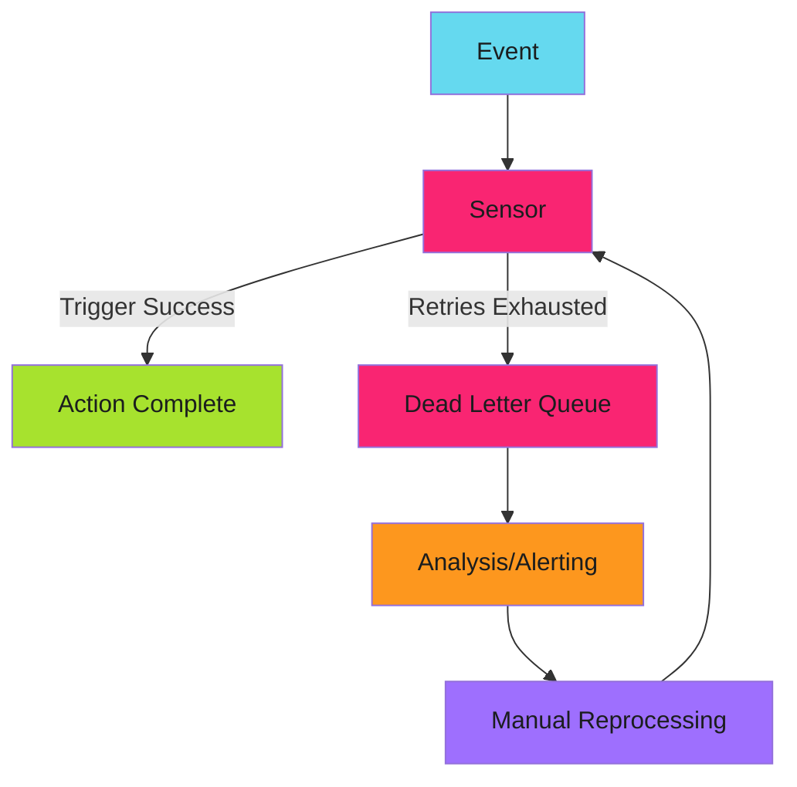

# Dead Letter Queues

When retries exhaust and events still can't be processed, they need somewhere to go. Dead letter queues (DLQs) capture failed events for later analysis, reprocessing, or alerting. This prevents silent data loss.

---

## Why Dead Letter Queues?

Without a DLQ, failed events disappear. You lose visibility into:

- What events failed
- Why they failed
- How to fix and reprocess them

A DLQ provides a safety net for production systems.

---

## DLQ Architecture



---

## EventBus DLQ with JetStream

JetStream natively supports dead letter queues:

```yaml
apiVersion: argoproj.io/v1alpha1
kind: EventBus
metadata:
  name: default
spec:
  jetstream:
    version: "2.9.11"
    settings: |
      max_deliver: 5
      ack_wait: "30s"
```

After `max_deliver` delivery attempts, messages move to a dead letter subject. Configure consumers to monitor this subject.

---

## Trigger-Level DLQ Pattern

Route failed events to a separate handling workflow:

```yaml
apiVersion: argoproj.io/v1alpha1
kind: Sensor
metadata:
  name: with-dlq
spec:
  dependencies:
    - name: main-event
      eventSourceName: source
      eventName: event

  triggers:
    # Primary trigger with retry
    - template:
        name: main-action
        argoWorkflow:
          operation: submit
          source:
            resource:
              # Primary workflow
      retryStrategy:
        steps: 3
        duration: 5s
        factor: 2

    # DLQ trigger - fires when main fails
    - template:
        name: dlq-handler
        conditions: main-action-failed
        argoWorkflow:
          operation: submit
          parameters:
            - src:
                dependencyName: main-event
                dataKey: body
              dest: spec.arguments.parameters.0.value
          source:
            resource:
              apiVersion: argoproj.io/v1alpha1
              kind: Workflow
              metadata:
                generateName: dlq-
              spec:
                arguments:
                  parameters:
                    - name: failed-event
                      value: ""
                workflowTemplateRef:
                  name: dlq-handler
```

---

## DLQ Handler Workflow

The DLQ handler captures event details for debugging:

```yaml
apiVersion: argoproj.io/v1alpha1
kind: WorkflowTemplate
metadata:
  name: dlq-handler
spec:
  entrypoint: handle-failure
  arguments:
    parameters:
      - name: failed-event
  templates:
    - name: handle-failure
      inputs:
        parameters:
          - name: failed-event
      steps:
        # Store failed event
        - - name: persist
            template: store-event
            arguments:
              parameters:
                - name: event
                  value: "{{inputs.parameters.failed-event}}"

        # Send alert
        - - name: alert
            template: send-alert
            arguments:
              parameters:
                - name: event
                  value: "{{inputs.parameters.failed-event}}"

    - name: store-event
      inputs:
        parameters:
          - name: event
      resource:
        action: create
        manifest: |
          apiVersion: v1
          kind: ConfigMap
          metadata:
            generateName: dlq-event-
            labels:
              type: dead-letter
          data:
            event: |
              {{inputs.parameters.event}}
            timestamp: "{{workflow.creationTimestamp}}"

    - name: send-alert
      inputs:
        parameters:
          - name: event
      container:
        image: curlimages/curl:latest
        command: [curl]
        args:
          - "-X"
          - "POST"
          - "-H"
          - "Content-Type: application/json"
          - "-d"
          - '{"text": "DLQ event received. Check ConfigMaps with label type=dead-letter"}'
          - "$(SLACK_WEBHOOK_URL)"
        env:
          - name: SLACK_WEBHOOK_URL
            valueFrom:
              secretKeyRef:
                name: slack-webhook
                key: url
```

---

## Reprocessing Failed Events

Query stored failures and resubmit:

```bash
# Find failed events
kubectl get configmaps -l type=dead-letter

# View a specific failure
kubectl get configmap dlq-event-abc123 -o jsonpath='{.data.event}' | jq .

# Resubmit to EventSource (if using webhook)
kubectl get configmap dlq-event-abc123 -o jsonpath='{.data.event}' | \
  curl -X POST -H "Content-Type: application/json" -d @- \
  http://eventsource-svc.argo-events:12000/webhook
```

---

## Alerting on DLQ Activity

Set up alerts when events hit the DLQ:

```yaml
# PrometheusRule for DLQ monitoring
apiVersion: monitoring.coreos.com/v1
kind: PrometheusRule
metadata:
  name: argo-events-dlq
spec:
  groups:
    - name: dlq-alerts
      rules:
        - alert: DeadLetterQueueActive
          expr: |
            increase(argo_events_sensor_trigger_failures_total[5m]) > 0
          for: 1m
          labels:
            severity: warning
          annotations:
            summary: "Events failing to dead letter queue"
            description: "{{ $value }} events failed in the last 5 minutes"
```

---

!!! warning "DLQ is Not a Fix"
    A dead letter queue captures failures; it doesn't fix them. Monitor DLQ activity and investigate root causes. A growing DLQ indicates a systemic problem that needs attention.

---

## Related

- [Retry Strategies](retry.md) - Before events hit DLQ
- [Troubleshooting Sensors](../../../patterns/argo-events/troubleshooting/sensors.md) - Debug trigger failures
- [Alerting Patterns](../../efficiency/index.md) - Notification setup
