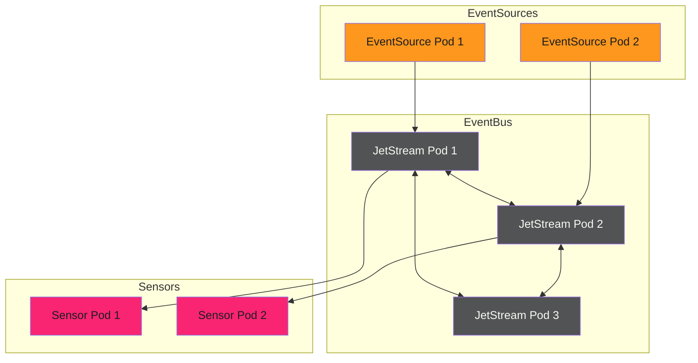

# High Availability

Production event systems require redundancy. Single points of failure cause outages. High availability (HA) configurations ensure events continue flowing even when components fail.

---

## HA Architecture

Redundant deployments across all components:



---

## EventBus HA

JetStream clustering provides EventBus redundancy:

```yaml
apiVersion: argoproj.io/v1alpha1
kind: EventBus
metadata:
  name: default
spec:
  jetstream:
    version: "2.9.11"
    replicas: 3
    persistence:
      accessMode: ReadWriteOnce
      storageClassName: standard
      volumeSize: 20Gi
    # Anti-affinity for node distribution
    affinity:
      podAntiAffinity:
        requiredDuringSchedulingIgnoredDuringExecution:
          - labelSelector:
              matchLabels:
                eventbus-name: default
            topologyKey: kubernetes.io/hostname
```

**Key HA settings:**

| Setting | Purpose |
| --------- | --------- |
| `replicas: 3` | Raft consensus requires odd number, 3 minimum |
| `persistence` | Survives pod restarts |
| `podAntiAffinity` | Spreads pods across nodes |

---

## EventSource HA

Scale EventSources for redundancy:

```yaml
apiVersion: argoproj.io/v1alpha1
kind: EventSource
metadata:
  name: webhook
spec:
  replicas: 2
  template:
    affinity:
      podAntiAffinity:
        preferredDuringSchedulingIgnoredDuringExecution:
          - weight: 100
            podAffinityTerm:
              labelSelector:
                matchLabels:
                  eventsource-name: webhook
              topologyKey: kubernetes.io/hostname
  webhook:
    endpoint:
      port: "12000"
      endpoint: /events
```

With multiple replicas, a Service load balances incoming webhooks across pods.

---

## Sensor HA

Sensors can also run multiple replicas:

```yaml
apiVersion: argoproj.io/v1alpha1
kind: Sensor
metadata:
  name: processor
spec:
  replicas: 2
  template:
    affinity:
      podAntiAffinity:
        preferredDuringSchedulingIgnoredDuringExecution:
          - weight: 100
            podAffinityTerm:
              labelSelector:
                matchLabels:
                  sensor-name: processor
              topologyKey: kubernetes.io/hostname
  dependencies:
    - name: event
      eventSourceName: source
      eventName: event
  triggers:
    - template:
        name: process
        argoWorkflow:
          # ...
```

Multiple Sensor replicas share event processing. JetStream ensures each event is processed exactly once across all replicas.

---

## Pod Disruption Budgets

Prevent all pods from being evicted simultaneously:

```yaml
apiVersion: policy/v1
kind: PodDisruptionBudget
metadata:
  name: eventbus-pdb
spec:
  minAvailable: 2
  selector:
    matchLabels:
      eventbus-name: default
---
apiVersion: policy/v1
kind: PodDisruptionBudget
metadata:
  name: sensor-pdb
spec:
  minAvailable: 1
  selector:
    matchLabels:
      sensor-name: processor
```

PDBs ensure cluster operations (node drains, upgrades) don't cause outages.

---

## Cross-Zone Deployment

Spread components across availability zones:

```yaml
spec:
  template:
    affinity:
      podAntiAffinity:
        requiredDuringSchedulingIgnoredDuringExecution:
          - labelSelector:
              matchLabels:
                app: eventbus
            topologyKey: topology.kubernetes.io/zone
```

Zone failures won't take down the entire event system.

---

## Health Checks

Configure proper health probes:

```yaml
spec:
  template:
    container:
      livenessProbe:
        httpGet:
          path: /healthz
          port: 8080
        initialDelaySeconds: 10
        periodSeconds: 10
      readinessProbe:
        httpGet:
          path: /readyz
          port: 8080
        initialDelaySeconds: 5
        periodSeconds: 5
```

Kubernetes automatically replaces unhealthy pods and removes them from service load balancing.

---

## Graceful Shutdown

Ensure events aren't lost during pod termination:

```yaml
spec:
  template:
    terminationGracePeriodSeconds: 60
```

Pods get 60 seconds to finish processing before forced termination. Events in-flight are acknowledged or returned to the queue.

---

!!! warning "HA Costs"
    High availability requires more resources: 3x EventBus replicas, 2x EventSource replicas, 2x Sensor replicas. Size your cluster appropriately and monitor resource usage.

---

## Testing HA

Validate your HA setup:

```bash
# Kill a random EventBus pod
kubectl delete pod -n argo-events -l eventbus-name=default --wait=false

# Verify events still flow
kubectl logs -n argo-events -l sensor-name=processor --tail=10

# Check EventBus cluster health
kubectl exec -n argo-events eventbus-default-0 -- nats server check cluster
```

If events stop flowing when a single pod dies, your HA configuration isn't working.

---

## Related

- [EventBus Configuration](../setup/event-bus.md) - Basic EventBus setup
- [Backpressure Handling](../../../patterns/argo-events/reliability/backpressure.md) - Handle high load
- [Retry Strategies](../../../patterns/argo-events/reliability/retry.md) - Recover from transient failures
