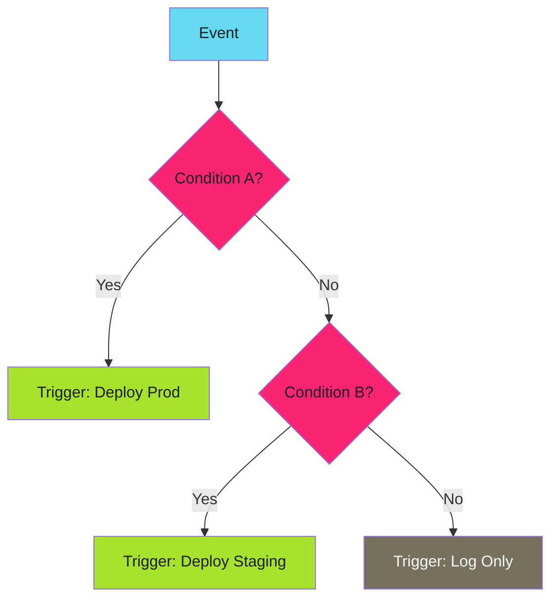

# Conditional Routing

Complex event flows require sophisticated decision logic. Conditional routing enables routing decisions based on event content, combining multiple conditions, and implementing decision trees. For the complete reference, see the [official Trigger Conditions docs](https://argoproj.github.io/argo-events/sensors/trigger-conditions/).

---

## Decision Flow

Conditions evaluate event data to determine which triggers fire:



---

## Basic Conditions

Define named conditions and reference them in triggers:

```yaml
apiVersion: argoproj.io/v1alpha1
kind: Sensor
metadata:
  name: conditional-router
spec:
  dependencies:
    - name: image-push
      eventSourceName: registry
      eventName: push

  triggers:
    - template:
        name: prod-deploy
        conditions: is-production
        argoWorkflow:
          operation: submit
          source:
            resource:
              apiVersion: argoproj.io/v1alpha1
              kind: Workflow
              metadata:
                generateName: prod-deploy-
              spec:
                workflowTemplateRef:
                  name: deploy-production

    - template:
        name: staging-deploy
        conditions: is-staging
        argoWorkflow:
          operation: submit
          source:
            resource:
              apiVersion: argoproj.io/v1alpha1
              kind: Workflow
              metadata:
                generateName: staging-deploy-
              spec:
                workflowTemplateRef:
                  name: deploy-staging

  # Condition definitions
  conditions:
    is-production:
      expr: body.tag matches "^v[0-9]+\\.[0-9]+\\.[0-9]+$"
    is-staging:
      expr: body.tag matches "^staging-"
```

Only the trigger whose condition matches will fire.

---

## Expression Syntax

Conditions use CEL (Common Expression Language):

| Operator | Description | Example |
| ---------- | ------------- | --------- |
| `==` | Equality | `body.branch == "main"` |
| `!=` | Inequality | `body.author != "bot"` |
| `matches` | Regex match | `body.tag matches "^v[0-9]+"` |
| `in` | List membership | `body.env in ["prod", "staging"]` |
| `&&` | Logical AND | `body.branch == "main" && body.merged == true` |
| `\|\|` | Logical OR | `body.env == "prod" \|\| body.urgent == true` |
| `!` | Negation | `!body.draft` |

---

## Complex Conditions

Combine multiple checks with logical operators:

```yaml
conditions:
  deploy-allowed:
    expr: >-
      body.ref == "refs/heads/main" &&
      body.commits != nil &&
      len(body.commits) > 0 &&
      !body.commits.0.message.contains("[skip deploy]")
```

This fires only when:

- Push is to main branch (`AND`)
- Commits array exists and is non-empty (`AND`)
- First commit message doesn't contain `[skip deploy]`

---

## Dependency Conditions

Conditions can reference dependency states for multi-event coordination:

```yaml
spec:
  dependencies:
    - name: code-push
      eventSourceName: github
      eventName: push
    - name: tests-passed
      eventSourceName: ci
      eventName: success
    - name: approval
      eventSourceName: slack
      eventName: approved

  triggers:
    - template:
        name: deploy-after-approval
        conditions: all-checks-passed
        argoWorkflow:
          # Only fires when all three events have arrived
          operation: submit
          source:
            resource:
              # ...

  conditions:
    all-checks-passed:
      expr: code-push && tests-passed && approval
```

The condition references dependency names. All three events must arrive before the trigger fires.

---

## Fallback Triggers

Implement catch-all patterns with negated conditions:

```yaml
triggers:
  - template:
      name: prod-deploy
      conditions: is-production
      argoWorkflow:
        # ...

  - template:
      name: staging-deploy
      conditions: is-staging
      argoWorkflow:
        # ...

  - template:
      name: dev-deploy
      conditions: is-other
      argoWorkflow:
        # Catch-all for non-prod, non-staging

conditions:
  is-production:
    expr: body.tag matches "^v[0-9]+"
  is-staging:
    expr: body.tag matches "^staging-"
  is-other:
    expr: >-
      !(body.tag matches "^v[0-9]+") &&
      !(body.tag matches "^staging-")
```

---

## Condition Debugging

Conditions that don't match produce no output. Debug by:

1. **Logging all events first**: Create a trigger with no conditions to see what's arriving
2. **Simplifying conditions**: Start with `true` and add restrictions
3. **Checking event structure**: The actual JSON path might differ from documentation

```yaml
# Debug trigger - always fires, logs event
triggers:
  - template:
      name: debug-log
      # No conditions - always triggers
      log:
        intervalSeconds: 0
```

---

!!! tip "Start Permissive"
    Begin with simple conditions that match broadly. Add restrictions incrementally and verify each change catches the expected events. Complex conditions that never fire are hard to debug.

---

## Related

- [Simple Filtering](filtering.md) - Pre-sensor filtering
- [Multi-Trigger Actions](multi-trigger.md) - Fan-out patterns
- [Troubleshooting Sensors](../../../patterns/argo-events/troubleshooting/sensors.md) - Debug routing issues
- [Official Conditions Docs](https://argoproj.github.io/argo-events/sensors/trigger-conditions/) - Complete reference
