# Parallel Execution

When child workflows don't depend on each other, run them in parallel. This reduces total pipeline time from the sum of all steps to the duration of the longest step.

---

## Why Parallel Execution?

Sequential execution is safe but slow. If tests take 5 minutes and linting takes 2 minutes, running them sequentially takes 7 minutes. Running them in parallel takes 5 minutes, the time of the longer task.

The savings compound. With three 5-minute independent tasks, sequential takes 15 minutes; parallel takes 5. With ten tasks, the difference is 50 minutes versus 5.

The tradeoff is resource consumption. Parallel execution uses more CPU, memory, and API quota simultaneously. A cluster that handles ten sequential workflows might struggle with ten parallel workflows competing for resources.

---

## Basic Parallel Pattern

```yaml
templates:
  - name: main
    steps:
      # Sequential: clone first (others depend on it)
      - - name: clone-repo
          template: spawn-git-clone

      # Parallel: tests and linting don't depend on each other
      - - name: run-tests
          template: spawn-tests
        - name: run-lint
          template: spawn-lint

      # Sequential: deploy only after both complete
      - - name: deploy
          template: spawn-deploy
```

The double-dash syntax (`- -`) starts a new sequential step. Multiple items under the same step run in parallel.

**Execution order:**

1. Clone runs alone (sequential)
2. Tests and lint run together (parallel)
3. Deploy runs after both tests and lint complete (sequential)

---

## Parallel Execution Timeline

```mermaid
gantt

%% Ghostty Hardcore Theme
    title Sequential vs Parallel Execution
    dateFormat X
    axisFormat %s

    section Sequential
    Clone: a1, 0, 3
    Tests: a2, after a1, 5
    Lint: a3, after a2, 2
    Deploy: a4, after a3, 3

    section Parallel
    Clone: b1, 0, 3
    Tests: b2, after b1, 5
    Lint: b3, after b1, 2
    Deploy: b4, after b2 b3, 3

```



The parallel version completes in 11 time units versus 13 for sequential. With more parallel tasks, the savings grow larger.

---

## Fan-Out Pattern

Process multiple items in parallel using `withItems`:

```yaml
templates:
  - name: main
    steps:
      - - name: process-repos
          template: spawn-processor
          withItems:
            - repo: api-service
              env: production
            - repo: web-frontend
              env: production
            - repo: worker-backend
              env: staging
          arguments:
            parameters:
              - name: repository
                value: "{{item.repo}}"
              - name: environment
                value: "{{item.env}}"
```

This spawns three child workflows in parallel, each with different parameters. All three run simultaneously; the step completes when all finish.

**Controlling fan-out:**

```yaml
spec:
  parallelism: 5  # Max 5 parallel workflows
```

The `parallelism` field limits how many items process simultaneously. With 10 items and `parallelism: 5`, items process in two batches of 5.

---

## Failure Handling in Parallel Steps

By default, if any parallel task fails, the entire step fails and remaining tasks are cancelled. This is fail-fast behavior.

To continue despite failures, use `continueOn`:

```yaml
steps:
  - - name: run-tests
      template: spawn-tests
      continueOn:
        failed: true
    - name: run-lint
      template: spawn-lint
      continueOn:
        failed: true
```

Now both tasks run to completion regardless of failures. The step's overall status depends on both results:

| Tests | Lint | Step Status |
| ------- | ------ | ------------- |
| Pass | Pass | Succeeded |
| Pass | Fail | Failed |
| Fail | Pass | Failed |
| Fail | Fail | Failed |

!!! warning "Use with Caution"
    `continueOn: failed: true` can mask failures. Use it only when you need all results regardless of individual outcomes, like collecting test reports from multiple suites.

---

## Resource Considerations

Parallel execution multiplies resource usage:

```yaml
# Each child requests 500m CPU
# 10 parallel children = 5 CPU total
spec:
  templates:
    - name: spawn-processor
      resource:
        action: create
        manifest: |
          ...
          spec:
            templates:
              - name: process
                container:
                  resources:
                    requests:
                      cpu: 500m
```

Before parallelizing, calculate total resource requirements:

- **CPU** - Sum of all parallel tasks' requests
- **Memory** - Sum of all parallel tasks' requests
- **API quota** - Parallel tasks make concurrent API calls
- **Storage** - Parallel tasks may compete for I/O bandwidth

Adjust cluster capacity or `parallelism` limits accordingly.

---

## Mixing Sequential and Parallel

Complex pipelines mix both patterns:

```yaml
steps:
  # Phase 1: Setup (sequential)
  - - name: clone
      template: spawn-clone

  # Phase 2: Validation (parallel)
  - - name: unit-tests
      template: spawn-unit-tests
    - name: lint
      template: spawn-lint
    - name: security-scan
      template: spawn-security-scan

  # Phase 3: Build (sequential, depends on validation)
  - - name: build
      template: spawn-build

  # Phase 4: Integration (parallel)
  - - name: integration-tests
      template: spawn-integration-tests
    - name: performance-tests
      template: spawn-perf-tests

  # Phase 5: Deploy (sequential)
  - - name: deploy
      template: spawn-deploy
```

Each sequential boundary is a synchronization point. All parallel tasks in one phase must complete before the next phase starts.

---

## Related

- [Spawning Child Workflows](spawning-children.md) - Basic child workflow creation
- [DAG Orchestration](dag.md) - Alternative approach for complex dependencies
- [Concurrency Control](../concurrency/index.md) - Managing resource contention
