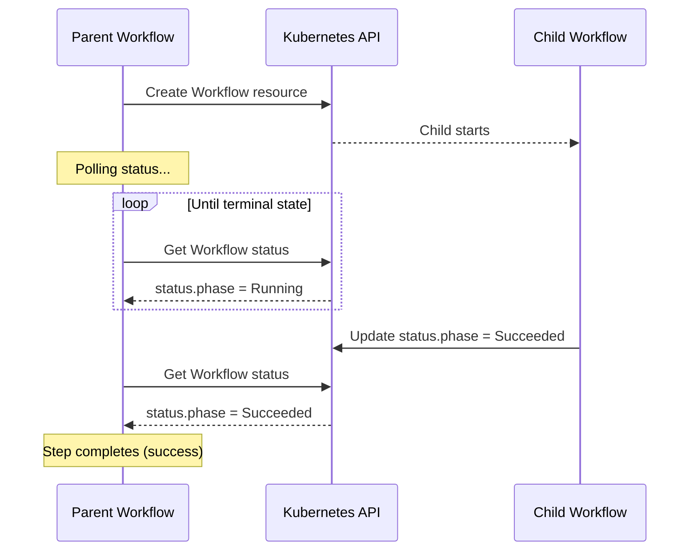

# Spawning Child Workflows

The `resource.action: create` pattern spawns a child workflow and waits for its completion. This is the fundamental building block of composition. The parent creates a child, monitors its status, and proceeds or fails based on the result.

---

## Why Spawn Children?

A template within a workflow shares the workflow's lifetime, resources, and failure domain. If the template fails, the whole workflow fails. If the workflow times out, all templates stop.

A child workflow is independent. It has its own timeout, its own retry logic, its own resource allocation. The parent monitors it but doesn't control its internals. This separation enables:

- **Isolation**: Child failures don't immediately crash the parent
- **Reusability**: The same child workflow can be spawned from multiple parents
- **Visibility**: Each child appears as a separate workflow in the UI
- **Resource management**: Children can have different resource requirements

---

## Basic Pattern

```yaml
templates:
  - name: spawn-child
    inputs:
      parameters:
        - name: app-name
        - name: app-url
    resource:
      action: create
      manifest: |
        apiVersion: argoproj.io/v1alpha1
        kind: Workflow
        metadata:
          generateName: child-workflow-
          namespace: argo-workflows
        spec:
          arguments:
            parameters:
              - name: name
                value: "{{inputs.parameters.app-name}}"
              - name: url
                value: "{{inputs.parameters.app-url}}"
          workflowTemplateRef:
            name: child-template
      successCondition: status.phase == Succeeded
      failureCondition: status.phase in (Failed, Error)
```

**Key elements:**

| Field | Purpose |
| ------- | --------- |
| `generateName` | Unique name for each child instance |
| `workflowTemplateRef` | Reference to the WorkflowTemplate to instantiate |
| `successCondition` | Status that marks parent step as successful |
| `failureCondition` | Status that marks parent step as failed |

---

## How Status Propagation Works



The parent polls the child's status until it reaches a terminal state. This happens automatically; you don't implement the polling. However, there's latency: the parent doesn't immediately know when the child finishes.

---

## The Full-Monty Pattern

Production pipelines often chain multiple children in sequence. Each child is a complete, self-contained workflow. The parent orchestrates the sequence.

```yaml
apiVersion: argoproj.io/v1alpha1
kind: WorkflowTemplate
metadata:
  name: full-pipeline
  annotations:
    workflows.argoproj.io/description: |
      Orchestrates the complete pipeline: clone, process, and build.
spec:
  serviceAccountName: orchestrator-sa
  entrypoint: main
  templates:
    - name: main
      steps:
        - - name: git-clone
            template: spawn-git-clone
        - - name: process-data
            template: spawn-process-data
        - - name: build
            template: spawn-build

    - name: spawn-git-clone
      resource:
        action: create
        manifest: |
          apiVersion: argoproj.io/v1alpha1
          kind: Workflow
          metadata:
            generateName: pipeline-git-clone-
            namespace: argo-workflows
          spec:
            workflowTemplateRef:
              name: "git-clone-template"
        successCondition: status.phase == Succeeded
        failureCondition: status.phase in (Failed, Error)

    - name: spawn-process-data
      resource:
        action: create
        manifest: |
          apiVersion: argoproj.io/v1alpha1
          kind: Workflow
          metadata:
            generateName: pipeline-process-data-
            namespace: argo-workflows
          spec:
            workflowTemplateRef:
              name: "data-processor-template"
        successCondition: status.phase == Succeeded
        failureCondition: status.phase in (Failed, Error)

    - name: spawn-build
      resource:
        action: create
        manifest: |
          apiVersion: argoproj.io/v1alpha1
          kind: Workflow
          metadata:
            generateName: pipeline-build-
            namespace: argo-workflows
          spec:
            workflowTemplateRef:
              name: "build-template"
        successCondition: status.phase == Succeeded
        failureCondition: status.phase in (Failed, Error)
```

If any child fails, the parent fails and remaining steps don't execute. This fail-fast behavior is usually correct. There's no point building if the clone failed.

---

## Passing Parameters to Children

Extract parameters from parent inputs or workflow context:

```yaml
- name: spawn-builder
  inputs:
    parameters:
      - name: repo-url
      - name: branch
  resource:
    action: create
    manifest: |
      apiVersion: argoproj.io/v1alpha1
      kind: Workflow
      metadata:
        generateName: build-
      spec:
        arguments:
          parameters:
            - name: repository
              value: "{{inputs.parameters.repo-url}}"
            - name: ref
              value: "{{inputs.parameters.branch}}"
            - name: parent-workflow
              value: "{{workflow.name}}"
        workflowTemplateRef:
          name: build-template
```

The `{{workflow.name}}` reference passes the parent's name to the child. This enables correlation so you can find all children spawned by a specific parent.

---

## RBAC Requirements

The parent workflow needs permission to create child workflows:

```yaml
apiVersion: rbac.authorization.k8s.io/v1
kind: ClusterRole
metadata:
  name: workflow-orchestrator
rules:
  - apiGroups: ["argoproj.io"]
    resources: ["workflows"]
    verbs: ["create", "get", "watch", "list"]
```

The `get` and `watch` verbs are needed for status polling. Without them, the parent can create children but can't monitor their progress.

---

!!! warning "Child Workflow RBAC"
    The parent needs `create`, `get`, `watch`, and `list` permissions on `workflows` resources. Without `get` and `watch`, the parent can spawn children but can't track their completion.

---

## Related

- [Parallel Execution](parallel.md) - Running children simultaneously
- [DAG Orchestration](dag.md) - Complex dependency patterns
- [RBAC Configuration](../templates/rbac.md) - Permission setup
