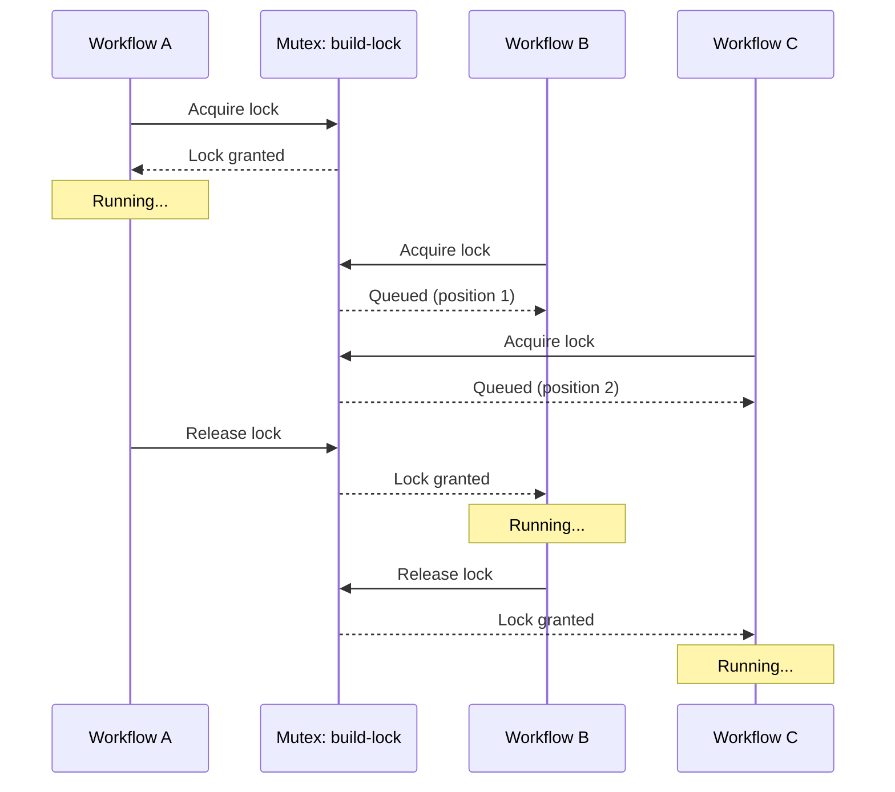

# Mutex Synchronization

A mutex (mutual exclusion) ensures only one workflow instance can run at a time. When a workflow acquires a mutex, other workflows requesting the same mutex wait in a queue. When the first workflow completes, the next in queue proceeds.

---

## Why Mutexes?

Some operations must be atomic. A database migration can't run twice simultaneously. A deployment to production must complete before another starts. A cache rebuild mustn't overlap with itself.

Without mutexes, you rely on timing. If events arrive slowly enough, workflows don't overlap. But under load, multiple workflows trigger at once: during a deployment storm, after a network partition resolves, or when a backlog drains. The system that worked fine in testing fails in production.

Mutexes make the single-execution guarantee explicit. The system behaves the same whether one event arrives or a hundred arrive simultaneously.

---

## Basic Configuration

```yaml
apiVersion: argoproj.io/v1alpha1
kind: WorkflowTemplate
metadata:
  name: build-pipeline
spec:
  synchronization:
    mutexes:
      - name: build-lock
  entrypoint: main
  templates:
    - name: main
      # ... workflow steps
```

The `synchronization.mutexes` field declares which mutexes this workflow needs. When the workflow starts, it attempts to acquire the lock. If another workflow holds it, this one waits.

---

## How Mutex Queuing Works



Workflows execute in FIFO order. The first to request the lock gets it. Others queue up. No workflow starves indefinitely. Eventually it reaches the front of the queue.

---

## Dynamic Mutex Names

Mutex names can include workflow parameters, enabling per-resource locks:

```yaml
spec:
  synchronization:
    mutexes:
      - name: "deploy-{{workflow.parameters.environment}}"
```

This creates separate locks for each environment. Deployments to `staging` and `production` can run simultaneously. Two deployments to `production` cannot.

**Common patterns:**

| Scenario | Mutex Pattern |
| ---------- | --------------- |
| Single build at a time | `mutexes: [{name: build-lock}]` |
| Per-environment locks | `mutexes: [{name: "deploy-{{workflow.parameters.env}}"}]` |
| Per-repository locks | `mutexes: [{name: "build-{{workflow.parameters.repo}}"}]` |
| Shared resource access | `mutexes: [{name: database-migration}]` |

---

## Multiple Mutexes

Workflows can require multiple locks:

```yaml
spec:
  synchronization:
    mutexes:
      - name: "deploy-{{workflow.parameters.env}}"
      - name: database-lock
```

The workflow acquires all locks before starting. This prevents deadlocks where workflow A holds lock 1 and waits for lock 2, while workflow B holds lock 2 and waits for lock 1.

!!! warning "Deadlock Prevention"
    Argo acquires all mutexes atomically. If any lock isn't available, the workflow waits for all of them. This prevents deadlocks but means a workflow waiting for multiple locks might wait longer than expected.

---

## Mutex Debugging

When workflows seem stuck, check mutex state:

```bash
# List workflows waiting on mutexes
kubectl get workflows -l workflows.argoproj.io/sync-id

# Check a specific workflow's sync status
kubectl get workflow <name> -o jsonpath='{.status.synchronization}'
```

**Common issues:**

| Symptom | Cause | Fix |
| --------- | ------- | ----- |
| Workflow stuck in Pending | Waiting for mutex | Check which workflow holds the lock |
| Workflows never start | Mutex held by failed workflow | Terminate the failed workflow |
| Inconsistent mutex names | Parameter typo | Verify parameter values match |

A failed workflow still holds its mutex until terminated. If a workflow fails and isn't cleaned up, subsequent workflows wait forever. Use TTL strategies to automatically clean up failed workflows.

---

## Mutex vs Concurrency Policy

CronWorkflows have a separate `concurrencyPolicy` field:

```yaml
apiVersion: argoproj.io/v1alpha1
kind: CronWorkflow
spec:
  concurrencyPolicy: Replace  # or Forbid, Allow
  schedule: "0 * * * *"
  workflowSpec:
    synchronization:
      mutexes:
        - name: hourly-job
```

**The difference:**

- `concurrencyPolicy` controls what happens when a scheduled run triggers while a previous run is active
- `mutexes` control access to shared resources across any workflows (not just the same CronWorkflow)

Use both when a CronWorkflow should also coordinate with event-triggered workflows:

- `concurrencyPolicy: Forbid` prevents overlapping scheduled runs
- `mutexes` prevents overlap with event-triggered runs of related workflows

---

## Related

- [Semaphores](semaphores.md) - Limited concurrent access
- [TTL Strategy](ttl.md) - Cleanup to prevent mutex deadlocks
- [Scheduled Workflows](../scheduled/index.md) - CronWorkflow concurrency
