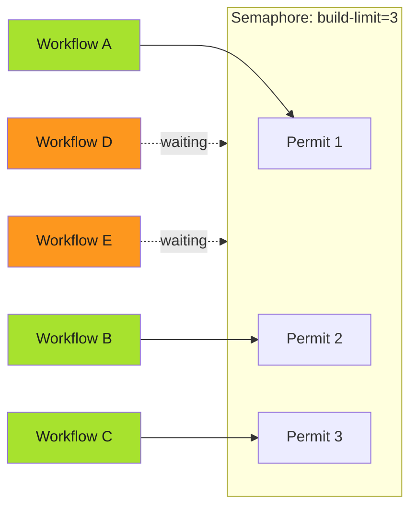

# Semaphores

Semaphores limit concurrent access to a resource without requiring exclusive access. Unlike mutexes (which allow exactly one holder), semaphores allow N concurrent holders. This enables controlled parallelism. Multiple workflows can run simultaneously, but not unlimited numbers.

---

## Why Semaphores?

Mutexes are binary: either one workflow runs or none. But some resources can handle limited concurrency. A build server might support three simultaneous builds but crash under ten. An API might allow five concurrent requests before rate limiting.

Semaphores model this capacity. Configure the limit based on what the resource can handle. Workflows acquire permits from the semaphore; when all permits are taken, additional workflows wait.

---

## Configuration

Semaphores use a ConfigMap to store the limit:

```yaml
apiVersion: v1
kind: ConfigMap
metadata:
  name: workflow-semaphores
  namespace: argo-workflows
data:
  build-limit: "3"
  deploy-limit: "1"
  api-calls: "5"
```

Workflows reference the ConfigMap:

```yaml
apiVersion: argoproj.io/v1alpha1
kind: WorkflowTemplate
metadata:
  name: build-pipeline
spec:
  synchronization:
    semaphore:
      configMapKeyRef:
        name: workflow-semaphores
        key: build-limit
  entrypoint: main
  templates:
    - name: main
      # ... workflow steps
```

---

## How Semaphore Permits Work



Three workflows hold permits and run. Two workflows wait. When A, B, or C completes, D gets the released permit.

---

## Dynamic Limit Adjustment

The ConfigMap value can be changed at runtime:

```bash
kubectl patch configmap workflow-semaphores \
  -p '{"data":{"build-limit":"5"}}'
```

New workflows see the updated limit immediately. Running workflows aren't affected. They keep their permits until completion.

**Use cases for dynamic adjustment:**

- Scale up during low-load periods
- Scale down when resource contention is high
- Emergency reduction to protect overloaded systems
- Testing different concurrency levels without redeploying

---

## Semaphore vs Mutex

| Aspect | Mutex | Semaphore |
| -------- | ------- | ----------- |
| Concurrent holders | 1 | N (configurable) |
| Configuration | Inline in workflow | ConfigMap reference |
| Dynamic adjustment | No | Yes (via ConfigMap) |
| Use case | Exclusive access | Limited parallelism |

**Use mutex when:**

- The resource truly can't handle any concurrent access
- You need exactly-once execution guarantees
- You don't need to adjust limits at runtime

**Use semaphore when:**

- The resource can handle some concurrent access
- You want to tune limits without workflow changes
- Different workflows share the same capacity pool

---

## Combining Semaphore with Other Controls

Semaphores can combine with other concurrency mechanisms:

```yaml
spec:
  synchronization:
    semaphore:
      configMapKeyRef:
        name: workflow-semaphores
        key: build-limit
    mutexes:
      - name: "repo-{{workflow.parameters.repo}}"
```

This configuration:

1. Limits total concurrent builds to the semaphore value
2. Ensures only one build per repository at a time

Three builds can run simultaneously, but not two builds of the same repo.

---

## Monitoring Semaphore Usage

Check current semaphore state:

```bash
# List workflows using a specific semaphore
kubectl get workflows -l workflows.argoproj.io/semaphore-name=workflow-semaphores

# Count running vs waiting
kubectl get workflows -o json | jq '.items | map(select(.status.phase == "Running")) | length'
```

If workflows consistently wait, consider increasing the semaphore limit or optimizing workflow duration to free permits faster.

---

!!! note "ConfigMap Updates Are Instant"
    Changes to the semaphore ConfigMap take effect immediately for new workflows. Use this for emergency scaling without redeploying anything.

---

## Related

- [Mutex Synchronization](mutex.md) - Exclusive access patterns
- [TTL Strategy](ttl.md) - Cleanup to free permits
- [WorkflowTemplate Patterns](../templates/index.md) - Basic workflow structure
