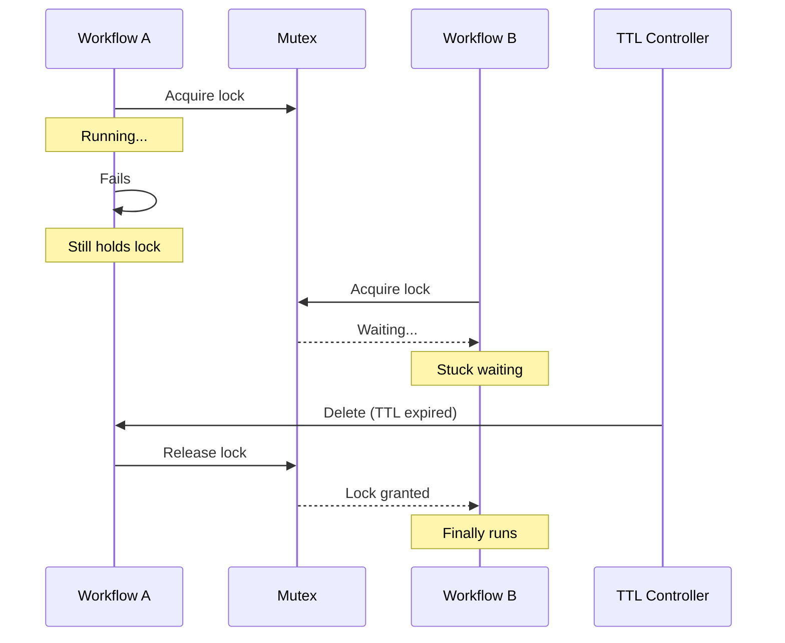

# TTL Strategy

TTL (Time To Live) strategies automatically clean up completed workflows after a specified duration. Without TTL, completed workflows accumulate indefinitely, consuming cluster resources and making the Argo UI unusable.

---

## Why TTL Matters

Every completed workflow remains in the cluster as a Workflow resource. Each workflow stores its status, pod information, logs references, and artifact metadata. Over time, this accumulates:

- **Etcd pressure**: Thousands of workflow objects strain Kubernetes storage
- **API server load**: Listing workflows becomes slow
- **UI performance**: The Argo UI struggles with large workflow counts
- **Resource quotas**: Completed workflows count against namespace quotas

TTL prevents this by automatically deleting workflows after they've served their purpose. Successful workflows might be deleted quickly because you don't need to debug them. Failed workflows might be kept longer for investigation.

---

## Configuration

```yaml
spec:
  ttlStrategy:
    secondsAfterCompletion: 3600   # Delete 1 hour after any completion
    secondsAfterSuccess: 1800      # Delete 30 min after success
    secondsAfterFailure: 86400     # Keep failures for 24 hours
```

The most specific setting wins. A successful workflow uses `secondsAfterSuccess`. A failed workflow uses `secondsAfterFailure`. If neither applies, `secondsAfterCompletion` is the fallback.

---

## Choosing TTL Values

| Workflow Type | Success TTL | Failure TTL | Rationale |
| --------------- | ------------- | ------------- | ----------- |
| CI builds | 30 min | 24 hours | Debug failures; successes are routine |
| Deployments | 1 hour | 72 hours | Need time to verify, longer for rollback investigation |
| Scheduled jobs | 2 hours | 48 hours | Compare recent runs; investigate failures |
| One-off tasks | 15 min | 4 hours | Quick cleanup; brief investigation window |

**Rules of thumb:**

- **Success TTL**: Long enough to verify the result, short enough to not accumulate
- **Failure TTL**: Long enough to investigate, alert, and fix the underlying issue
- **Completion TTL**: Catch-all for edge cases (cancelled, etc.)

---

## TTL and Concurrency Interaction

TTL interacts with mutex synchronization. A workflow holding a mutex continues holding it until deleted. If a workflow fails but isn't cleaned up, subsequent workflows wait forever for the mutex.



Keep failure TTL reasonable. Very long TTLs mean long waits when failures hold mutexes.

---

## History Limits

Related to TTL but different: history limits control how many completed workflow runs are retained for Sensors and CronWorkflows.

**Sensor history:**

```yaml
apiVersion: argoproj.io/v1alpha1
kind: Sensor
metadata:
  name: deployment-trigger
spec:
  revisionHistoryLimit: 3
```

The `revisionHistoryLimit` controls how many sensor revisions (configuration versions) to keep. This is different from workflow TTL. It's about the sensor itself, not the workflows it triggers.

**CronWorkflow history:**

```yaml
apiVersion: argoproj.io/v1alpha1
kind: CronWorkflow
metadata:
  name: nightly-backup
spec:
  successfulJobsHistoryLimit: 3
  failedJobsHistoryLimit: 1
  workflowSpec:
    ttlStrategy:
      secondsAfterCompletion: 3600
```

History limits and TTL work together:

- `successfulJobsHistoryLimit: 3` keeps the last 3 successful workflow runs
- `failedJobsHistoryLimit: 1` keeps the last failed run for debugging
- `ttlStrategy` provides time-based cleanup as a secondary mechanism

!!! tip "Use Both"
    History limits provide count-based retention. TTL provides time-based cleanup. Using both ensures workflows are cleaned up by whichever limit hits first.

---

## Disabling TTL

Some workflows should never auto-delete. These include audit trails, compliance records, and forensic evidence. Set TTL to 0 or omit the field entirely:

```yaml
spec:
  ttlStrategy:
    secondsAfterCompletion: 0  # Never auto-delete
```

For these workflows, implement separate cleanup processes with appropriate retention policies.

---

## TTL Best Practices

1. **Always set TTL** on production workflows. The default (no TTL) causes accumulation.

2. **Keep failures longer than successes.** You need time to investigate failures; successes are routine.

3. **Match TTL to your alerting cadence.** If alerts fire within an hour, failures can have shorter TTL.

4. **Consider mutex implications.** Don't set failure TTL longer than acceptable mutex wait times.

5. **Monitor workflow counts.** If counts grow despite TTL, check for workflows that bypass it.

---

## Related

- [Mutex Synchronization](mutex.md) - TTL prevents mutex deadlocks
- [Semaphores](semaphores.md) - TTL frees semaphore permits
- [Scheduled Workflows](../scheduled/index.md) - History limits for CronWorkflows
