# Concurrency Policies

When a scheduled run triggers while a previous run is still active, the `concurrencyPolicy` determines what happens. Choose the policy that matches your workflow's behavior: some workflows can overlap, others must not.

---

## Why Concurrency Policies Matter

Consider a scheduled database backup that runs every hour. If a backup takes 90 minutes, the next scheduled run will trigger while the previous is still running. Without a concurrency policy:

- Do both backups run simultaneously? (They might conflict)
- Does the new backup wait? (It might fall further behind)
- Does the new backup cancel the old? (Data might be lost)

The concurrency policy makes this behavior explicit. You decide what happens, and the system enforces it consistently.

---

## Policy Options

```yaml
spec:
  concurrencyPolicy: Forbid  # or Allow, Replace
```

| Policy | Behavior | Use When |
| -------- | ---------- | ---------- |
| `Allow` | Run concurrently (default) | Workflows are independent |
| `Forbid` | Skip new if previous running | Overlap would cause conflicts |
| `Replace` | Cancel previous, start new | Only latest result matters |

---

## Allow: Concurrent Execution

```yaml
spec:
  concurrencyPolicy: Allow
  schedule: "*/5 * * * *"
```

New runs start regardless of whether previous runs are active. This is the default and works when:

- Workflows don't share resources
- Each run produces independent results
- Occasional overlap doesn't cause problems

```mermaid
gantt

%% Ghostty Hardcore Theme
    title Allow Policy
    dateFormat X
    axisFormat %s

    section Runs
    Run 1: a1, 0, 8
    Run 2: a2, 5, 8
    Run 3: a3, 10, 8

```



Runs overlap freely. With slow workflows and frequent schedules, you might have many running simultaneously.

!!! warning "Resource Exhaustion"
    `Allow` can exhaust cluster resources if workflows back up. Consider semaphores or resource quotas as additional protection.

---

## Forbid: Skip on Overlap

```yaml
spec:
  concurrencyPolicy: Forbid
  schedule: "*/5 * * * *"
```

New runs don't start while a previous run is active. The scheduled run is skipped entirely.

```mermaid
gantt

%% Ghostty Hardcore Theme
    title Forbid Policy
    dateFormat X
    axisFormat %s

    section Runs
    Run 1: a1, 0, 12
    Run 2 (skipped): crit, a2, 5, 0
    Run 3 (skipped): crit, a3, 10, 0
    Run 4: a4, 15, 8

```



Run 1 takes longer than the schedule interval, so runs 2 and 3 are skipped. Run 4 starts after run 1 completes.

Use `Forbid` when:

- Concurrent runs would corrupt data
- Skipping is better than overlapping
- You'll investigate and fix slow runs

---

## Replace: Cancel Previous

```yaml
spec:
  concurrencyPolicy: Replace
  schedule: "*/5 * * * *"
```

When a new run triggers, any active run is cancelled and the new one starts.

```mermaid
gantt

%% Ghostty Hardcore Theme
    title Replace Policy
    dateFormat X
    axisFormat %s

    section Runs
    Run 1 (cancelled): crit, a1, 0, 5
    Run 2 (cancelled): crit, a2, 5, 5
    Run 3: a3, 10, 8

```



Each new scheduled time cancels the previous run and starts fresh.

Use `Replace` when:

- Only the most recent data matters
- Old runs become stale quickly
- Partial completion is worthless

!!! warning "Work Loss"
    `Replace` discards work from cancelled runs. Use only when partial results have no value.

---

## Combining with History Limits

Concurrency policy and history limits work together:

```yaml
spec:
  concurrencyPolicy: Forbid
  successfulJobsHistoryLimit: 3
  failedJobsHistoryLimit: 1
```

The history limits control how many completed runs are retained:

- `successfulJobsHistoryLimit: 3` keeps the last 3 successful runs
- `failedJobsHistoryLimit: 1` keeps the last failed run

This provides debugging context while preventing unbounded growth.

---

## Combining with Mutexes

CronWorkflow concurrency policy controls overlapping scheduled runs. Mutexes control access to shared resources across any workflows.

```yaml
apiVersion: argoproj.io/v1alpha1
kind: CronWorkflow
spec:
  concurrencyPolicy: Forbid
  schedule: "0 * * * *"
  workflowSpec:
    synchronization:
      mutexes:
        - name: build-lock
```

This configuration:

- `concurrencyPolicy: Forbid` prevents overlapping scheduled runs
- `mutexes` prevents overlap with event-triggered runs of related workflows

Use both when scheduled and event-triggered workflows share resources.

---

## Debugging Skipped Runs

With `Forbid` policy, skipped runs don't create workflow objects. Check CronWorkflow events to see what happened:

```bash
kubectl describe cronworkflow my-job -n argo-workflows
```

Look for events like "Skipping scheduled run because previous run is still active."

If runs are frequently skipped:

1. Investigate why the previous run takes so long
2. Adjust the schedule to match actual runtime
3. Optimize the workflow to complete faster

---

## Related

- [Basic CronWorkflow](basic.md): CronWorkflow fundamentals
- [Mutex Synchronization](../concurrency/mutex.md): Cross-workflow locking
- [TTL Strategy](../concurrency/ttl.md): Automatic cleanup
