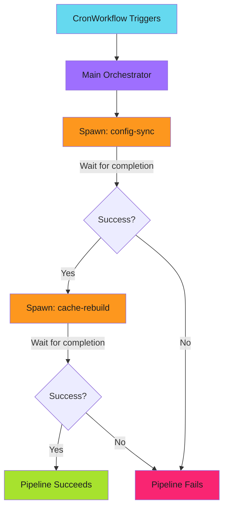

# Scheduled Orchestration

CronWorkflows can orchestrate complex pipelines by spawning multiple child workflows. This pattern runs multi-stage automation on a schedule, with each stage as an independent, reusable workflow.

---

## Why Scheduled Orchestration?

Simple scheduled jobs run a single task. But production automation often requires multiple stages: sync configuration, then rebuild caches, then notify downstream systems.

Scheduled orchestration combines the reliability of CronWorkflows with the flexibility of workflow composition. Each stage is a separate WorkflowTemplate that can be tested, debugged, and reused independently.

---

## Basic Orchestration Pattern

```yaml
apiVersion: argoproj.io/v1alpha1
kind: CronWorkflow
metadata:
  name: scheduled-sync
  namespace: argo-workflows
spec:
  schedule: "0 */4 * * *"
  timezone: Europe/Zurich
  concurrencyPolicy: Replace
  startingDeadlineSeconds: 60
  successfulJobsHistoryLimit: 3
  failedJobsHistoryLimit: 1
  workflowSpec:
    serviceAccountName: orchestrator-sa
    entrypoint: main
    templates:
      - name: main
        steps:
          - - name: sync-config
              template: spawn-config-sync
          - - name: rebuild-cache
              template: spawn-cache-rebuild

      - name: spawn-config-sync
        resource:
          action: create
          manifest: |
            apiVersion: argoproj.io/v1alpha1
            kind: Workflow
            metadata:
              generateName: config-sync-
              namespace: argo-workflows
            spec:
              workflowTemplateRef:
                name: config-sync
          successCondition: status.phase == Succeeded
          failureCondition: status.phase in (Failed, Error)

      - name: spawn-cache-rebuild
        resource:
          action: create
          manifest: |
            apiVersion: argoproj.io/v1alpha1
            kind: Workflow
            metadata:
              generateName: cache-rebuild-
              namespace: argo-workflows
            spec:
              workflowTemplateRef:
                name: cache-rebuild
          successCondition: status.phase == Succeeded
          failureCondition: status.phase in (Failed, Error)
```

This runs every 4 hours:

1. Sync configuration from an external source
2. After sync completes, rebuild caches using the new config

Each step spawns a complete workflow from a WorkflowTemplate. If sync fails, cache rebuild doesn't run.

---

## Orchestration Flow



The orchestrator manages the flow. Each child workflow handles its specific task. The UI shows the full hierarchy.

---

## Parallel Scheduled Tasks

When tasks don't depend on each other, run them in parallel:

```yaml
templates:
  - name: main
    steps:
      # Parallel: independent sync tasks
      - - name: sync-users
          template: spawn-user-sync
        - name: sync-permissions
          template: spawn-permission-sync
        - name: sync-config
          template: spawn-config-sync

      # Sequential: rebuild after all syncs complete
      - - name: rebuild
          template: spawn-rebuild
```

All three sync tasks run simultaneously. Rebuild waits for all to complete. Total time is the longest sync plus rebuild, not the sum of all tasks.

---

## Passing Parameters to Children

Schedule-specific parameters can be passed to child workflows:

```yaml
spec:
  schedule: "0 2 * * *"
  workflowSpec:
    arguments:
      parameters:
        - name: run-date
          value: "{{workflow.creationTimestamp}}"
    templates:
      - name: spawn-report
        resource:
          action: create
          manifest: |
            apiVersion: argoproj.io/v1alpha1
            kind: Workflow
            metadata:
              generateName: daily-report-
            spec:
              arguments:
                parameters:
                  - name: report-date
                    value: "{{workflow.parameters.run-date}}"
              workflowTemplateRef:
                name: generate-report
```

The child workflow receives the parent's creation timestamp, enabling date-specific processing.

---

## Error Handling

Each child workflow has independent error handling:

```yaml
# Child WorkflowTemplate with retry
apiVersion: argoproj.io/v1alpha1
kind: WorkflowTemplate
metadata:
  name: config-sync
spec:
  templates:
    - name: sync
      retryStrategy:
        limit: 3
        backoff:
          duration: "10s"
          factor: 2
```

The child retries transient failures. If all retries fail, the child workflow fails, which causes the parent orchestrator step to fail.

**Failure isolation benefits:**

- Child retries don't affect the parent's timeout
- Child logs are separate and searchable
- Failed children can be rerun independently for debugging

---

## Monitoring Orchestrated Runs

Check the CronWorkflow and its spawned children:

```bash
# View CronWorkflow status
kubectl get cronworkflow scheduled-sync -o yaml

# Find child workflows from a specific run
kubectl get workflows -l workflows.argoproj.io/cron-workflow=scheduled-sync
```

The Argo UI provides a better experience. Click through the hierarchy to see each child's status, logs, and duration.

---

!!! tip "Test Children Independently"
    Before scheduling orchestration, test each child WorkflowTemplate manually. Scheduled failures are harder to debug than interactive ones.

---

## Related

- [Basic CronWorkflow](basic.md): Simple scheduled execution
- [Spawning Child Workflows](../composition/spawning-children.md): The resource.action pattern
- [Concurrency Policies](concurrency-policy.md): Handling overlapping runs
