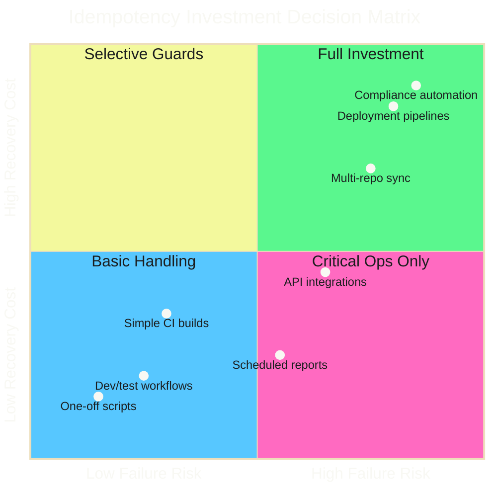

# Decision Matrix

!!! tip "Investment Guide"
    Not every workflow needs bulletproof idempotency. Use this matrix to decide how much investment makes sense.

## Visual Guide

---

## Scoring Factors

| Factor | Low Priority (0 pts) | High Priority (1 pt) |
| -------- | --------------------- | ---------------------- |
| **Failure frequency** | Rarely fails | Fails often (network, APIs, rate limits) |
| **Recovery cost** | Quick manual fix | Hours of manual intervention |
| **Operation count** | Single operation | Many operations (matrix, loops) |
| **Schedule** | Manual trigger only | Cron/scheduled runs |
| **Criticality** | Nice-to-have | Business critical |
| **State complexity** | Simple/stateless | Complex state across systems |

---

## Scoring Guide

**0-2 points**: Minimal idempotency. Basic error handling sufficient.

**3-4 points**: Selective idempotency. Make critical operations idempotent, accept some manual recovery.

**5-6 points**: Full idempotency. Invest in comprehensive guards and state management.

---

## When NOT to Invest

### One-Off Scripts

If you're running something once and throwing away the code, don't over-engineer.

### Fast Manual Recovery

If fixing a failed run takes 30 seconds manually, spending hours on idempotency guards isn't worth it.

### Truly Unique Operations

Some things should only happen once. User signup, payment processing, audit log entries. These need different patterns (exactly-once semantics, transaction logs).

### Development/Testing

Local development scripts don't need production-grade idempotency. Optimize for iteration speed.
