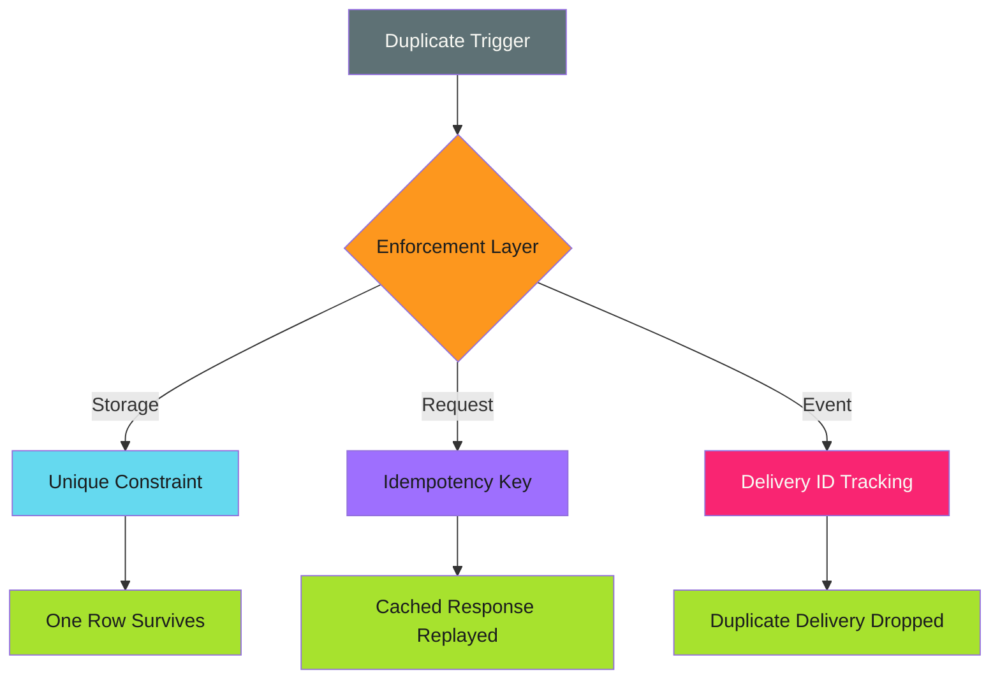

# Deduplication

Prevent duplicate operations before they land, not after.

---

## The Pattern

Deduplication is idempotency applied at a boundary: storage, request, or event. Instead of making an operation safe to repeat, deduplication stops the repeat from producing a second effect in the first place.



!!! info "Related but Distinct"

    [Unique Identifiers](unique-identifiers.md) covers deriving deterministic IDs for naming resources. Deduplication covers enforcing that duplicates targeting the same ID or event get rejected or collapsed, at the database, the API, or the message consumer.

---

## When to Use

!!! success "Good Fit"

    - APIs that must survive client retries without double-charging or double-creating
    - Databases where a business key must map to exactly one row
    - Message consumers reading from at-least-once delivery queues
    - Webhook receivers where the sender retries on timeout

!!! warning "Poor Fit"

    - Single-writer, single-attempt operations with no retry path
    - Systems where duplicate side effects are cheap and self-correcting
    - Cases where [Check-Before-Act](check-before-act.md) alone already closes the gap

---

## Unique Constraint Enforcement

Push deduplication into the storage layer. Let the database reject the duplicate instead of relying on application logic to catch it first.

```sql
CREATE TABLE subscriptions (
  tenant_id UUID NOT NULL,
  plan_code TEXT NOT NULL,
  activated_at TIMESTAMPTZ NOT NULL DEFAULT now(),
  UNIQUE (tenant_id, plan_code)
);

INSERT INTO subscriptions (tenant_id, plan_code)
VALUES ($1, $2)
ON CONFLICT (tenant_id, plan_code) DO NOTHING;
```

!!! tip "Constraint Beats Check"

    A `SELECT` followed by an `INSERT` has a race window between the two statements. A unique constraint closes that window because the database enforces it atomically, even under concurrent writers.

Composite constraints handle the common case where uniqueness depends on more than one column:

```sql
-- A webhook event is unique per source system, not globally
CREATE TABLE processed_events (
  source TEXT NOT NULL,
  event_id TEXT NOT NULL,
  processed_at TIMESTAMPTZ NOT NULL DEFAULT now(),
  PRIMARY KEY (source, event_id)
);
```

When the application catches the constraint violation instead of avoiding it, log the collision and move on:

```python
try:
    insert_subscription(tenant_id, plan_code)
except UniqueViolation:
    log.info("subscription already active, skipping duplicate activation")
```

---

## Idempotency Keys

Idempotency keys move deduplication to the API boundary. A client generates a key once per logical operation and sends it with every retry of that operation. The server treats requests carrying the same key as one operation, no matter how many times they arrive.

```sql
CREATE TABLE idempotency_keys (
  key TEXT PRIMARY KEY,
  request_hash TEXT NOT NULL,
  status TEXT NOT NULL DEFAULT 'processing',
  response_body JSONB,
  created_at TIMESTAMPTZ NOT NULL DEFAULT now(),
  expires_at TIMESTAMPTZ NOT NULL
);
```

Server-side flow:

```python
def handle_request(key, request_body):
    request_hash = hash(request_body)

    existing = db.query(
        "SELECT status, response_body, request_hash "
        "FROM idempotency_keys WHERE key = %s", key
    )

    if existing:
        if existing.request_hash != request_hash:
            raise ConflictError("key reused with a different payload")
        if existing.status == "completed":
            return existing.response_body
        raise ConflictError("request with this key is already in flight")

    # Row insert doubles as the concurrency lock: a second concurrent
    # request with the same key fails on the primary key constraint.
    db.execute(
        "INSERT INTO idempotency_keys (key, request_hash, expires_at) "
        "VALUES (%s, %s, %s)",
        key, request_hash, now() + timedelta(hours=24)
    )

    result = perform_operation(request_body)

    db.execute(
        "UPDATE idempotency_keys SET status = 'completed', response_body = %s "
        "WHERE key = %s",
        result, key
    )
    return result
```

Client side, the key is generated once and reused across retries:

```python
idempotency_key = str(uuid4())

for attempt in range(max_retries):
    response = client.post(
        "/api/payments",
        headers={"Idempotency-Key": idempotency_key},
        json=payload,
    )
    if response.status_code < 500:
        break
```

!!! warning "Scope the Key"

    An idempotency key without a scope is a collision waiting to happen. Scope keys per client, per endpoint, or per tenant so two unrelated callers can't collide on the same key value.

---

## Request Deduplication

Idempotency keys deduplicate across retries over time. Request deduplication (also called request coalescing or single-flight) deduplicates concurrent requests that arrive at almost the same moment, before either one has finished.

```python
in_flight = {}
lock = threading.Lock()

def get_or_fetch(request_key, fetch_fn):
    with lock:
        future = in_flight.get(request_key)
        if future is None:
            future = concurrent.futures.Future()
            in_flight[request_key] = future
            leader = True
        else:
            leader = False

    if leader:
        try:
            result = fetch_fn()
            future.set_result(result)
        finally:
            with lock:
                del in_flight[request_key]
        return result

    return future.result()
```

The first caller for a given key does the work. Every concurrent caller for the same key waits on the same result instead of triggering a second, redundant execution.

This is a runtime pattern, not a persisted one. It collapses duplicate work within a process. It composes with idempotency keys, which handle cross-process and cross-retry safety.

---

## Event and Webhook Deduplication

Message queues and webhook senders generally guarantee at-least-once delivery, not exactly-once. Every consumer that cares about duplicates has to deduplicate on the receiving end using the delivery identifier the sender provides.

```yaml
# GitHub webhook payload includes a delivery ID header
# X-GitHub-Delivery: 72d3162e-cc78-11e3-81ab-4c9367dc0958
```

```python
def handle_webhook(delivery_id, source, payload):
    try:
        db.execute(
            "INSERT INTO processed_events (source, event_id) VALUES (%s, %s)",
            source, delivery_id
        )
    except UniqueViolation:
        log.info("duplicate delivery %s from %s, skipping", delivery_id, source)
        return

    process_event(payload)
```

For high-volume event streams, a time-bounded dedup window keeps the tracking table small instead of growing forever:

```sql
CREATE TABLE processed_events (
  source TEXT NOT NULL,
  event_id TEXT NOT NULL,
  processed_at TIMESTAMPTZ NOT NULL DEFAULT now(),
  PRIMARY KEY (source, event_id)
);

-- Run on a schedule: drop entries outside the redelivery window
DELETE FROM processed_events WHERE processed_at < now() - INTERVAL '7 days';
```

!!! tip "Match the Window to Redelivery Guarantees"

    Set the retention window to at least the maximum redelivery delay of the sending system. A window that's too short lets a late retry through as if it were new.

---

## Choosing Where to Enforce

| Boundary | Mechanism | Closes |
| -------- | --------- | ------ |
| Storage | Unique constraint | Two writers racing to create the same row |
| API request | Idempotency key | A client retrying the same logical operation |
| Concurrent request | Single-flight coalescing | Two callers hitting the same endpoint at once |
| Event/webhook | Delivery ID tracking | At-least-once redelivery from a queue or sender |

These layers stack. A payment API typically uses an idempotency key at the request boundary and a unique constraint on the ledger table underneath it, so even a bug in the key-checking logic can't produce two ledger rows.

---

## Edge Cases and Gotchas

### Key Reuse With a Different Payload

A client that reuses an idempotency key for a different request body is a bug, not a duplicate. Compare the stored request hash and reject the mismatch instead of silently returning the old response.

### In-Flight Collisions

Two requests with the same key arriving before the first one finishes must not both proceed. Insert the key row before doing the work, not after, so the second request's insert fails against the constraint.

### Unbounded Tracking Tables

An idempotency key or event ID table with no expiry grows forever. Set `expires_at` on write and prune on a schedule, sized to the longest realistic retry or redelivery window.

### Clock Skew on Expiry

Expiring keys based on client-supplied timestamps is unsafe. Compute `expires_at` from server time when the key is first stored.

---

## Anti-Patterns

### Check-Then-Insert Instead of a Constraint

```sql
-- Bad: race window between SELECT and INSERT
SELECT 1 FROM subscriptions WHERE tenant_id = $1 AND plan_code = $2;
INSERT INTO subscriptions (tenant_id, plan_code) VALUES ($1, $2);
```

```sql
-- Good: constraint closes the race
INSERT INTO subscriptions (tenant_id, plan_code)
VALUES ($1, $2)
ON CONFLICT (tenant_id, plan_code) DO NOTHING;
```

### Deduplicating on a Non-Unique Field

```python
# Bad: two different events can share a timestamp
if event.timestamp in seen_timestamps:
    return
```

```python
# Good: use the sender's delivery identifier
if event.delivery_id in seen_delivery_ids:
    return
```

### Trusting an Unscoped Key

```python
# Bad: any client can collide with any other client's key
idempotency_keys[key] = result
```

```python
# Good: scope the key to the caller
idempotency_keys[(tenant_id, key)] = result
```

---

## Comparison with Other Patterns

| Aspect | Deduplication | [Unique Identifiers](unique-identifiers.md) | [Check-Before-Act](check-before-act.md) |
| ------ | ------------- | -------------------------------------------- | ----------------------------------------- |
| Primary concern | Rejecting a duplicate operation | Naming a resource deterministically | Verifying state before acting |
| Race condition safe | Yes, when backed by a constraint | N/A | No |
| Where enforced | Storage, request, or event boundary | ID generation logic | Application logic |
| Typical mechanism | Unique constraint, idempotency key, delivery ID | Content hash | Existence query |

---

## Summary

Deduplication stops the second copy of an operation from ever landing.

!!! abstract "Key Takeaways"

    1. **Enforce at the storage layer first** - a unique constraint closes race windows an application check cannot
    2. **Scope idempotency keys** - per client, per endpoint, or per tenant, never global
    3. **Deduplicate events on the delivery ID** - at-least-once queues make consumer-side dedup mandatory, not optional
    4. **Bound the tracking window** - expire keys and prune event IDs so tracking tables don't grow forever
