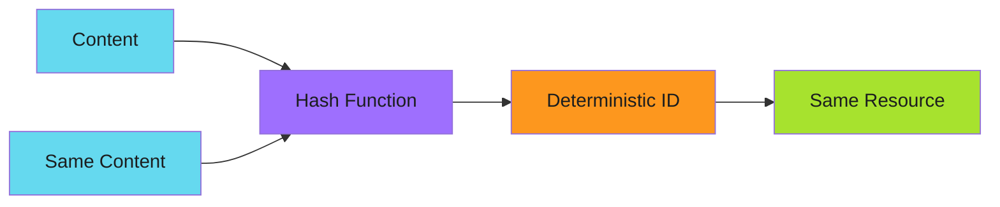

# Unique Identifiers

Make duplicates impossible by design.

---

## The Pattern

```bash
# Generate deterministic ID from content
ID="resource-$(sha256sum content.txt | cut -c1-8)"
create_resource "$ID"
```

When IDs are derived deterministically from content or context, duplicate operations naturally target the same resource instead of creating new ones.



!!! info "Content-Addressable by Design"

    Same input always produces the same ID. Run twice with identical content, get identical IDs, target the same resource. Deduplication is automatic.

---

## When to Use

!!! success "Good Fit"

    - Content-addressable storage (same content = same ID)
    - Batch operations where items need stable identifiers
    - Distributed systems where multiple workers might process the same item
    - Operations that should be deduplicated by content, not time

!!! warning "Poor Fit"

    - Resources that need human-readable names
    - Operations where duplicate content should create separate resources
    - Simple cases where check-before-act suffices

---

## Examples

### Content-Based Branch Names

```bash
# Branch name derived from file content hash
CONTENT_HASH=$(sha256sum "$SOURCE_FILE" | cut -c1-8)
BRANCH="sync-${CONTENT_HASH}"

git checkout -b "$BRANCH"
```

If the same content is synced multiple times, it always uses the same branch name.

### Deterministic PR Titles

```bash
# PR identifier based on source and target
PR_KEY="${SOURCE_REPO}-to-${TARGET_REPO}-${FILE_PATH}"
PR_TITLE="Sync: $PR_KEY"

# Check using the deterministic title
if ! gh pr list --search "in:title $PR_KEY" --json number | jq -e 'length > 0'; then
  gh pr create --title "$PR_TITLE" --body "Automated sync"
fi
```

### Run-Based Identifiers

```bash
# Combine workflow context for unique but deterministic ID
RUN_KEY="${GITHUB_REPOSITORY}-${GITHUB_RUN_ID}-${GITHUB_RUN_ATTEMPT}"

# Use for artifacts, logs, or state files
ARTIFACT_NAME="build-${RUN_KEY}"
```

### Date-Based Identifiers

```bash
# Daily report - same day = same file
REPORT_DATE=$(date +%Y-%m-%d)
REPORT_FILE="reports/daily-${REPORT_DATE}.json"

# Running twice on same day overwrites same file (idempotent)
generate_report > "$REPORT_FILE"
```

### Composite Keys

```bash
# Combine multiple attributes for uniqueness
DEPLOY_KEY="${ENVIRONMENT}-${SERVICE}-${VERSION}"
TAG="deploy-${DEPLOY_KEY}"

# Tagging is idempotent when tag name is deterministic
git tag -f "$TAG"
```

---

## Hash-Based Strategies

### SHA-256 for Content

```bash
# Full hash for maximum uniqueness
HASH=$(sha256sum file.txt | cut -c1-64)

# Short hash for readability (collision risk increases)
SHORT_HASH=$(sha256sum file.txt | cut -c1-8)
```

!!! warning "Hash Length Tradeoffs"

   | Length | Bits | Collision likely at |
    | -------- |------ | --------------------- |
   | 4 chars | 16 | ~256 items |
   | 8 chars | 32 | ~65,000 items |
   | 16 chars | 64 | ~4 billion items |

    For small datasets, 8 chars is usually fine. For large-scale systems, use 16+.

### MD5 for Speed (Non-Security)

```bash
# Faster but not cryptographically secure
HASH=$(md5sum file.txt | cut -c1-32)
```

### Git Object Hash

```bash
# Hash content as git would
HASH=$(git hash-object file.txt)
```

### Combined Hashes

```bash
# Hash multiple inputs together
COMBINED_HASH=$(echo "${INPUT1}${INPUT2}${INPUT3}" | sha256sum | cut -c1-16)
```

---

## GitHub Actions Examples

### Content-Addressed Cache Keys

```yaml
- uses: actions/cache@v4
  with:
    path: node_modules
    # Key derived from lock file content
    key: npm-${{ hashFiles('package-lock.json') }}
```

!!! tip "GitHub's hashFiles Function"

    `hashFiles()` is purpose-built for deterministic cache keys. It handles glob patterns, sorts files consistently, and produces stable SHA-256 hashes across runs.

### Deterministic Artifact Names

```yaml
- name: Generate artifact name
  id: artifact
  run: |
    # Artifact name from commit + workflow
    NAME="build-${{ github.sha }}-${{ github.run_number }}"
    echo "name=$NAME" >> "$GITHUB_OUTPUT"

- uses: actions/upload-artifact@v4
  with:
    name: ${{ steps.artifact.outputs.name }}
    path: dist/
```

### Matrix-Based Identifiers

```yaml
jobs:
  build:
    strategy:
      matrix:
        os: [ubuntu, windows, macos]
        node: [18, 20]
    steps:
      - name: Set cache key
        run: |
          # Unique per matrix combination
          KEY="deps-${{ matrix.os }}-node${{ matrix.node }}-${{ hashFiles('**/package-lock.json') }}"
          echo "CACHE_KEY=$KEY" >> "$GITHUB_ENV"
```

---

## Database Patterns

### Natural Keys

```sql
-- Use business identifier instead of auto-increment
CREATE TABLE users (
  email VARCHAR(255) PRIMARY KEY,  -- Natural key
  name VARCHAR(255)
);

-- Insert is idempotent on email
INSERT INTO users (email, name)
VALUES ('user@example.com', 'User')
ON CONFLICT (email) DO UPDATE SET name = EXCLUDED.name;
```

### Idempotency Keys

```sql
-- Track processed requests by unique key
CREATE TABLE processed_requests (
  idempotency_key VARCHAR(64) PRIMARY KEY,
  result JSONB,
  created_at TIMESTAMP DEFAULT NOW()
);

-- Check before processing
SELECT result FROM processed_requests WHERE idempotency_key = $1;
```

---

## Edge Cases and Gotchas

### Hash Collisions

Short hashes increase collision probability:

```bash
# 8 hex chars = 32 bits = collision likely around 65k items
SHORT_HASH=$(sha256sum file.txt | cut -c1-8)
```

**Mitigation**: Use longer hashes for large datasets, or accept rare collisions.

### Unstable Inputs

Non-deterministic content produces different hashes:

```bash
# Bad: timestamp changes hash every run
echo "Generated at $(date)" > file.txt
HASH=$(sha256sum file.txt | cut -c1-8)

# Good: exclude timestamps from hashed content
echo "Static content" > file.txt
HASH=$(sha256sum file.txt | cut -c1-8)
```

### Whitespace and Encoding

Different platforms might produce different hashes:

```bash
# Windows vs Unix line endings
echo -e "line1\r\nline2" | sha256sum  # Different from
echo -e "line1\nline2" | sha256sum
```

**Mitigation**: Normalize content before hashing.

### Hash Algorithm Changes

Changing algorithms invalidates all existing IDs:

```bash
# Migration nightmare if you switch from MD5 to SHA-256
OLD_ID=$(md5sum file.txt | cut -c1-32)
NEW_ID=$(sha256sum file.txt | cut -c1-64)  # Different!
```

---

## Anti-Patterns

### Random Components in "Deterministic" IDs

```bash
# Bad: includes random element
ID="resource-$(date +%s)-$RANDOM"

# Good: fully deterministic
ID="resource-$(sha256sum content.txt | cut -c1-16)"
```

### Hashing Volatile Data

```bash
# Bad: process ID changes every run
ID="job-$$-$(sha256sum file.txt | cut -c1-8)"

# Good: only hash stable content
ID="job-$(sha256sum file.txt | cut -c1-8)"
```

### Ignoring Hash Prefix Collisions

```bash
# Risky with many items
ID=$(sha256sum file.txt | cut -c1-4)  # Only 16 bits!

# Safer
ID=$(sha256sum file.txt | cut -c1-16)  # 64 bits
```

---

## Comparison with Other Patterns

| Aspect | [Check-Before-Act](check-before-act.md) | [Upsert](upsert.md) | Unique Identifiers |
| -------- | ----------------- | -------- | ------------------- |
| Requires existence check | Yes | No | No |
| Natural deduplication | No | No | Yes |
| ID predictability | N/A | N/A | High |
| Complexity | Low | Low | Medium |

---

## Summary

Unique identifiers make idempotency automatic.

!!! abstract "Key Takeaways"

    1. **Derive IDs from content** - same input = same ID = same resource
    2. **Use sufficient hash length** - balance readability vs collision risk
    3. **Keep inputs stable** - don't hash timestamps or random data
    4. **Consider the scope** - workflow run, day, content version?
