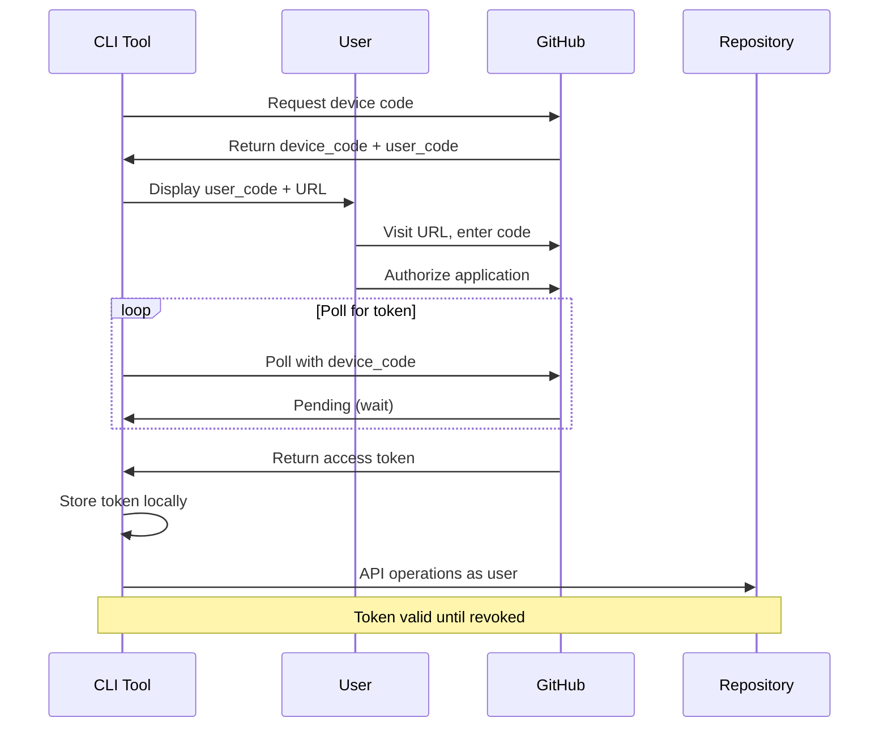

## Device Flow

For CLI tools and headless environments without browser access.

### Flow Diagram



### Step 1: Request Device Code

```python
import requests
import time

def request_device_code(client_id, scope='repo user'):
    """Request device and user codes from GitHub"""

    response = requests.post(
        'https://github.com/login/device/code',
        json={
            'client_id': client_id,
            'scope': scope,
        },
        headers={
            'Accept': 'application/json',
        },
    )

    response.raise_for_status()
    return response.json()

# Request device code
device_data = request_device_code('Iv1.your_client_id')

print(f"""
Please visit: {device_data['verification_uri']}
And enter code: {device_data['user_code']}

Waiting for authorization...
""")
```

### Step 2: Poll for Access Token

```python
def poll_for_token(client_id, device_code, interval):
    """Poll GitHub for access token approval"""

    while True:
        time.sleep(interval)

        response = requests.post(
            'https://github.com/login/oauth/access_token',
            json={
                'client_id': client_id,
                'device_code': device_code,
                'grant_type': 'urn:ietf:params:oauth:grant-type:device_code',
            },
            headers={
                'Accept': 'application/json',
            },
        )

        data = response.json()

        if 'access_token' in data:
            return data['access_token']
        elif data.get('error') == 'authorization_pending':
            continue  # Keep polling
        elif data.get('error') == 'slow_down':
            interval += 5  # Increase polling interval
            continue
        else:
            raise Exception(f"Authorization failed: {data.get('error_description')}")

# Poll for token
access_token = poll_for_token(
    client_id='Iv1.your_client_id',
    device_code=device_data['device_code'],
    interval=device_data['interval'],
)

print("Authorization successful!")
```

### Complete Device Flow Example

```python
#!/usr/bin/env python3
"""
CLI tool demonstrating GitHub App OAuth device flow
"""

import requests
import time
import json
import os
from pathlib import Path

CLIENT_ID = 'Iv1.your_client_id'
TOKEN_FILE = Path.home() / '.github-cli-token'

def device_flow_auth():
    """Perform device flow authentication"""

    # Step 1: Request device code
    print("Requesting device code...")
    response = requests.post(
        'https://github.com/login/device/code',
        json={'client_id': CLIENT_ID, 'scope': 'repo user'},
        headers={'Accept': 'application/json'},
    )
    device_data = response.json()

    # Step 2: Display user instructions
    print(f"""
╔══════════════════════════════════════════════════════════╗
║  GitHub Authorization Required                           ║
╠══════════════════════════════════════════════════════════╣
║  1. Visit: {device_data['verification_uri']:43}║
║  2. Enter code: {device_data['user_code']:38}║
╚══════════════════════════════════════════════════════════╝

Waiting for authorization...
    """)

    # Step 3: Poll for token
    interval = device_data['interval']

    while True:
        time.sleep(interval)

        response = requests.post(
            'https://github.com/login/oauth/access_token',
            json={
                'client_id': CLIENT_ID,
                'device_code': device_data['device_code'],
                'grant_type': 'urn:ietf:params:oauth:grant-type:device_code',
            },
            headers={'Accept': 'application/json'},
        )

        data = response.json()

        if 'access_token' in data:
            print("✓ Authorization successful!")
            return data['access_token']
        elif data.get('error') == 'authorization_pending':
            print(".", end="", flush=True)
            continue
        elif data.get('error') == 'slow_down':
            interval += 5
            continue
        elif data.get('error') == 'expired_token':
            print("\n✗ Device code expired. Please try again.")
            return None
        else:
            print(f"\n✗ Authorization failed: {data.get('error_description')}")
            return None

def save_token(token):
    """Save token to local file"""
    TOKEN_FILE.write_text(json.dumps({'access_token': token}))
    TOKEN_FILE.chmod(0o600)  # Secure permissions

def load_token():
    """Load token from local file"""
    if TOKEN_FILE.exists():
        data = json.loads(TOKEN_FILE.read_text())
        return data.get('access_token')
    return None

def verify_token(token):
    """Verify token is still valid"""
    response = requests.get(
        'https://api.github.com/user',
        headers={
            'Authorization': f'Bearer {token}',
            'Accept': 'application/vnd.github+json',
        },
    )
    return response.status_code == 200

def get_authenticated_user(token):
    """Get authenticated user details"""
    response = requests.get(
        'https://api.github.com/user',
        headers={
            'Authorization': f'Bearer {token}',
            'Accept': 'application/vnd.github+json',
        },
    )
    return response.json()

def main():
    # Try to load existing token
    token = load_token()

    if token and verify_token(token):
        print("Using cached credentials")
    else:
        print("No valid credentials found")
        token = device_flow_auth()
        if token:
            save_token(token)
        else:
            print("Authentication failed")
            return

    # Use token
    user = get_authenticated_user(token)
    print(f"\nAuthenticated as: {user['login']}")
    print(f"Name: {user.get('name', 'N/A')}")
    print(f"Email: {user.get('email', 'N/A')}")

if __name__ == '__main__':
    main()
```

!!! tip "Token Caching"

    Device flow is interactive and time-consuming. Cache tokens locally and verify before requesting new ones.

## Token Storage and Security

### Secure Token Storage

```python
import keyring
import json

def store_token_secure(username, token):
    """Store token in system keychain"""
    keyring.set_password('github-app', username, token)

def retrieve_token_secure(username):
    """Retrieve token from system keychain"""
    return keyring.get_password('github-app', username)

# Usage
store_token_secure('user@example.com', access_token)
token = retrieve_token_secure('user@example.com')
```

### Database Storage

```python
from cryptography.fernet import Fernet
import os

# Generate encryption key (store securely, not in code)
ENCRYPTION_KEY = os.environ['TOKEN_ENCRYPTION_KEY']

def encrypt_token(token):
    """Encrypt token for database storage"""
    f = Fernet(ENCRYPTION_KEY)
    return f.encrypt(token.encode()).decode()

def decrypt_token(encrypted_token):
    """Decrypt token from database"""
    f = Fernet(ENCRYPTION_KEY)
    return f.decrypt(encrypted_token.encode()).decode()

# Store in database
encrypted = encrypt_token(access_token)
# db.execute("INSERT INTO tokens (user_id, encrypted_token) VALUES (?, ?)",
#            (user_id, encrypted))

# Retrieve from database
# result = db.execute("SELECT encrypted_token FROM tokens WHERE user_id = ?", (user_id,))
# token = decrypt_token(result[0]['encrypted_token'])
```

!!! danger "Token Storage Security"

    - **Never store tokens in plain text**
    - Use system keychain (macOS Keychain, Windows Credential Manager)
    - Encrypt tokens before database storage
    - Use secure environment variables for encryption keys
    - Implement token rotation and expiration

## Token Refresh and Expiration

OAuth tokens for GitHub Apps do not expire automatically but should be refreshed periodically.

### Check Token Validity

```python
def check_token_status(access_token):
    """Check if token is still valid and get user info"""

    response = requests.get(
        'https://api.github.com/user',
        headers={
            'Authorization': f'Bearer {access_token}',
            'Accept': 'application/vnd.github+json',
        },
    )

    if response.status_code == 200:
        return {'valid': True, 'user': response.json()}
    elif response.status_code == 401:
        return {'valid': False, 'reason': 'Token revoked or expired'}
    else:
        return {'valid': False, 'reason': f'Error: {response.status_code}'}
```

### Token Refresh Strategy

```python
from datetime import datetime, timedelta

class TokenManager:
    def __init__(self, token, acquired_at=None):
        self.token = token
        self.acquired_at = acquired_at or datetime.now()

    def should_refresh(self, max_age_days=90):
        """Check if token should be refreshed based on age"""
        age = datetime.now() - self.acquired_at
        return age > timedelta(days=max_age_days)

    def get_valid_token(self):
        """Get valid token, refreshing if needed"""
        if self.should_refresh():
            # Trigger re-authentication flow
            return None  # Signal that new auth is needed

        # Verify token still works
        status = check_token_status(self.token)
        if not status['valid']:
            return None  # Signal that new auth is needed

        return self.token
```
