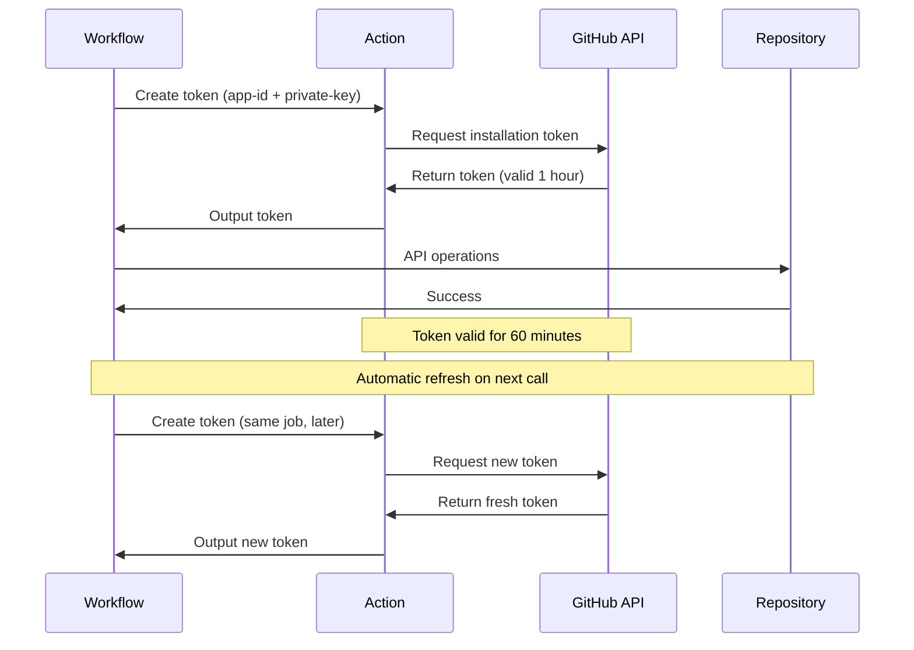

# Token Refresh Patterns

## Token Expiration

Installation tokens expire after **1 hour**.



## Automatic Token Refresh

The action automatically generates fresh tokens on each call.

```yaml
jobs:
  long-running:
    runs-on: ubuntu-latest
    steps:
      - name: Initial token
        id: token1
        uses: actions/create-github-app-token@v2
        with:
          app-id: ${{ secrets.CORE_APP_ID }}
          private-key: ${{ secrets.CORE_APP_PRIVATE_KEY }}
          owner: adaptive-enforcement-lab

      - name: Operation 1 (using token1)
        env:
          GH_TOKEN: ${{ steps.token1.outputs.token }}
        run: gh repo list adaptive-enforcement-lab --limit 50

      # ... 50 minutes of processing ...

      - name: Refresh token
        id: token2
        uses: actions/create-github-app-token@v2
        with:
          app-id: ${{ secrets.CORE_APP_ID }}
          private-key: ${{ secrets.CORE_APP_PRIVATE_KEY }}
          owner: adaptive-enforcement-lab

      - name: Operation 2 (using fresh token2)
        env:
          GH_TOKEN: ${{ steps.token2.outputs.token }}
        run: gh repo list adaptive-enforcement-lab --limit 50
```

!!! tip "Token Refresh Strategy"

    For workflows longer than 30 minutes, regenerate tokens periodically to avoid expiration errors.

## Error Handling for Expired Tokens

For workflows that may exceed token lifetime, regenerate tokens periodically or implement retry logic with token refresh between attempts.

## Related Documentation

- [Token Generation](../token-generation/index.md) - Creating installation tokens
- [Long Workflows](long-workflows.md) - Managing tokens in extended workflows
- [Caching & Rate Limits](caching-rate-limits.md) - Token reuse strategies
- [Security Best Practices](../token-generation/lifecycle-security.md) - Secure token handling

## References

- [actions/create-github-app-token](https://github.com/actions/create-github-app-token) - Official action documentation
- [Installation Access Tokens](https://docs.github.com/en/rest/apps/installations#create-an-installation-access-token-for-an-app)
