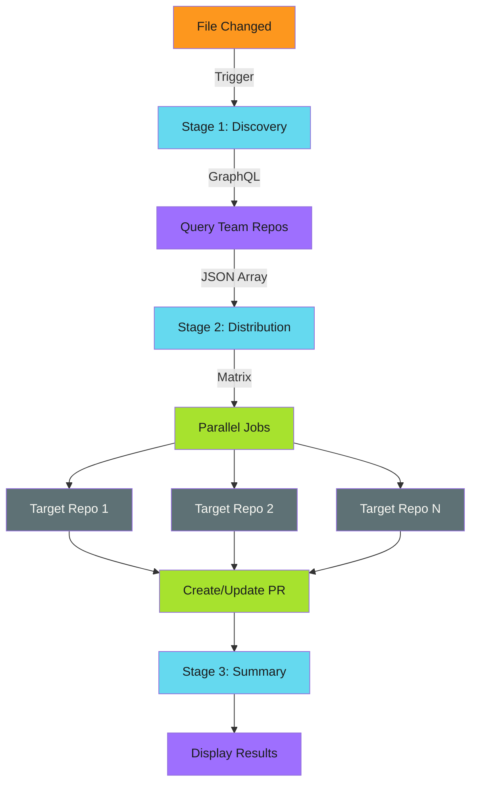

# Architecture

This workflow implements the [Three-Stage Design][three-stage] pattern
with [Matrix Distribution][matrix] for parallel processing.

!!! tip "Separation of Concerns"
    Discovery finds targets. Distribution processes them in parallel. Summary reports results. Each stage has a single responsibility.

[three-stage]: ../../../../patterns/architecture/three-stage-design.md
[matrix]: ../../../../patterns/architecture/matrix-distribution/index.md

## Workflow Overview



## Stage Summary

| Stage | Purpose | Implementation |
| ----- | ------- | -------------- |
| [Discovery](discovery-stage.md) | Find target repositories via GraphQL | Query team membership |
| [Distribution](distribution-stage.md) | Copy files and create PRs in parallel | Matrix strategy |
| [Summary](summary-stage.md) | Report results | Workflow step summary |

## Applied Patterns

This workflow demonstrates several patterns from the [Developer Guide][dev-guide]:

| Pattern | Application |
| ------- | ----------- |
| [Three-Stage Design][three-stage] | Separates discovery, execution, and reporting |
| [Matrix Distribution][matrix] | Parallelizes file distribution across repos |
| [Idempotency][idempotency] | Makes reruns safe with change detection |

[dev-guide]: ../../../../patterns/index.md
[idempotency]: ../../../../patterns/efficiency/idempotency/index.md

## Key Configuration

```yaml
strategy:
  matrix:
    repo: ${{ fromJson(needs.discover.outputs.repositories) }}
  fail-fast: false   # Continue if individual repos fail
  max-parallel: 10   # Respect API rate limits
```

For detailed implementation of each stage, see the stage-specific pages.
