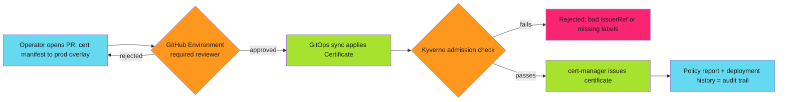

# Gated Certificate Operator Promotion

Certificates are identity. Promoting a `cert-manager` `Certificate` from staging to production without a gate is the same mistake as merging to `main` without a review. The blast radius is just bigger: every mTLS connection in the fleet.

This pattern combines three primitives you likely already run: cert-manager for issuance, Kyverno for admission-time policy, and GitHub Environments for human approval. None of them is new. The pattern is wiring them into a single promotion path that cannot be skipped.

!!! note "Separation of Duties, Enforced Not Requested"
    The operator who requests a certificate promotion must not be the operator who approves it into production. Don't write that rule in a runbook. Encode it in a required reviewer list and let GitHub reject the merge if it is violated.

## The Three Gates

| Gate | Mechanism | What It Blocks |
| :--- | :--- | :--- |
| **Admission** | Kyverno `ClusterPolicy` | Certificates issued by an unapproved `ClusterIssuer`, missing renewal windows, or targeting production namespaces without the right labels |
| **Approval** | GitHub Environment with required reviewers | A promotion PR merging into the production overlay without a second, independent sign-off |
| **Audit** | cert-manager events plus GitHub deployment history | Silent, untracked certificate rotation with no linked change |

### Gate 1: cert-manager issues, Kyverno validates

Certificates flow through cert-manager's `Certificate` and `ClusterIssuer` pair. The promotion gate is not in cert-manager itself. It is in what Kyverno allows onto the cluster.

```yaml
apiVersion: cert-manager.io/v1
kind: Certificate
metadata:
  name: payments-api-tls
  namespace: prod-payments
spec:
  secretName: payments-api-tls
  duration: 2160h # 90d
  renewBefore: 360h # 15d
  issuerRef:
    name: prod-ca-issuer
    kind: ClusterIssuer
    group: cert-manager.io
  dnsNames:
    - payments-api.internal.example.com
```

Kyverno gates what `issuerRef` is even legal in a production namespace. A staging certificate pointed at `prod-ca-issuer` never reaches the cluster:

```yaml
apiVersion: kyverno.io/v1
kind: ClusterPolicy
metadata:
  name: restrict-production-issuers
spec:
  validationFailureAction: enforce
  background: true
  rules:
    - name: block-non-prod-issuer-in-prod-namespace
      match:
        resources:
          kinds:
            - Certificate
          namespaceSelector:
            matchLabels:
              environment-tier: production
      validate:
        message: >-
          Certificates in production namespaces must reference an approved
          production ClusterIssuer. Staging and dev issuers are not promoted.
        pattern:
          spec:
            issuerRef:
              kind: ClusterIssuer
              name: "prod-*"
```

That single rule is the technical half of gated promotion. No operator, however senior, can hand-apply a certificate against the wrong issuer in a production namespace. The policy enforces the boundary. Nobody has to remember it.

See the full set of production-ready rules in the [Kyverno policy template library](../../../enforce/policy-as-code/template-library/kyverno/index.md). Start in `audit` mode, watch violations for 48 hours, then flip to `enforce`.

### Gate 2: GitHub Environment as the human checkpoint

Admission control stops a bad manifest from running. It does not stop someone from opening the PR that changes `issuerRef` to `prod-ca-issuer` in the first place.

That is a human decision, and it needs a human gate: a GitHub [Environment](https://docs.github.com/en/actions/deployment/targeting-different-environments/using-environments-for-deployment) with required reviewers on the production overlay.

```yaml
# .github/workflows/promote-certificate.yml
name: Promote Certificate Manifest
on:
  pull_request:
    paths:
      - "clusters/prod/**/certificate.yaml"

jobs:
  promote:
    runs-on: ubuntu-latest
    environment:
      name: production-pki
    steps:
      - uses: actions/checkout@v4
      - name: Apply via GitOps sync
        run: ./scripts/sync-certificate.sh clusters/prod
```

`production-pki` is configured with required reviewers who are not the PR author, and, critically, not the same identity that manages the `ClusterIssuer` secret. That is the separation of duties from the note above, made structural instead of procedural.

Configure it the same way you would configure any tiered production repo. See [Branch Protection Enforcement Patterns](../../../enforce/branch-protection/index.md) for the tiering model (Standard, Enhanced, Maximum) and how to apply it consistently across a fleet of repos, not just one.

### Gate 3: audit trail, not a wiki page

Both gates above emit their own evidence for free:

- Kyverno policy reports (`kubectl get cpolr`) show every certificate that was evaluated and why it passed or failed.
- The GitHub Environment's deployment history shows who approved the promotion, when, and against which commit.

Wire both into whatever log aggregation you already run. Do not build a fourth system to track promotions. The two you already have are the audit trail, if you stop discarding their output.

## Putting It Together



Neither gate alone is sufficient. Kyverno without the reviewer gate means a bad manifest gets a fast, automated rejection. But nothing stopped the operator from trying in the first place, and a same-day retry with a slightly different pattern could slip through.

The reviewer gate without Kyverno means trusting a human to catch a YAML diff under time pressure.

Together, the human decides whether a promotion should happen at all, and the cluster refuses to apply anything the policy does not recognize as legitimate, even if the reviewer missed it.

## Related Patterns

- [Kyverno Policy Templates](../../../enforce/policy-as-code/template-library/kyverno/index.md): the full admission-control library.
  Includes image validation and network policy gates that pair with certificate enforcement.
- [Branch Protection Enforcement Patterns](../../../enforce/branch-protection/index.md): tiered protection and required-reviewer configuration for the human half of the gate.
- [Fail Secure](../secure-by-design/fail-secure.md): the underlying principle. A rejected promotion should fail closed, not fall back to the last-known-good certificate silently.
