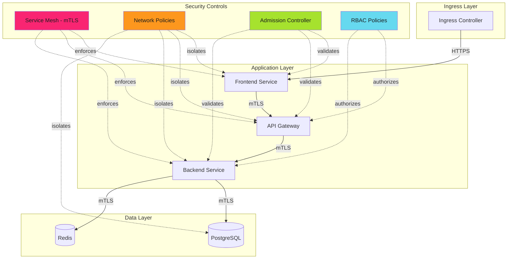

# End-to-End Deployment

Complete example combining all secure-by-design patterns into a production-ready deployment.

## Architecture Overview



## Namespace Configuration

```yaml
apiVersion: v1
kind: Namespace
metadata:
  name: production
  labels:
    istio-injection: enabled
    security-policy: enforced
    network-policy: restricted
```

## Zero Trust: Service Mesh mTLS

### Istio PeerAuthentication

```yaml
apiVersion: security.istio.io/v1beta1
kind: PeerAuthentication
metadata:
  name: default-mtls
  namespace: production
spec:
  mtls:
    mode: STRICT
```

### Authorization Policy

```yaml
apiVersion: security.istio.io/v1beta1
kind: AuthorizationPolicy
metadata:
  name: backend-authz
  namespace: production
spec:
  selector:
    matchLabels:
      app: backend
  action: ALLOW
  rules:
  - from:
    - source:
        principals: ["cluster.local/ns/production/sa/api-gateway"]
    to:
    - operation:
        methods: ["GET", "POST"]
        paths: ["/api/v1/*"]
```

## Defense in Depth: Pod Security

Backend deployment with full security hardening: non-root user, read-only filesystem, dropped capabilities, resource limits, and pod anti-affinity.

### Network Policy

```yaml
apiVersion: networking.k8s.io/v1
kind: NetworkPolicy
metadata:
  name: backend-netpol
  namespace: production
spec:
  podSelector:
    matchLabels:
      app: backend
  policyTypes:
  - Ingress
  - Egress
  ingress:
  - from:
    - podSelector:
        matchLabels:
          app: api-gateway
    ports:
    - protocol: TCP
      port: 8080
  egress:
  # Allow DNS
  - to:
    - namespaceSelector:
        matchLabels:
          name: kube-system
      podSelector:
        matchLabels:
          k8s-app: kube-dns
    ports:
    - protocol: UDP
      port: 53
  # Allow PostgreSQL
  - to:
    - podSelector:
        matchLabels:
          app: postgres
    ports:
    - protocol: TCP
      port: 5432
  # Allow Redis
  - to:
    - podSelector:
        matchLabels:
          app: redis
    ports:
    - protocol: TCP
      port: 6379
```

## Least Privilege: RBAC

### ServiceAccount

```yaml
apiVersion: v1
kind: ServiceAccount
metadata:
  name: backend-sa
  namespace: production
automountServiceAccountToken: false
```

### Role (if API access needed)

```yaml
apiVersion: rbac.authorization.k8s.io/v1
kind: Role
metadata:
  name: backend-role
  namespace: production
rules:
- apiGroups: [""]
  resources: ["configmaps"]
  resourceNames: ["backend-config", "feature-flags"]
  verbs: ["get", "watch"]
apiVersion: rbac.authorization.k8s.io/v1
kind: RoleBinding
metadata:
  name: backend-rolebinding
  namespace: production
subjects:
- kind: ServiceAccount
  name: backend-sa
  namespace: production
roleRef:
  kind: Role
  name: backend-role
  apiGroup: rbac.authorization.k8s.io
```

## Fail Secure: Admission Control

### ValidatingWebhookConfiguration

```yaml
apiVersion: admissionregistration.k8s.io/v1
kind: ValidatingWebhookConfiguration
metadata:
  name: production-security-policy
webhooks:
- name: validate.security.production.svc
  admissionReviewVersions: ["v1"]
  clientConfig:
    service:
      name: security-webhook
      namespace: security-system
      path: "/validate"
    caBundle: LS0tLS1CRUdJTi...
  failurePolicy: Fail
  sideEffects: None
  rules:
  - operations: ["CREATE", "UPDATE"]
    apiGroups: ["", "apps"]
    apiVersions: ["*"]
    resources: ["pods", "deployments"]
  namespaceSelector:
    matchLabels:
      security-policy: enforced
  timeoutSeconds: 10
```

### Policy Rules Enforced

The webhook validates:

1. **Image Registry**: Only gcr.io/my-project/* allowed
2. **Security Context**: runAsNonRoot: true required
3. **Privilege Escalation**: allowPrivilegeEscalation: false required
4. **Root Filesystem**: readOnlyRootFilesystem: true required
5. **Resource Limits**: CPU and memory limits required
6. **ServiceAccount**: No default ServiceAccount allowed

## Resource Quotas and Monitoring

Resource quotas limit namespace consumption. Prometheus ServiceMonitors collect metrics. Audit policies log all security-relevant events.

## Complete Deployment Workflow

1. Deploy namespace and base resources (namespace, resource quotas, default-deny policies)
2. Deploy security infrastructure (Istio mTLS, admission webhooks)
3. Deploy application components (ServiceAccounts, RBAC, deployments, services)
4. Deploy network policies (backend, API gateway, frontend)

## Security Audit Checklist {#security-audit-checklist}

!!! tip "Print This Checklist"
    Use before every production deployment. Missing even one item creates an exploitable gap.

Verify all controls:

### Zero Trust

- [ ] Istio PeerAuthentication configured with `mode: STRICT`
- [ ] AuthorizationPolicy defines allowed service-to-service communication
- [ ] No PERMISSIVE mTLS mode in namespace
- [ ] Certificate rotation configured (default 24h)
- [ ] Verify mTLS with: `istioctl authn tls-check`

### Defense in Depth

- [ ] Pod security contexts enforce `runAsNonRoot: true`
- [ ] `allowPrivilegeEscalation: false` on all containers
- [ ] `readOnlyRootFilesystem: true` on all containers
- [ ] All Linux capabilities dropped (`capabilities.drop: [ALL]`)
- [ ] Seccomp profile applied (`seccompProfile.type: RuntimeDefault`)
- [ ] Resource limits defined for all containers
- [ ] No privileged containers in namespace

### Network Policies

- [ ] Default-deny network policy in place
- [ ] Explicit ingress rules for each service
- [ ] Explicit egress rules for each service
- [ ] DNS access allowed to kube-dns only
- [ ] No wildcard (`0.0.0.0/0`) egress without justification
- [ ] Verify with: `kubectl describe netpol -n production`

### Least Privilege

- [ ] Dedicated ServiceAccount per workload
- [ ] `automountServiceAccountToken: false` unless API access needed
- [ ] No wildcard (`*`) in RBAC rules
- [ ] No cluster-admin or cluster-level permissions for workloads
- [ ] ResourceNames specified for sensitive resources
- [ ] Minimal verbs granted (prefer `get` over `list`)
- [ ] Review permissions: `kubectl auth can-i --list --as=system:serviceaccount:production:backend-sa`

### Fail Secure

- [ ] ValidatingWebhookConfiguration uses `failurePolicy: Fail`
- [ ] Webhook service has 3+ replicas
- [ ] PodDisruptionBudget ensures 2+ webhook pods available
- [ ] Webhook timeout configured (10s recommended)
- [ ] Test webhook failure: scale webhook to 0, try deploying pod
- [ ] Audit policy logs all denials

### Image Security

- [ ] Only approved registries allowed
- [ ] Image tags are immutable (not `latest`)
- [ ] Images signed and verified
- [ ] Vulnerability scanning in CI/CD
- [ ] No images older than 30 days

### Monitoring

- [ ] Audit logging enabled and forwarded
- [ ] Security metrics exported to Prometheus
- [ ] Alerting configured for policy violations
- [ ] Dashboard shows denied admissions
- [ ] Regular review of audit logs (weekly minimum)

!!! warning "Test Controls Before Trusting Them"
    Assume every security control is broken until you verify it works. Deploy a deliberately non-compliant pod and confirm it's rejected. Trust but verify.

## Testing the Security Posture

Use the following commands to verify security controls:

- **mTLS**: Deploy test pod without sidecar and verify connection fails
- **Network Policies**: Deploy test pod in different namespace and verify timeout
- **Admission Control**: Try creating privileged pod and verify rejection
- **RBAC**: Use `kubectl auth can-i` to verify permission denials

## Incident Response

If security controls are bypassed:

1. **Immediate**: Review audit logs for unauthorized changes
2. **Isolate**: Apply stricter network policies to contain breach
3. **Investigate**: Check webhook logs, admission decisions, RBAC changes
4. **Remediate**: Patch vulnerability, update policies
5. **Document**: Write postmortem, update runbooks

## References

- [Kubernetes Security Best Practices](https://kubernetes.io/docs/concepts/security/pod-security-standards/)
- [Istio Security Documentation](https://istio.io/latest/docs/concepts/security/)
- [Network Policy Recipes](https://github.com/ahmetb/kubernetes-network-policy-recipes)
- [RBAC Authorization](https://kubernetes.io/docs/reference/access-authn-authz/rbac/)
- [Admission Controllers](https://kubernetes.io/docs/reference/access-authn-authz/admission-controllers/)
*Security by design: zero trust, defense in depth, least privilege, fail secure. Enforce all layers.*
