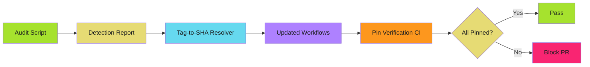
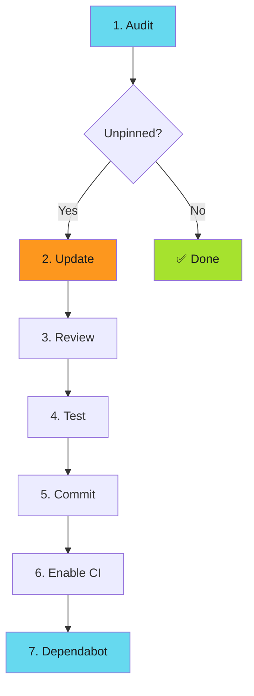

# Action Pinning Automation

Automate SHA pinning enforcement. Manual pinning doesn't scale.

!!! tip "The Approach"

    Audit → Generate SHA pins → Verify compliance → Enforce via CI

## Automation Strategy



## 1. Audit Script

Find workflows using tag references instead of SHA pins.

```python
#!/usr/bin/env python3
# audit-action-pins.py

import re, sys
from pathlib import Path

WORKFLOWS_DIR = Path(".github/workflows")
SHA_PATTERN = re.compile(r"@[0-9a-f]{40}$")
ACTION_PATTERN = re.compile(r"uses:\s*([^\s#]+)")

def audit_workflow(workflow_path):
    unpinned = []
    with open(workflow_path) as f:
        for num, line in enumerate(f, 1):
            if match := ACTION_PATTERN.search(line):
                action = match.group(1).strip('"\'')
                if not (action.startswith(("./", "docker://")) or SHA_PATTERN.search(action)):
                    unpinned.append((num, action))
    return unpinned

if not WORKFLOWS_DIR.exists():
    print(f"Error: {WORKFLOWS_DIR} not found")
    sys.exit(1)

print("=== GitHub Actions Pinning Audit ===\n")
total = 0

for workflow in WORKFLOWS_DIR.glob("*.y*ml"):
    print(f"Checking: {workflow}")
    unpinned = audit_workflow(workflow)
    if unpinned:
        for num, action in unpinned:
            print(f"  ❌ Line {num}: {action}")
            total += 1
    else:
        print("  ✅ All actions SHA-pinned")
    print()

print(f"=== Audit Summary ===\nUnpinned actions: {total}")
sys.exit(1 if total > 0 else 0)
```

**Usage**: `./audit-action-pins.py`

## 2. Tag-to-SHA Resolver

Convert tag references to SHA pins with version comments.

```bash
#!/usr/bin/env bash
# tag-to-sha-resolver.sh

set -euo pipefail

if ! command -v gh &> /dev/null; then
    echo "Error: GitHub CLI not found. Install: https://cli.github.com/"
    exit 1
fi

resolve() {
    local action_ref="$1"
    local owner_repo="${action_ref%@*}"
    local tag="${action_ref#*@}"

    # Skip if already SHA
    [[ "$tag" =~ ^[0-9a-f]{40}$ ]] && echo "$action_ref" && return

    # Query GitHub API
    local sha=$(gh api "repos/$owner_repo/commits/$tag" --jq '.sha' 2>/dev/null || echo "")
    [[ -z "$sha" ]] && echo "Error: Failed to resolve $action_ref" >&2 && return 1

    echo "${owner_repo}@${sha}  # ${tag}"
}

[[ $# -eq 0 ]] && echo "Usage: $0 <action-ref>" && exit 1
resolve "$1"
```

**Usage**: `./tag-to-sha-resolver.sh actions/checkout@v4`

## 3. Bulk Workflow Updater

Update all workflows with SHA pins.

```python
#!/usr/bin/env python3
# bulk-update-pins.py

import re, sys, subprocess
from pathlib import Path
from shutil import copytree
from datetime import datetime

WORKFLOWS_DIR = Path(".github/workflows")
ACTION_PATTERN = re.compile(r"uses:\s*([^\s#]+)")
SHA_PATTERN = re.compile(r"@[0-9a-f]{40}$")

def resolve_tag_to_sha(action_ref):
    try:
        owner_repo, tag = action_ref.split("@")
    except ValueError:
        return action_ref

    if SHA_PATTERN.search(tag):
        return action_ref

    try:
        result = subprocess.run(
            ["gh", "api", f"repos/{owner_repo}/commits/{tag}", "--jq", ".sha"],
            capture_output=True, text=True, check=True
        )
        return f"{owner_repo}@{result.stdout.strip()}  # {tag}"
    except subprocess.CalledProcessError:
        return action_ref

def update_workflow(workflow_path):
    with open(workflow_path) as f:
        lines = f.readlines()

    updated = []
    changes = 0

    for line in lines:
        if match := ACTION_PATTERN.search(line):
            action = match.group(1).strip('"\'')
            if not (action.startswith(("./", "docker://")) or SHA_PATTERN.search(action)):
                pinned = resolve_tag_to_sha(action)
                if pinned != action:
                    indent = line[:line.index("uses:")]
                    updated.append(f"{indent}uses: {pinned}\n")
                    print(f"  Updated: {action}")
                    changes += 1
                    continue
        updated.append(line)

    if changes > 0:
        with open(workflow_path, 'w') as f:
            f.writelines(updated)
    return changes

if not WORKFLOWS_DIR.exists():
    print(f"Error: {WORKFLOWS_DIR} not found")
    sys.exit(1)

try:
    subprocess.run(["gh", "--version"], capture_output=True, check=True)
except (subprocess.CalledProcessError, FileNotFoundError):
    print("Error: GitHub CLI not found. Install: https://cli.github.com/")
    sys.exit(1)

backup = Path(f".github/workflows.backup.{int(datetime.now().timestamp())}")
print(f"Creating backup: {backup}")
copytree(WORKFLOWS_DIR, backup)

print("\n=== Bulk SHA Pin Update ===\n")
total = sum(update_workflow(w) for w in WORKFLOWS_DIR.glob("*.y*ml"))

print(f"\n✅ Update complete: {total} actions updated")
print(f"Backup: {backup}")
print("Review: git diff .github/workflows")
```

**Requirements**: GitHub CLI (`gh`) installed and authenticated.

## 4. CI Verification Workflow

Enforce SHA pinning via CI status check.

```yaml
# .github/workflows/verify-action-pins.yml
name: Verify Action Pins

on:
  pull_request:
    paths: ['.github/workflows/**']
  push:
    branches: [main]

permissions:
  contents: read

jobs:
  verify-pins:
    runs-on: ubuntu-latest
    steps:
      - uses: actions/checkout@b4ffde65f46336ab88eb53be808477a3936bae11  # v4.1.1

      - name: Verify SHA pins
        run: |
          python3 << 'EOF'
          import re, sys
          from pathlib import Path

          unpinned = []
          for wf in Path(".github/workflows").glob("*.y*ml"):
              with open(wf) as f:
                  for n, line in enumerate(f, 1):
                      if m := re.search(r"uses:\s*([^\s#]+)", line):
                          action = m.group(1).strip('"\'')
                          if not (action.startswith(("./", "docker://")) or
                                  re.search(r"@[0-9a-f]{40}(\s|$)", action)):
                              unpinned.append(f"{wf}:{n} - {action}")

          if unpinned:
              print("❌ Unpinned actions:\n")
              for item in unpinned:
                  print(f"  {item}")
              print("\nRun: ./scripts/bulk-update-pins.py")
              sys.exit(1)
          print("✅ All actions SHA-pinned")
          EOF
```

Blocks PRs with unpinned actions. Zero external dependencies.

## Migration Workflow



### Commands

```bash
# Audit → Update → Review → Commit
./audit-action-pins.py
./bulk-update-pins.py
git diff .github/workflows
git commit -am "security: pin actions to SHA-256"
```

## Troubleshooting

### Private Actions

**Problem**: Resolution fails for private actions.

**Solution**: Authenticate `gh` CLI with org access:

```bash
gh auth status
gh auth refresh -s read:org
```

### Rate Limits

**Problem**: API rate limits during bulk updates.

**Solution**: Check limits and add delays:

```bash
gh api rate_limit

# Add to bulk-update-pins.py
import time
time.sleep(1)  # between API calls
```

### Composite Actions

**Problem**: Composite actions have internal unpinned actions.

**Solution**: Clone and audit separately:

```bash
git clone https://github.com/org/composite-action
cd composite-action
python3 audit-action-pins.py
```

## Dependabot Integration

```yaml
# .github/dependabot.yml
version: 2
updates:
  - package-ecosystem: "github-actions"
    directory: "/"
    schedule:
      interval: "weekly"
```

See **[Dependabot Configuration](dependabot.md)** for complete configuration.

## Quick Reference

```bash
# Audit
./audit-action-pins.py

# Resolve single action
./tag-to-sha-resolver.sh actions/checkout@v4

# Bulk update
./bulk-update-pins.py
```

## Next Steps

- **[Dependabot Configuration](dependabot.md)**: Auto-update strategies
- **[SHA Pinning Patterns](sha-pinning.md)**: Pinning patterns and standards
- **[Action Pinning Overview](index.md)**: Threat model and attack vectors

---

!!! success "Automation Scales Security"

    Manual processes don't scale. Automate detection, resolution, and enforcement.
