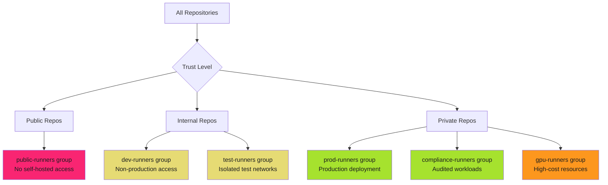

# Runner Group Management

Runner groups are security boundaries. Organize by trust level. Restrict by default. Enforce with workflow controls.

!!! warning "The Risk"

    Without runner groups, all self-hosted runners are available to all repositories. One compromised repository means access to production runners with elevated permissions. Malicious workflows can target high-value runners for lateral movement.

## Why Runner Groups Matter

Self-hosted runners have different security profiles. Production runners have network access to production systems. Development runners are isolated. GPU runners cost money. Compliance runners must audit every job.

**Without groups**: All runners available to all repositories. No trust boundaries. No access control.

**With groups**: Security boundaries between runner types. Repository allow-lists. Workflow restrictions. Audit trails.

## Runner Group Organization Strategies

Organize runners by security requirements, compliance needs, and operational constraints.



### Strategy 1: Trust-Based Organization

Organize by repository trust level and workflow sensitivity.

| Group Name | Trust Level | Repository Access | Network Scope | Credentials | Use Case |
| ---------- | ----------- | ----------------- | ------------- | ----------- | -------- |
| **public-runners** | Untrusted | Public repos only | Internet-only | None | Never use self-hosted for public repos |
| **dev-runners** | Low | Development repos | Isolated dev network | Development service accounts | Feature development, testing |
| **staging-runners** | Medium | Staging repos | Staging network | Staging credentials | Pre-production validation |
| **prod-runners** | High | Production repos | Production network | Production OIDC | Production deployments |
| **compliance-runners** | Highest | Compliance-approved repos | Audited networks | Minimal credentials | HIPAA, PCI-DSS, SOC2 workloads |

**Best Practice**: Never allow self-hosted runners for public repositories. External contributors can submit malicious workflows that execute on your infrastructure.

### Strategy 2: Workload-Based Organization

Organize by job type and resource requirements.

| Group Name | Job Type | Repository Access | Resource Profile | Cost Model | Use Case |
| ---------- | -------- | ----------------- | ---------------- | ---------- | -------- |
| **ci-runners** | CI/CD | All repos | 8 CPU, 16GB RAM | Standard | Build, test, lint |
| **deploy-runners** | Deployment | Release repos only | 4 CPU, 8GB RAM | Standard | Cloud deployments |
| **gpu-runners** | ML/AI | ML repos only | 16 CPU, 64GB RAM, 1 GPU | High-cost | Model training, inference |
| **build-runners** | Compilation | Build repos | 16 CPU, 32GB RAM | Standard | Large codebases, monorepo builds |
| **integration-runners** | Integration tests | Test repos | 8 CPU, 16GB RAM | Standard | Database integration, API tests |

**Best Practice**: Isolate high-cost runners (GPU, high-memory) to prevent accidental usage from unauthorized repositories. Monitor for cost anomalies.

### Strategy 3: Environment-Based Organization

Organize by deployment environment and protection rules.

| Group Name | Environment | Protection Rules | Approval Required | Network Access | Use Case |
| ---------- | ----------- | ---------------- | ----------------- | -------------- | -------- |
| **dev-runners** | Development | None | No | Dev VPC | Rapid iteration |
| **staging-runners** | Staging | Branch protection | No | Staging VPC | Pre-prod testing |
| **prod-runners** | Production | Environment protection | Yes | Prod VPC | Production deployments |
| **dr-runners** | Disaster Recovery | Manual trigger only | Yes | DR VPC | Failover scenarios |

**Best Practice**: Combine runner groups with GitHub environment protection rules. Require manual approval before jobs execute on production runners.

### Strategy 4: Compliance-Based Organization

Organize by regulatory requirements and audit needs.

| Group Name | Compliance Scope | Audit Logging | Data Classification | Network Isolation | Use Case |
| ---------- | ---------------- | ------------- | ------------------- | ----------------- | -------- |
| **pci-runners** | PCI-DSS | Full audit logs to SIEM | Cardholder data | Segmented PCI network | Payment processing |
| **hipaa-runners** | HIPAA | Encrypted logs, BAA | PHI | HIPAA-compliant VPC | Healthcare data |
| **fedramp-runners** | FedRAMP | CloudWatch + Splunk | CUI | FedRAMP-authorized VPC | Government workloads |
| **sox-runners** | SOX | Immutable logs | Financial data | Audited network | Financial reporting |
| **standard-runners** | None | Standard GitHub logs | Public/internal | Standard network | Non-regulated workloads |

**Best Practice**: Dedicated compliance runners with enhanced logging, immutable audit trails, and network segmentation per regulatory requirements.

## Repository Access Restrictions

Control which repositories can use which runner groups.

### GitHub Enterprise Organization Settings

Runner groups are configured at the organization level with repository access controls.

**Configuration Path**: Organization Settings → Actions → Runner groups

#### Restriction Levels

##### Level 1: All Repositories (Least Secure)

All repositories in the organization can access the runner group.

**Use Case**: Development runners for non-sensitive workloads.

**Risk**: Compromised repository gains access to all runners in the group.

```yaml
# Runner group configuration (Settings UI)
Group: dev-runners
Access: All repositories
Workflow restrictions: None
```

##### Level 2: Selected Repositories (Recommended)

Explicit allow-list of repositories that can access the runner group.

**Use Case**: Production runners, compliance runners, high-cost runners.

**Risk**: Lower risk, but requires maintenance as new repositories are created.

```yaml
# Runner group configuration (Settings UI)
Group: prod-runners
Access: Selected repositories
Repositories:
  - org/production-api
  - org/production-web
  - org/production-infra
Workflow restrictions: Selected workflows
```

##### Level 3: Private Repositories Only

Only private repositories can access the runner group. Public repositories are blocked.

**Use Case**: Internal runners that should never execute public repository code.

**Risk**: Lower risk, but does not prevent compromised private repositories from accessing runners.

```yaml
# Runner group configuration (Settings UI)
Group: internal-runners
Access: Private repositories
Workflow restrictions: None
```

### API-Based Configuration

Automate runner group configuration using GitHub API.

```bash
#!/bin/bash
# Create runner group with repository restrictions

set -euo pipefail

ORG="your-organization"
GROUP_NAME="prod-runners"
RUNNER_GROUP_ID="123"
ALLOWED_REPOS=(
  "production-api"
  "production-web"
  "production-infra"
)

# Create runner group
gh api \
  --method POST \
  -H "Accept: application/vnd.github+json" \
  "/orgs/${ORG}/actions/runner-groups" \
  -f name="${GROUP_NAME}" \
  -f visibility="selected" \
  -F allows_public_repositories=false

# Add repositories to runner group
for repo in "${ALLOWED_REPOS[@]}"; do
  REPO_ID=$(gh api "/repos/${ORG}/${repo}" --jq '.id')

  gh api \
    --method PUT \
    -H "Accept: application/vnd.github+json" \
    "/orgs/${ORG}/actions/runner-groups/${RUNNER_GROUP_ID}/repositories/${REPO_ID}"

  echo "Added ${repo} to runner group ${GROUP_NAME}"
done
```

### Repository Access Verification

Audit which repositories can access which runner groups.

```bash
#!/bin/bash
# Audit runner group repository access

set -euo pipefail

ORG="your-organization"

# List all runner groups
echo "==> Auditing runner group access for ${ORG}"

gh api "/orgs/${ORG}/actions/runner-groups" --paginate --jq '.runner_groups[]' | while read -r group; do
  GROUP_ID=$(echo "$group" | jq -r '.id')
  GROUP_NAME=$(echo "$group" | jq -r '.name')
  VISIBILITY=$(echo "$group" | jq -r '.visibility')

  echo ""
  echo "Runner Group: ${GROUP_NAME} (${VISIBILITY})"

  if [[ "$VISIBILITY" == "selected" ]]; then
    # List repositories with access
    gh api "/orgs/${ORG}/actions/runner-groups/${GROUP_ID}/repositories" --paginate \
      | jq -r '.repositories[].full_name' \
      | while read -r repo; do
        echo "  - ${repo}"
      done
  else
    echo "  - Access: All repositories"
  fi
done
```

## Workflow Restrictions for Sensitive Runners

Control which workflows can execute on specific runner groups.

### Why Workflow Restrictions?

Repository access controls specify which repositories can use runners. Workflow restrictions specify which workflow files within those repositories can execute on those runners.

**Scenario**: Production runners should only execute deployment workflows, not arbitrary CI workflows.

**Without workflow restrictions**: Any workflow file in allowed repositories can use production runners.

**With workflow restrictions**: Only approved workflow files (e.g., `.github/workflows/deploy-production.yml`) can use production runners.

### Workflow Restriction Configuration

**Configuration Path**: Organization Settings → Actions → Runner groups → Workflow access

#### Option 1: No Restrictions (Default)

All workflows in allowed repositories can use the runner group.

**Use Case**: Development runners, non-sensitive workloads.

**Risk**: Any workflow file can target these runners.

#### Option 2: Selected Workflows (Recommended for Sensitive Runners)

Explicit allow-list of workflow files that can use the runner group.

**Use Case**: Production runners, compliance runners, high-value runners.

**Risk**: Requires maintenance as new deployment workflows are created.

```yaml
# Runner group configuration (Settings UI)
Group: prod-runners
Workflow access: Selected workflows
Allowed workflows:
  - org/production-api/.github/workflows/deploy-production.yml@refs/heads/main
  - org/production-web/.github/workflows/deploy-production.yml@refs/heads/main
  - org/production-infra/.github/workflows/terraform-apply.yml@refs/heads/main
```

**Format**: `{owner}/{repo}/.github/workflows/{workflow}.yml@{ref}`

**Best Practice**: Pin workflows to `refs/heads/main` to prevent malicious branches from bypassing restrictions.

### Workflow Restriction Patterns

#### Pattern 1: Production Deployment Workflows Only

Restrict production runners to deployment workflows verified by security team.

```yaml
# prod-runners group configuration
Allowed workflows:
  - org/app-api/.github/workflows/deploy-prod.yml@refs/heads/main
  - org/app-web/.github/workflows/deploy-prod.yml@refs/heads/main
  - org/app-worker/.github/workflows/deploy-prod.yml@refs/heads/main
```

**Enforcement**: CI workflows, test workflows, and feature branch workflows cannot use production runners.

#### Pattern 2: Compliance Workflows with Audit Trail

Restrict compliance runners to audited workflows with immutable logs.

```yaml
# hipaa-runners group configuration
Allowed workflows:
  - org/patient-portal/.github/workflows/deploy-hipaa.yml@refs/heads/main
  - org/ehr-integration/.github/workflows/deploy-hipaa.yml@refs/heads/main
```

**Additional Controls**:

- Workflows require manual approval (environment protection rules)
- All jobs logged to immutable SIEM
- Network isolated to HIPAA-compliant VPC

#### Pattern 3: Cost-Control for GPU Runners

Restrict expensive GPU runners to approved ML training workflows.

```yaml
# gpu-runners group configuration
Allowed workflows:
  - org/ml-training/.github/workflows/train-model.yml@refs/heads/main
  - org/ml-inference/.github/workflows/batch-inference.yml@refs/heads/main
```

**Monitoring**: Alert on unexpected GPU runner usage or cost spikes.

### API-Based Workflow Restrictions

Automate workflow restriction configuration using GitHub API.

```bash
#!/bin/bash
# Configure workflow restrictions for runner group

set -euo pipefail

ORG="your-organization"
RUNNER_GROUP_ID="123"
ALLOWED_WORKFLOWS=(
  "${ORG}/production-api/.github/workflows/deploy-production.yml@refs/heads/main"
  "${ORG}/production-web/.github/workflows/deploy-production.yml@refs/heads/main"
)

# Enable workflow restrictions
gh api \
  --method PATCH \
  -H "Accept: application/vnd.github+json" \
  "/orgs/${ORG}/actions/runner-groups/${RUNNER_GROUP_ID}" \
  -f restricted_to_workflows=true

# Add allowed workflows
for workflow in "${ALLOWED_WORKFLOWS[@]}"; do
  gh api \
    --method PUT \
    -H "Accept: application/vnd.github+json" \
    "/orgs/${ORG}/actions/runner-groups/${RUNNER_GROUP_ID}/workflows" \
    -f workflow="${workflow}"

  echo "Allowed workflow: ${workflow}"
done
```

### Workflow Restriction Verification

Audit which workflows can access which runner groups.

```bash
#!/bin/bash
# Audit runner group workflow restrictions

set -euo pipefail

ORG="your-organization"

echo "==> Auditing runner group workflow restrictions for ${ORG}"

gh api "/orgs/${ORG}/actions/runner-groups" --paginate --jq '.runner_groups[]' | while read -r group; do
  GROUP_ID=$(echo "$group" | jq -r '.id')
  GROUP_NAME=$(echo "$group" | jq -r '.name')
  RESTRICTED=$(echo "$group" | jq -r '.restricted_to_workflows')

  echo ""
  echo "Runner Group: ${GROUP_NAME}"
  echo "  Workflow Restrictions: ${RESTRICTED}"

  if [[ "$RESTRICTED" == "true" ]]; then
    # List allowed workflows
    gh api "/orgs/${ORG}/actions/runner-groups/${GROUP_ID}/workflows" --paginate \
      | jq -r '.workflows[].path' \
      | while read -r workflow; do
        echo "  - ${workflow}"
      done
  else
    echo "  - All workflows allowed"
  fi
done
```

## Runner Group Security Best Practices

### Principle 1: Deny by Default

Default to no access. Explicitly grant repository and workflow access only when justified.

**Implementation**:

- Create runner groups with "Selected repositories" access
- Enable workflow restrictions for sensitive runners
- Review access quarterly and revoke unused permissions

### Principle 2: Least Privilege Groups

Organize runners by sensitivity and grant minimal access.

**Implementation**:

- Separate development, staging, and production runner groups
- Production runners accessible only to production repositories
- Compliance runners accessible only to audited workflows

### Principle 3: Workflow Pinning

Pin allowed workflows to specific branches (typically `main` or `release/*`) to prevent bypass via malicious branches.

**Implementation**:

```yaml
Allowed workflows:
  - org/app/.github/workflows/deploy.yml@refs/heads/main  # Good
  - org/app/.github/workflows/deploy.yml@*  # Bad - any branch can execute
```

### Principle 4: Monitor Group Access

Alert on unauthorized runner group configuration changes.

**Implementation**:

```yaml
# .github/workflows/audit-runner-groups.yml
# Monitor runner group configuration changes

name: Audit Runner Groups
on:
  schedule:
    - cron: '0 */6 * * *'  # Every 6 hours
  workflow_dispatch:

permissions:
  contents: read

jobs:
  audit-groups:
    runs-on: ubuntu-latest
    steps:
      - name: Audit runner groups
        env:
          GH_TOKEN: ${{ secrets.ORG_AUDIT_TOKEN }}
        run: |
          ORG="your-organization"

          # Expected configuration
          declare -A EXPECTED_GROUPS=(
            ["prod-runners"]="selected,restricted"
            ["dev-runners"]="selected,unrestricted"
            ["gpu-runners"]="selected,restricted"
          )

          # Audit actual configuration
          while IFS= read -r group; do
            GROUP_NAME=$(echo "$group" | jq -r '.name')
            VISIBILITY=$(echo "$group" | jq -r '.visibility')
            RESTRICTED=$(echo "$group" | jq -r '.restricted_to_workflows')

            EXPECTED="${EXPECTED_GROUPS[$GROUP_NAME]}"
            ACTUAL="${VISIBILITY},${RESTRICTED}"

            if [[ "$EXPECTED" != "$ACTUAL" ]]; then
              echo "::error::Runner group ${GROUP_NAME} misconfigured: expected ${EXPECTED}, got ${ACTUAL}"
              exit 1
            fi
          done < <(gh api "/orgs/${ORG}/actions/runner-groups" --jq '.runner_groups[]')

          echo "All runner groups properly configured"
```

### Principle 5: Document Group Purpose

Maintain documentation for each runner group with purpose, trust level, and access rationale.

**Implementation**:

```yaml
# .github/runner-groups.yml
# Runner group configuration documentation

groups:
  - name: prod-runners
    purpose: Production deployment workflows only
    trust_level: High
    network_access: Production VPC
    allowed_repos:
      - production-api
      - production-web
    allowed_workflows:
      - .github/workflows/deploy-production.yml
    approval_required: true
    rationale: Production deployments require manual approval and audit trail

  - name: dev-runners
    purpose: Development and testing workflows
    trust_level: Low
    network_access: Development VPC
    allowed_repos: All private repositories
    allowed_workflows: All workflows
    approval_required: false
    rationale: Isolated network with no production access
```

## Common Misconfigurations

### Misconfiguration 1: All Repositories Access for Production Runners

**Problem**: Production runners available to all repositories.

**Risk**: Compromised development repository can execute on production runners with production network access.

**Fix**:

```yaml
# Before (insecure)
Group: prod-runners
Access: All repositories

# After (secure)
Group: prod-runners
Access: Selected repositories
Repositories:
  - production-api
  - production-web
```

### Misconfiguration 2: No Workflow Restrictions

**Problem**: Production runners accessible to any workflow file in allowed repositories.

**Risk**: Malicious developer adds new workflow file that targets production runners.

**Fix**:

```yaml
# Before (insecure)
Group: prod-runners
Workflow restrictions: None

# After (secure)
Group: prod-runners
Workflow restrictions: Selected workflows
Allowed workflows:
  - org/production-api/.github/workflows/deploy-production.yml@refs/heads/main
```

### Misconfiguration 3: Wildcard Branch References

**Problem**: Workflow restrictions allow any branch reference.

**Risk**: Attacker creates malicious branch with modified workflow that bypasses security controls.

**Fix**:

```yaml
# Before (insecure)
Allowed workflows:
  - org/app/.github/workflows/deploy.yml@*

# After (secure)
Allowed workflows:
  - org/app/.github/workflows/deploy.yml@refs/heads/main
```

### Misconfiguration 4: Public Repository Access

**Problem**: Self-hosted runners accessible to public repositories.

**Risk**: External contributors submit malicious pull requests that execute on your infrastructure.

**Fix**:

```yaml
# Before (insecure)
Group: any-group
Allows public repositories: Yes

# After (secure)
Group: any-group
Allows public repositories: No
```

**Rule**: Never allow self-hosted runners for public repositories. Use GitHub-hosted runners instead.

## Troubleshooting

### Issue: Workflow Cannot Find Runners

**Symptom**: Workflow queued indefinitely with "No runners available" message.

**Causes**:

1. Repository not in runner group's allowed repositories
2. Workflow not in runner group's allowed workflows
3. Runner group visibility set to private repos but repository is public
4. Workflow specifies incorrect `runs-on` label

**Diagnosis**:

```bash
# Check repository access
gh api "/orgs/${ORG}/actions/runner-groups/${GROUP_ID}/repositories" \
  | jq -r '.repositories[].full_name' \
  | grep "your-repo"

# Check workflow restrictions
gh api "/orgs/${ORG}/actions/runner-groups/${GROUP_ID}/workflows" \
  | jq -r '.workflows[].path'
```

**Fix**:

Add repository to runner group or add workflow to allowed workflows list.

### Issue: Unauthorized Workflow Executes on Sensitive Runners

**Symptom**: Non-deployment workflow executed on production runners.

**Causes**:

1. Workflow restrictions disabled
2. Workflow added to allowed list without approval
3. Wildcard branch reference allows malicious branch

**Diagnosis**:

```bash
# Check workflow restriction status
gh api "/orgs/${ORG}/actions/runner-groups/${GROUP_ID}" \
  | jq -r '.restricted_to_workflows'
```

**Fix**:

Enable workflow restrictions and audit allowed workflows:

```bash
# Enable workflow restrictions
gh api --method PATCH \
  "/orgs/${ORG}/actions/runner-groups/${GROUP_ID}" \
  -f restricted_to_workflows=true
```

### Issue: Runner Group Configuration Drift

**Symptom**: Runner group access differs from documented configuration.

**Causes**:

1. Manual changes via Settings UI without documentation update
2. API-based changes without audit trail
3. Multiple administrators with conflicting changes

**Diagnosis**:

Compare actual configuration against documented configuration:

```bash
# Export current configuration
gh api "/orgs/${ORG}/actions/runner-groups" \
  | jq '.runner_groups[] | {name, visibility, restricted_to_workflows}' \
  > current-config.json

# Compare against documented configuration
diff current-config.json documented-config.json
```

**Fix**:

Implement configuration-as-code with CI validation:

```yaml
# .github/workflows/validate-runner-config.yml
name: Validate Runner Configuration
on:
  pull_request:
    paths:
      - .github/runner-groups.yml

jobs:
  validate:
    runs-on: ubuntu-latest
    steps:
      - name: Validate configuration
        run: |
          # Validate runner group configuration matches documented state
          yamllint .github/runner-groups.yml
          # Additional validation logic
```

## Quick Reference: Runner Group Checklist

### Setup Checklist

- [ ] Create runner groups organized by trust level or workload type
- [ ] Set visibility to "Selected repositories" (not "All repositories")
- [ ] Configure repository allow-list with minimal required repositories
- [ ] Enable workflow restrictions for sensitive runner groups
- [ ] Pin allowed workflows to specific branches (refs/heads/main)
- [ ] Disable public repository access for all runner groups
- [ ] Document group purpose and access rationale
- [ ] Configure audit logging for group access changes

### Operational Checklist

- [ ] Review runner group membership quarterly
- [ ] Revoke access for deprecated repositories
- [ ] Audit workflow restrictions for compliance changes
- [ ] Monitor runner group configuration for drift
- [ ] Alert on unauthorized configuration changes
- [ ] Verify new workflows before adding to allowed list
- [ ] Test runner access with non-production workflows first
- [ ] Document approval process for runner group access

### Security Checklist

- [ ] Production runners restricted to production repositories only
- [ ] Compliance runners restricted to audited workflows only
- [ ] High-cost runners restricted to authorized teams only
- [ ] No self-hosted runners for public repositories
- [ ] Workflow restrictions enabled for all sensitive runner groups
- [ ] Branch references pinned (no wildcard refs)
- [ ] Repository access follows least privilege principle
- [ ] Audit trail configured for all runner group changes

## Next Steps

- **[Runner Security Overview](index.md)**: Understanding the self-hosted runner threat model
- **[Hardening Checklist](hardening.md)**: OS-level and runtime hardening for runners
- **[Ephemeral Runners](ephemeral.md)**: Disposable runner patterns for state isolation

## Related Documentation

- [Token Permissions](../token-permissions/index.md): Scoping GITHUB_TOKEN permissions for runner jobs
- [Third-Party Actions](../third-party-actions/index.md): Evaluating actions that execute on runners
- [Workflow Triggers](../workflows/triggers.md): Understanding which events trigger runner execution
