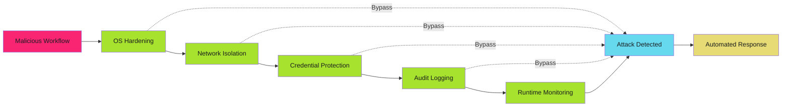

# Self-Hosted Runner Hardening

Hardening is not optional. Every layer of defense you skip is an attack vector you gift to adversaries. Deploy runners defensively or accept the breach.

!!! danger "The Default Is Insecure"

    A default runner installation has root access, unrestricted network, cloud metadata endpoints, persistent filesystem, and ambient credentials. One malicious workflow means full infrastructure compromise. Apply every hardening layer.

## Hardening Strategy

Defense in depth. Assume every layer will fail. Combine multiple mitigations so that breaching one does not compromise the entire system.



## OS-Level Hardening

Harden the operating system before installing the runner. Every unnecessary service is an attack surface.

### Base OS Configuration

#### Minimal Installation

Install only required packages. Eliminate unnecessary services that expand attack surface.

```bash
#!/bin/bash
# Minimal Ubuntu server hardening for GitHub Actions runner

set -euo pipefail

echo "==> Applying OS hardening for GitHub Actions runner"

# Remove unnecessary packages
apt-get purge -y \
  snapd \
  cloud-init \
  lxd \
  landscape-client \
  landscape-common \
  telnet \
  rsh-client \
  rsh-redone-client

# Remove package management tools that workflows should not use
apt-get purge -y apt-listchanges

# Update all packages
apt-get update
apt-get upgrade -y
apt-get autoremove -y

# Install security tools
apt-get install -y \
  unattended-upgrades \
  auditd \
  aide \
  fail2ban \
  ufw \
  apparmor \
  apparmor-utils

echo "==> OS hardening complete"
```

#### Automatic Security Updates

Enable unattended security updates to patch vulnerabilities automatically.

```bash
# /etc/apt/apt.conf.d/50unattended-upgrades
# Automatic security updates configuration

Unattended-Upgrade::Allowed-Origins {
    "${distro_id}:${distro_codename}-security";
    "${distro_id}ESMApps:${distro_codename}-apps-security";
    "${distro_id}ESM:${distro_codename}-infra-security";
};

Unattended-Upgrade::DevRelease "false";
Unattended-Upgrade::AutoFixInterruptedDpkg "true";
Unattended-Upgrade::MinimalSteps "true";
Unattended-Upgrade::Remove-Unused-Kernel-Packages "true";
Unattended-Upgrade::Remove-Unused-Dependencies "true";
Unattended-Upgrade::Automatic-Reboot "true";
Unattended-Upgrade::Automatic-Reboot-Time "03:00";
```

```bash
# /etc/apt/apt.conf.d/20auto-upgrades
# Enable automatic updates

APT::Periodic::Update-Package-Lists "1";
APT::Periodic::Download-Upgradeable-Packages "1";
APT::Periodic::AutocleanInterval "7";
APT::Periodic::Unattended-Upgrade "1";
```

#### CIS Benchmark Hardening

Apply Center for Internet Security (CIS) benchmarks for baseline hardening.

```bash
#!/bin/bash
# CIS Ubuntu Linux 22.04 LTS Benchmark Level 1 (selected controls)

set -euo pipefail

echo "==> Applying CIS benchmarks for runner hardening"

# 1.1.1.1 - Disable unused filesystems
cat > /etc/modprobe.d/disable-filesystems.conf <<EOF
install cramfs /bin/true
install freevxfs /bin/true
install jffs2 /bin/true
install hfs /bin/true
install hfsplus /bin/true
install udf /bin/true
EOF

# 1.5.1 - Configure bootloader permissions
chmod 600 /boot/grub/grub.cfg

# 3.1.1 - Disable IP forwarding (unless runner needs it)
cat >> /etc/sysctl.d/99-runner-hardening.conf <<EOF
net.ipv4.ip_forward = 0
net.ipv6.conf.all.forwarding = 0
EOF

# 3.2.1 - Disable packet redirect sending
cat >> /etc/sysctl.d/99-runner-hardening.conf <<EOF
net.ipv4.conf.all.send_redirects = 0
net.ipv4.conf.default.send_redirects = 0
EOF

# 3.3.1 - Disable source routed packet acceptance
cat >> /etc/sysctl.d/99-runner-hardening.conf <<EOF
net.ipv4.conf.all.accept_source_route = 0
net.ipv4.conf.default.accept_source_route = 0
net.ipv6.conf.all.accept_source_route = 0
net.ipv6.conf.default.accept_source_route = 0
EOF

# 3.3.2 - Disable ICMP redirect acceptance
cat >> /etc/sysctl.d/99-runner-hardening.conf <<EOF
net.ipv4.conf.all.accept_redirects = 0
net.ipv4.conf.default.accept_redirects = 0
net.ipv6.conf.all.accept_redirects = 0
net.ipv6.conf.default.accept_redirects = 0
EOF

# 3.3.3 - Enable bad error message protection
cat >> /etc/sysctl.d/99-runner-hardening.conf <<EOF
net.ipv4.icmp_ignore_bogus_error_responses = 1
EOF

# 3.3.4 - Enable reverse path filtering
cat >> /etc/sysctl.d/99-runner-hardening.conf <<EOF
net.ipv4.conf.all.rp_filter = 1
net.ipv4.conf.default.rp_filter = 1
EOF

# 3.3.5 - Enable TCP SYN cookies
cat >> /etc/sysctl.d/99-runner-hardening.conf <<EOF
net.ipv4.tcp_syncookies = 1
EOF

# Apply sysctl settings
sysctl -p /etc/sysctl.d/99-runner-hardening.conf

# 5.2.1 - Configure SSH server (if enabled)
if systemctl is-enabled ssh; then
    sed -i 's/^#PermitRootLogin.*/PermitRootLogin no/' /etc/ssh/sshd_config
    sed -i 's/^#PasswordAuthentication.*/PasswordAuthentication no/' /etc/ssh/sshd_config
    sed -i 's/^#PubkeyAuthentication.*/PubkeyAuthentication yes/' /etc/ssh/sshd_config
    systemctl restart ssh
fi

echo "==> CIS benchmark hardening complete"
```

### User and Permission Hardening

Run the runner as a dedicated non-root user with minimal privileges.

#### Runner User Creation

```bash
#!/bin/bash
# Create dedicated runner user with minimal privileges

set -euo pipefail

RUNNER_USER="github-runner"
RUNNER_HOME="/opt/github-runner"

# Create runner user (system account, no shell, no password)
useradd \
  --system \
  --home-dir "$RUNNER_HOME" \
  --create-home \
  --shell /usr/sbin/nologin \
  --comment "GitHub Actions Runner" \
  "$RUNNER_USER"

# Lock the account (prevent password login)
passwd -l "$RUNNER_USER"

# Set restrictive permissions on runner home
chmod 750 "$RUNNER_HOME"
chown -R "$RUNNER_USER:$RUNNER_USER" "$RUNNER_HOME"

# Create workspace directory with isolation
mkdir -p "$RUNNER_HOME/_work"
chmod 700 "$RUNNER_HOME/_work"
chown "$RUNNER_USER:$RUNNER_USER" "$RUNNER_HOME/_work"

echo "==> Runner user created: $RUNNER_USER"
```

#### Sudo Restrictions

Never grant the runner user sudo access. If specific elevated operations are required, use targeted sudoers rules with command restrictions.

```bash
# /etc/sudoers.d/github-runner
# ONLY if specific commands require elevation (avoid if possible)

# Allow runner to restart specific service (example only)
github-runner ALL=(ALL) NOPASSWD: /usr/bin/systemctl restart myapp.service

# Prevent everything else
github-runner ALL=(ALL) !ALL
```

**Best Practice**: Avoid sudo entirely. If workflows need privileged operations, redesign to use rootless containers or external services.

### Filesystem Hardening

Restrict filesystem access to prevent malicious workflows from reading sensitive data or persisting backdoors.

#### Mount Options

Apply security-focused mount options to runner filesystems.

```bash
# /etc/fstab
# Restrictive mount options for runner workspace

# Example: Mount runner workspace with noexec, nosuid, nodev
tmpfs /opt/github-runner/_work tmpfs noexec,nosuid,nodev,size=8G,mode=0700,uid=github-runner,gid=github-runner 0 0

# Alternative: Dedicated partition for runner workspace
/dev/sdb1 /opt/github-runner/_work ext4 noexec,nosuid,nodev,noatime 0 2
```

**Mount options explained**:

- `noexec`: Prevent execution of binaries (malicious workflows cannot run compiled exploits)
- `nosuid`: Ignore setuid/setgid bits (prevent privilege escalation)
- `nodev`: Prevent device file creation (block device-based attacks)
- `noatime`: Disable access time updates (performance optimization)

#### AppArmor Profile

Confine the runner process with AppArmor mandatory access control.

```bash
# /etc/apparmor.d/github-runner
# AppArmor profile for GitHub Actions runner

#include <tunables/global>

/opt/github-runner/bin/Runner.Listener {
  #include <abstractions/base>
  #include <abstractions/nameservice>

  # Runner binary and libraries
  /opt/github-runner/** r,
  /opt/github-runner/bin/Runner.Listener rix,

  # Workspace access (read-write)
  /opt/github-runner/_work/** rw,

  # Network access (required for GitHub API)
  network inet stream,
  network inet6 stream,

  # Deny access to sensitive system paths
  deny /etc/shadow r,
  deny /root/** rw,
  deny /home/** rw,
  deny /var/log/** rw,

  # Deny execution of shells (prevent interactive backdoors)
  deny /bin/bash x,
  deny /bin/sh x,
  deny /bin/dash x,

  # Deny cloud metadata endpoints
  deny network inet to 169.254.169.254,
  deny network inet to fd00:ec2::254,
}
```

```bash
# Enable AppArmor profile
apparmor_parser -r /etc/apparmor.d/github-runner
aa-enforce /opt/github-runner/bin/Runner.Listener
```

## Network Isolation

Isolate runners from production systems and restrict network access to required destinations only.

### Firewall Configuration (UFW)

Configure deny-by-default firewall rules with explicit allow-lists.

```bash
#!/bin/bash
# UFW firewall configuration for GitHub Actions runner

set -euo pipefail

echo "==> Configuring firewall for runner network isolation"

# Reset to clean state
ufw --force reset

# Default policies: deny all incoming and outgoing
ufw default deny incoming
ufw default deny outgoing
ufw default deny routed

# Allow outbound to GitHub (required for runner operation)
# GitHub IP ranges: https://api.github.com/meta
ufw allow out to 140.82.112.0/20 port 443 proto tcp comment 'GitHub API'
ufw allow out to 143.55.64.0/20 port 443 proto tcp comment 'GitHub API'
ufw allow out to 185.199.108.0/22 port 443 proto tcp comment 'GitHub Pages/Assets'
ufw allow out to 192.30.252.0/22 port 443 proto tcp comment 'GitHub API'

# Allow outbound DNS
ufw allow out to any port 53 proto udp comment 'DNS'

# Allow outbound NTP (if time sync required)
ufw allow out to any port 123 proto udp comment 'NTP'

# Allow outbound to package registries (add as needed)
# Example: PyPI
ufw allow out to any port 443 proto tcp comment 'PyPI'

# Deny outbound to cloud metadata endpoints
ufw deny out to 169.254.169.254 comment 'Block AWS/GCP metadata'
ufw deny out to fd00:ec2::254 comment 'Block AWS IMDSv2 IPv6'

# Deny outbound to private networks (prevent internal reconnaissance)
ufw deny out to 10.0.0.0/8 comment 'Block RFC1918 10.0.0.0/8'
ufw deny out to 172.16.0.0/12 comment 'Block RFC1918 172.16.0.0/12'
ufw deny out to 192.168.0.0/16 comment 'Block RFC1918 192.168.0.0/16'

# Enable firewall
ufw --force enable

# Display rules
ufw status verbose

echo "==> Firewall configured with deny-by-default policies"
```

### Network Namespace Isolation

Use Linux network namespaces to isolate runner network access (advanced).

```bash
#!/bin/bash
# Create isolated network namespace for runner jobs

set -euo pipefail

NAMESPACE="runner-isolated"
VETH_HOST="veth-runner0"
VETH_NS="veth-runner1"

# Create network namespace
ip netns add "$NAMESPACE"

# Create veth pair
ip link add "$VETH_HOST" type veth peer name "$VETH_NS"

# Move one end to namespace
ip link set "$VETH_NS" netns "$NAMESPACE"

# Configure host side
ip addr add 10.200.1.1/24 dev "$VETH_HOST"
ip link set "$VETH_HOST" up

# Configure namespace side
ip netns exec "$NAMESPACE" ip addr add 10.200.1.2/24 dev "$VETH_NS"
ip netns exec "$NAMESPACE" ip link set "$VETH_NS" up
ip netns exec "$NAMESPACE" ip link set lo up

# Set default route in namespace
ip netns exec "$NAMESPACE" ip route add default via 10.200.1.1

# Enable NAT for outbound traffic
iptables -t nat -A POSTROUTING -s 10.200.1.0/24 -j MASQUERADE

# Run runner in isolated namespace
ip netns exec "$NAMESPACE" sudo -u github-runner /opt/github-runner/bin/Runner.Listener
```

### Cloud Metadata Endpoint Blocking

Prevent workflows from stealing cloud credentials via metadata endpoints.

#### iptables Rules

```bash
#!/bin/bash
# Block access to cloud metadata endpoints

set -euo pipefail

# AWS IMDSv1 (169.254.169.254)
iptables -A OUTPUT -d 169.254.169.254 -j REJECT --reject-with icmp-port-unreachable

# AWS IMDSv2 IPv6 (fd00:ec2::254)
ip6tables -A OUTPUT -d fd00:ec2::254/128 -j REJECT --reject-with icmp6-port-unreachable

# GCP metadata endpoint (metadata.google.internal)
iptables -A OUTPUT -d 169.254.169.254 -p tcp --dport 80 -j REJECT --reject-with tcp-reset
iptables -A OUTPUT -d 169.254.169.254 -p tcp --dport 8080 -j REJECT --reject-with tcp-reset

# Azure metadata endpoint (169.254.169.254)
iptables -A OUTPUT -d 169.254.169.254 -p tcp --dport 80 -j REJECT --reject-with tcp-reset

# Make persistent
iptables-save > /etc/iptables/rules.v4
ip6tables-save > /etc/iptables/rules.v6
```

#### IMDSv2 Enforcement (AWS)

If runners must access AWS metadata, enforce IMDSv2 with token requirement.

```bash
# Force IMDSv2 on EC2 instance (requires session token)
aws ec2 modify-instance-metadata-options \
  --instance-id i-1234567890abcdef0 \
  --http-tokens required \
  --http-put-response-hop-limit 1
```

**IMDSv2 protection**: Requires HTTP PUT to obtain session token before metadata access. Prevents SSRF-based credential theft.

## Credential Protection

Eliminate long-lived credentials. Use short-lived tokens with minimal scope.

### OIDC Federation (Recommended)

Use OpenID Connect federation to mint temporary credentials per job. No stored secrets.

```yaml
# .github/workflows/deploy-with-oidc.yml
# Secretless authentication using OIDC

name: Deploy with OIDC
on:
  push:
    branches: [main]

permissions:
  id-token: write  # Required for OIDC token
  contents: read

jobs:
  deploy:
    runs-on: self-hosted
    steps:
      - uses: actions/checkout@b4ffde65f46336ab88eb53be808477a3936bae11  # v4.1.1

      - name: Authenticate to GCP
        uses: google-github-actions/auth@55bd3a7c6e2ae7cf1877fd1ccb9d54c0503c457c  # v2.1.2
        with:
          workload_identity_provider: 'projects/123456789/locations/global/workloadIdentityPools/github-pool/providers/github-provider'
          service_account: 'github-runner@my-project.iam.gserviceaccount.com'

      - name: Deploy to Cloud Run
        run: |
          gcloud run deploy myapp \
            --image gcr.io/my-project/myapp:${{ github.sha }} \
            --region us-central1
```

**Security benefits**:

- No stored secrets in repository or runner
- Short-lived credentials (1 hour maximum)
- Subject claim validation prevents token reuse
- Audit trail via cloud IAM logs

See [OIDC Federation Patterns](../secrets/oidc.md) for complete setup.

### Environment Variable Injection

If secrets are required, inject via environment variables with minimal lifetime.

```yaml
# Secure secret injection pattern

jobs:
  deploy:
    runs-on: self-hosted
    steps:
      - name: Deploy with secret
        env:
          # Secret available only during this step
          DEPLOY_TOKEN: ${{ secrets.DEPLOY_TOKEN }}
        run: |
          # Use secret directly from environment
          curl -H "Authorization: Bearer $DEPLOY_TOKEN" https://api.example.com/deploy

      # Secret no longer available in subsequent steps
      - name: Cleanup
        run: echo "Secret was never written to disk"
```

**Avoid**:

- Writing secrets to files (persists on disk, leaks to logs)
- Exporting secrets to shell environment (accessible to subprocesses)
- Passing secrets as command arguments (visible in process list)

### Secrets Masking Verification

Verify GitHub masks secrets in logs automatically.

```yaml
# Test secrets masking

jobs:
  test-masking:
    runs-on: self-hosted
    steps:
      - name: Verify secret masking
        env:
          TEST_SECRET: ${{ secrets.TEST_SECRET }}
        run: |
          # This will appear as *** in logs
          echo "Secret value: $TEST_SECRET"

          # This will also be masked
          echo "$TEST_SECRET" | base64

          # Verify masking works
          if echo "$TEST_SECRET" | grep -q "secret-value"; then
            echo "::error::Secret masking failed!"
            exit 1
          fi
```

## Audit Logging

Comprehensive logging to detect and investigate runner compromise.

### auditd Configuration

Configure Linux audit daemon to log runner security events.

```bash
# /etc/audit/rules.d/99-runner-security.rules
# Audit rules for GitHub Actions runner

# Monitor runner binary execution
-w /opt/github-runner/bin/Runner.Listener -p x -k runner_exec

# Monitor runner configuration changes
-w /opt/github-runner/.runner -p wa -k runner_config
-w /opt/github-runner/.credentials -p wa -k runner_creds

# Monitor runner workspace
-w /opt/github-runner/_work -p wa -k runner_workspace

# Monitor privileged operations
-a always,exit -F arch=b64 -S execve -F euid=0 -k privileged_exec
-a always,exit -F arch=b32 -S execve -F euid=0 -k privileged_exec

# Monitor network connections
-a always,exit -F arch=b64 -S connect -k network_connect
-a always,exit -F arch=b32 -S connect -k network_connect

# Monitor file deletions (cover-up attempts)
-a always,exit -F arch=b64 -S unlink -S unlinkat -S rename -S renameat -k file_deletion
-a always,exit -F arch=b32 -S unlink -S unlinkat -S rename -S renameat -k file_deletion

# Monitor changes to authentication files
-w /etc/passwd -p wa -k identity
-w /etc/group -p wa -k identity
-w /etc/shadow -p wa -k identity
-w /etc/sudoers -p wa -k identity

# Make configuration immutable (prevent tampering)
-e 2
```

```bash
# Apply audit rules
auditctl -R /etc/audit/rules.d/99-runner-security.rules

# Restart auditd
systemctl restart auditd

# Verify rules loaded
auditctl -l
```

### Centralized Log Aggregation

Send logs to centralized system for analysis and retention.

```bash
#!/bin/bash
# Configure rsyslog to forward runner logs

cat > /etc/rsyslog.d/99-runner-logs.conf <<'EOF'
# Forward runner logs to centralized logging

# Runner service logs
:programname, isequal, "Runner.Listener" @@logs.example.com:514

# Audit logs
:programname, isequal, "audispd" @@logs.example.com:514

# UFW firewall logs
:msg, contains, "[UFW" @@logs.example.com:514
EOF

systemctl restart rsyslog
```

### Workflow Job Logging

Capture metadata for every job executed on the runner.

```bash
#!/bin/bash
# /opt/github-runner/log-job-start.sh
# Log job execution metadata

set -euo pipefail

LOG_FILE="/var/log/github-runner-jobs.log"

log_entry() {
    echo "$(date -Iseconds) | $*" >> "$LOG_FILE"
}

log_entry "JOB_START | Repo: ${GITHUB_REPOSITORY:-unknown} | Run: ${GITHUB_RUN_ID:-unknown} | SHA: ${GITHUB_SHA:-unknown} | Actor: ${GITHUB_ACTOR:-unknown}"
```

Call from workflow:

```yaml
jobs:
  deploy:
    runs-on: self-hosted
    steps:
      - name: Log job start
        run: /opt/github-runner/log-job-start.sh
```

### Anomaly Detection

Monitor logs for suspicious patterns indicating compromise.

```bash
#!/bin/bash
# /opt/github-runner/detect-anomalies.sh
# Detect suspicious runner behavior

set -euo pipefail

ALERT_EMAIL="security-team@example.com"

# Check for metadata endpoint access attempts
if ausearch -k network_connect | grep -q "169.254.169.254"; then
    echo "ALERT: Metadata endpoint access detected" | mail -s "Runner Security Alert" "$ALERT_EMAIL"
fi

# Check for privileged command execution
if ausearch -k privileged_exec | grep -q "SUCCESS"; then
    echo "ALERT: Privileged command executed by runner" | mail -s "Runner Security Alert" "$ALERT_EMAIL"
fi

# Check for authentication file modifications
if ausearch -k identity | grep -q "SYSCALL"; then
    echo "ALERT: Authentication files modified" | mail -s "Runner Security Alert" "$ALERT_EMAIL"
fi

# Check for unexpected network destinations
ALLOWED_DESTINATIONS=(
    "140.82.112.0/20"
    "143.55.64.0/20"
    "185.199.108.0/22"
    "192.30.252.0/22"
)

# Parse network connections and alert on unexpected destinations
# Implementation depends on log format
```

Run as cron job:

```bash
# /etc/cron.d/runner-anomaly-detection
*/5 * * * * root /opt/github-runner/detect-anomalies.sh
```

## Quick Reference: Hardening Checklist

Use this checklist when deploying or auditing runner security.

### OS Hardening

- [ ] Minimal OS installation (unnecessary packages removed)
- [ ] Automatic security updates enabled
- [ ] CIS benchmarks applied
- [ ] Dedicated non-root runner user created
- [ ] No sudo access for runner user
- [ ] Restrictive filesystem mount options (noexec, nosuid, nodev)
- [ ] AppArmor profile configured and enforced

### Network Hardening

- [ ] Deny-by-default firewall rules
- [ ] Outbound allow-list for GitHub, package registries
- [ ] Cloud metadata endpoints blocked
- [ ] Private network ranges denied (10.0.0.0/8, 172.16.0.0/12, 192.168.0.0/16)
- [ ] Network namespace isolation (optional, advanced)
- [ ] IMDSv2 enforced if metadata access required

### Credential Hardening

- [ ] OIDC federation configured (no stored secrets)
- [ ] Environment variable injection for required secrets
- [ ] No secrets written to disk
- [ ] Secrets masking verified
- [ ] Short-lived credentials only (max 1 hour)

### Audit Hardening

- [ ] auditd installed and configured
- [ ] Runner execution logged
- [ ] Network connections logged
- [ ] Privileged operations logged
- [ ] Centralized log aggregation configured
- [ ] Log retention policy enforced (minimum 90 days)
- [ ] Anomaly detection monitoring active
- [ ] Security alerts configured

## Next Steps

- **[Ephemeral Runners](ephemeral.md)**: Deploy VM and container-based ephemeral runners for maximum isolation
- **[Runner Groups](groups.md)**: Organize runners by trust level and security requirements
- **[Runner Security Overview](index.md)**: Review threat model and deployment strategies

## Related Documentation

- [OIDC Federation](../secrets/oidc.md): Secretless authentication patterns
- [Secret Management](../secrets/index.md): Handling credentials securely
- [Workflow Triggers](../workflows/triggers.md): Understanding which events execute on runners
