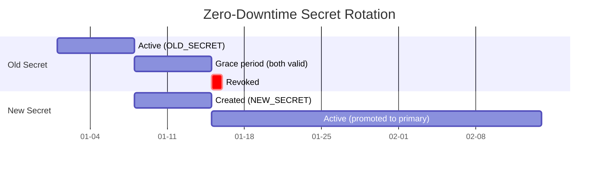

# Secret Rotation Patterns

Secrets don't age well. Automate rotation before credentials become liabilities.

!!! warning "The Risk"

    Long-lived credentials are time bombs. Every day a secret remains unchanged increases the probability it has already leaked. Rotation limits blast radius when compromise happens, not if.

## Why Rotate Secrets?

Static credentials persist in memory, logs, backups, and artifacts long after you think they're gone.

**Rotation Benefits**:

- **Limit blast radius**: Compromised credentials expire automatically
- **Detect breaches**: Failed rotation indicates credential misuse
- **Compliance**: Meet regulatory requirements for credential lifecycle
- **Reduce sprawl**: Forces inventory of what secrets exist and where
- **Audit trail**: Rotation events signal credential usage patterns

**Without Rotation**:

- Credentials persist indefinitely in GitHub audit logs
- Ex-employees retain access via copied credentials
- Leaked credentials remain valid forever
- No mechanism to detect unauthorized usage
- Compliance violations accumulate

## Rotation Schedule Recommendations

Not all secrets require the same rotation frequency. Risk-based scheduling balances security and operational overhead.

### Rotation Tiers

| Tier | Access Scope | Rotation Frequency | Examples |
| ---- | ------------ | ------------------ | -------- |
| **Critical** | Production write access, infrastructure control | **7-14 days** | Production deploy keys, cloud admin credentials, database root passwords |
| **High** | Production read access, sensitive data | **30 days** | Production API tokens, secrets managers, monitoring credentials |
| **Medium** | Non-production environments, limited scope | **90 days** | Staging credentials, package registry tokens, integration test accounts |
| **Low** | Read-only access, public services | **180 days** | Artifact storage, CDN tokens, external API read keys |

### Event-Driven Rotation

Rotate immediately when:

- **Employee departure**: Any team member with access leaves
- **Breach detected**: Credential found in logs, artifacts, or public repos
- **Service compromise**: Upstream service reports security incident
- **Workflow changes**: Modifications to `.github/workflows/` with secret access
- **Access expansion**: Secret shared with additional repositories or teams

## Zero-Downtime Rotation Strategy

Rotating secrets without breaking active workflows requires overlapping validity periods.

### Dual-Secret Pattern

Maintain two versions of each secret during rotation window.



**Implementation**:

1. **T-0**: Generate new credential, store as `SECRET_NAME_NEW`
2. **T+1h**: Update service to accept both old and new credentials
3. **T+24h**: Update GitHub secret `SECRET_NAME` with new value
4. **T+48h**: Verify all workflows using new credential
5. **T+7d**: Revoke old credential from service
6. **T+14d**: Remove `SECRET_NAME_NEW` from GitHub (cleanup)

### Rotation Workflow

Automate rotation with scheduled GitHub Actions workflow.

```yaml
name: Rotate Production Secrets

on:
  schedule:
    # Run monthly on 1st at 02:00 UTC
    - cron: '0 2 1 * *'
  workflow_dispatch:  # Manual trigger

permissions:
  contents: read

jobs:
  rotate-deploy-key:
    runs-on: ubuntu-latest
    environment: production  # Requires approval
    steps:
      # google-github-actions/auth v2.1.0
      - uses: google-github-actions/auth@f112390a2df9932162083945e46d439060d66ec2
        with:
          workload_identity_provider: ${{ secrets.GCP_WIF_PROVIDER }}
          service_account: 'secret-rotator@project.iam.gserviceaccount.com'

      - name: Generate new SSH key
        id: keygen
        run: |
          ssh-keygen -t ed25519 -N '' -f deploy_key -C "deploy-$(date +%Y%m%d)"
          echo "public_key=$(cat deploy_key.pub)" >> $GITHUB_OUTPUT
          echo "private_key<<EOF" >> $GITHUB_OUTPUT
          cat deploy_key >> $GITHUB_OUTPUT
          echo "EOF" >> $GITHUB_OUTPUT

      - name: Store new key in Secret Manager
        run: |
          # Store with version suffix for dual-key pattern
          echo "${{ steps.keygen.outputs.private_key }}" | \
            gcloud secrets versions add deploy-key-new --data-file=-

      - name: Update authorized_keys on servers
        run: |
          # Add new key to authorized_keys (old key still valid)
          gcloud compute ssh deploy-target \
            --command="echo '${{ steps.keygen.outputs.public_key }}' >> ~/.ssh/authorized_keys"

      - name: Verify new key works
        run: |
          # Test deployment with new key
          ssh -i deploy_key -o StrictHostKeyChecking=no deploy@target 'echo "New key verified"'

      - name: Update GitHub secret
        env:
          GH_TOKEN: ${{ secrets.ROTATION_GITHUB_TOKEN }}
        run: |
          # Update repository secret via GitHub CLI
          gh secret set DEPLOY_KEY --body "${{ steps.keygen.outputs.private_key }}"

      - name: Schedule old key revocation
        run: |
          # Store revocation timestamp in Secret Manager
          date -d '+7 days' -u +%Y-%m-%dT%H:%M:%SZ | \
            gcloud secrets versions add deploy-key-revoke-at --data-file=-
```

**Revocation Workflow** (7 days later):

```yaml
name: Revoke Old Secrets

on:
  schedule:
    # Run daily at 03:00 UTC
    - cron: '0 3 * * *'
  workflow_dispatch:

permissions:
  contents: read

jobs:
  revoke-expired:
    runs-on: ubuntu-latest
    environment: production
    steps:
      # google-github-actions/auth v2.1.0
      - uses: google-github-actions/auth@f112390a2df9932162083945e46d439060d66ec2
        with:
          workload_identity_provider: ${{ secrets.GCP_WIF_PROVIDER }}
          service_account: 'secret-rotator@project.iam.gserviceaccount.com'

      - name: Check revocation schedule
        id: check
        run: |
          revoke_at=$(gcloud secrets versions access latest --secret=deploy-key-revoke-at || echo "")
          if [[ -z "$revoke_at" ]]; then
            echo "No revocation scheduled"
            exit 0
          fi

          if [[ $(date -u +%s) -ge $(date -d "$revoke_at" +%s) ]]; then
            echo "revoke=true" >> $GITHUB_OUTPUT
          else
            echo "Not yet time to revoke (scheduled for $revoke_at)"
            exit 0
          fi

      - name: Remove old key from authorized_keys
        if: steps.check.outputs.revoke == 'true'
        run: |
          # Remove all but most recent key from servers
          gcloud compute ssh deploy-target \
            --command="tail -n1 ~/.ssh/authorized_keys > ~/.ssh/authorized_keys.new && mv ~/.ssh/authorized_keys.new ~/.ssh/authorized_keys"

      - name: Delete revocation marker
        if: steps.check.outputs.revoke == 'true'
        run: |
          gcloud secrets delete deploy-key-revoke-at --quiet
```

## Notification Patterns

Alert teams before credentials expire. Proactive notifications prevent outages.

### Expiration Tracking

Store secret metadata with expiration dates.

```yaml
name: Secret Expiration Monitor

on:
  schedule:
    # Run weekly on Monday at 09:00 UTC
    - cron: '0 9 * * 1'
  workflow_dispatch:

permissions:
  contents: read
  issues: write  # Create expiration warnings

jobs:
  check-expiration:
    runs-on: ubuntu-latest
    steps:
      - uses: actions/checkout@b4ffde65f46336ab88eb53be808477a3936bae11  # v4.1.1

      - name: Check secret ages
        id: check
        run: |
          # Read secret inventory with last rotation dates
          expiring=$(python3 << 'EOF'
          import json
          from datetime import datetime, timedelta

          with open('.github/secret-inventory.json') as f:
              inventory = json.load(f)

          now = datetime.now()
          expiring_secrets = []

          for secret in inventory['secrets']:
              last_rotated = datetime.fromisoformat(secret['last_rotated'])
              age_days = (now - last_rotated).days
              max_age = secret['rotation_tier_days']

              days_remaining = max_age - age_days

              if days_remaining <= 7:
                  expiring_secrets.append({
                      'name': secret['name'],
                      'days_remaining': days_remaining,
                      'tier': secret['tier']
                  })

          print(json.dumps(expiring_secrets))
          EOF
          )

          echo "expiring=$expiring" >> $GITHUB_OUTPUT

      - name: Create warning issue
        if: steps.check.outputs.expiring != '[]'
        env:
          GH_TOKEN: ${{ secrets.GITHUB_TOKEN }}
        run: |
          expiring='${{ steps.check.outputs.expiring }}'

          body=$(cat << EOF
          ## ⚠️ Secrets Expiring Soon

          The following secrets require rotation:

          $(echo "$expiring" | jq -r '.[] | "- **\(.name)** (Tier \(.tier)): \(.days_remaining) days remaining"')

          **Action Required**: Trigger rotation workflows in the next 7 days.

          See [Secret Rotation Patterns](https://adaptive-enforcement-lab.com/secure/github-actions-security/secrets/rotation/) for procedures.
          EOF
          )

          gh issue create \
            --title "Secret Rotation Required" \
            --label "security,secrets,rotation" \
            --body "$body"
```

### Slack Notification Integration

```yaml
      - name: Send Slack alert
        if: steps.check.outputs.expiring != '[]'
        run: |
          expiring='${{ steps.check.outputs.expiring }}'

          payload=$(cat << EOF
          {
            "text": "🔐 Secret Rotation Alert",
            "blocks": [
              {
                "type": "header",
                "text": {
                  "type": "plain_text",
                  "text": "⚠️ Secrets Expiring Soon"
                }
              },
              {
                "type": "section",
                "text": {
                  "type": "mrkdwn",
                  "text": "The following secrets need rotation:\n\n$(echo "$expiring" | jq -r '.[] | "• *\(.name)* (Tier \(.tier)): \(.days_remaining) days"')"
                }
              },
              {
                "type": "actions",
                "elements": [
                  {
                    "type": "button",
                    "text": {
                      "type": "plain_text",
                      "text": "Rotate Now"
                    },
                    "url": "${{ github.server_url }}/${{ github.repository }}/actions/workflows/rotate-secrets.yml"
                  }
                ]
              }
            ]
          }
          EOF
          )

          curl -X POST -H 'Content-type: application/json' \
            --data "$payload" \
            "${{ secrets.SLACK_WEBHOOK_URL }}"
```

### Secret Inventory Template

Maintain inventory file at `.github/secret-inventory.json`:

```json
{
  "secrets": [
    {
      "name": "PROD_DEPLOY_KEY",
      "tier": "Critical",
      "rotation_tier_days": 14,
      "last_rotated": "2026-01-01T00:00:00Z",
      "owner": "platform-team",
      "scope": "repository",
      "repositories": ["api-service"],
      "notes": "SSH key for production deployments"
    },
    {
      "name": "STAGING_API_TOKEN",
      "tier": "Medium",
      "rotation_tier_days": 90,
      "last_rotated": "2025-12-01T00:00:00Z",
      "owner": "dev-team",
      "scope": "organization",
      "repositories": ["api-service", "web-frontend"],
      "notes": "Third-party API token for staging environment"
    }
  ],
  "last_audit": "2026-01-01T00:00:00Z"
}
```

## Cloud-Specific Rotation Patterns

### GCP Service Account Key Rotation

```yaml
      - name: Rotate GCP service account key
        run: |
          # Create new key
          new_key=$(gcloud iam service-accounts keys create /dev/stdout \
            --iam-account=deploy@project.iam.gserviceaccount.com \
            --key-file-type=json)

          # Update GitHub secret
          echo "$new_key" | gh secret set GCP_SA_KEY

          # List old keys (created > 7 days ago)
          old_keys=$(gcloud iam service-accounts keys list \
            --iam-account=deploy@project.iam.gserviceaccount.com \
            --filter="validAfterTime < -P7D" \
            --format="value(name)")

          # Delete old keys after grace period
          for key in $old_keys; do
            gcloud iam service-accounts keys delete "$key" \
              --iam-account=deploy@project.iam.gserviceaccount.com \
              --quiet
          done
```

### Secrets Manager Integration

```yaml
      - name: Rotate secret in Secrets Manager
        run: |
          # Generate new random secret
          new_secret=$(openssl rand -base64 32)

          # Create new version in Secrets Manager
          echo -n "$new_secret" | \
            gcloud secrets versions add prod-api-key --data-file=-

          # Update GitHub Actions secret
          echo "$new_secret" | gh secret set PROD_API_KEY

          # Schedule old version deletion (7 days)
          old_version=$(gcloud secrets versions list prod-api-key \
            --filter="state=ENABLED" \
            --sort-by=~createTime \
            --limit=2 \
            --format="value(name)" | tail -n1)

          gcloud secrets versions destroy "$old_version" \
            --secret=prod-api-key \
            --etag=$(gcloud secrets versions describe "$old_version" --secret=prod-api-key --format="value(etag)")
```

### Database Credential Rotation

```yaml
      - name: Rotate database password
        run: |
          # Generate strong password
          new_password=$(openssl rand -base64 24 | tr -d "=+/" | cut -c1-20)

          # Update database user password
          psql -h db.example.com -U admin -c \
            "ALTER USER deploy_user WITH PASSWORD '$new_password';"

          # Update secret in Secrets Manager
          echo -n "$new_password" | \
            gcloud secrets versions add db-deploy-password --data-file=-

          # Update GitHub Actions secret
          echo "$new_password" | gh secret set DB_PASSWORD

          # Verify connection with new password
          PGPASSWORD="$new_password" psql -h db.example.com -U deploy_user -c "SELECT 1;"
```

## Emergency Rotation Procedures

When immediate rotation required due to suspected compromise.

### Breach Response Workflow

```yaml
name: Emergency Secret Rotation

on:
  workflow_dispatch:
    inputs:
      secret_name:
        description: 'Secret to rotate immediately'
        required: true
        type: string
      reason:
        description: 'Reason for emergency rotation'
        required: true
        type: choice
        options:
          - 'Found in logs'
          - 'Found in public repository'
          - 'Employee departure'
          - 'Service breach'
          - 'Other compromise'

permissions:
  contents: read
  issues: write  # Create incident ticket

jobs:
  emergency-rotate:
    runs-on: ubuntu-latest
    environment: production
    steps:
      - name: Create incident ticket
        env:
          GH_TOKEN: ${{ secrets.GITHUB_TOKEN }}
        run: |
          gh issue create \
            --title "🚨 Emergency Rotation: ${{ inputs.secret_name }}" \
            --label "security,incident,secrets" \
            --body "**Secret**: ${{ inputs.secret_name }}
          **Reason**: ${{ inputs.reason }}
          **Triggered by**: @${{ github.actor }}
          **Timestamp**: $(date -u +%Y-%m-%dT%H:%M:%SZ)

          **Actions Required**:
          - [ ] Rotate credential immediately
          - [ ] Audit usage logs for unauthorized access
          - [ ] Review workflows with access to this secret
          - [ ] Determine blast radius
          - [ ] Update incident response documentation"

      - name: Revoke old credential immediately
        run: |
          # Cloud-specific revocation logic here
          echo "Revoking ${{ inputs.secret_name }} immediately"

      - name: Generate and deploy new credential
        run: |
          # Generate replacement credential
          echo "Generating new credential for ${{ inputs.secret_name }}"

      - name: Send alert to security team
        run: |
          # Send high-priority notification
          curl -X POST "${{ secrets.SLACK_WEBHOOK_URL }}" \
            -H 'Content-Type: application/json' \
            -d '{
              "text": "🚨 EMERGENCY SECRET ROTATION",
              "blocks": [
                {
                  "type": "section",
                  "text": {
                    "type": "mrkdwn",
                    "text": "*Secret*: `${{ inputs.secret_name }}`\n*Reason*: ${{ inputs.reason }}\n*Triggered by*: @${{ github.actor }}"
                  }
                }
              ]
            }'
```

## Secret Rotation Checklist

Before implementing rotation:

- [ ] **Inventory secrets**: Document all secrets, owners, and rotation tiers
- [ ] **Assign rotation frequencies**: Map secrets to Critical/High/Medium/Low tiers
- [ ] **Set up monitoring**: Create expiration tracking workflow
- [ ] **Test dual-key pattern**: Verify service accepts both old and new credentials
- [ ] **Automate rotation**: Create scheduled workflows for each secret type
- [ ] **Configure notifications**: Set up Slack/email alerts for expiring secrets
- [ ] **Document procedures**: Write runbooks for manual rotation steps
- [ ] **Test emergency rotation**: Verify breach response workflow works
- [ ] **Schedule rotation windows**: Choose low-traffic times for production rotations
- [ ] **Audit rotation history**: Review Secret Manager versions regularly

## Common Rotation Mistakes

### Mistake 1: Immediate Revocation

**Problem**: Rotating secret and immediately revoking old value breaks active workflows.

**Fix**: Use dual-secret pattern with 7-day grace period.

### Mistake 2: No Verification

**Problem**: New credential doesn't work, outage occurs before detection.

**Fix**: Always verify new credential before revoking old one.

```yaml
- name: Verify new credential
  run: |
    # Test deployment with new key
    ./test-deployment.sh --key="$NEW_KEY" || exit 1
```

### Mistake 3: Missing Inventory

**Problem**: Rotating one copy of credential, missing duplicate stored elsewhere.

**Fix**: Maintain secret inventory in `.github/secret-inventory.json`.

### Mistake 4: No Rollback Plan

**Problem**: Rotation breaks production, no way to restore old credential.

**Fix**: Store old credential version in Secrets Manager for 30 days post-rotation.

```yaml
- name: Archive old credential
  run: |
    # Keep old version for emergency rollback
    gcloud secrets versions disable previous --secret=deploy-key
    # Auto-delete after 30 days
    gcloud secrets versions destroy previous \
      --secret=deploy-key \
      --ttl=30d
```

### Mistake 5: Hardcoded Rotation

**Problem**: Rotation scripts contain service-specific logic, not reusable.

**Fix**: Use reusable workflows with secret type parameters.

```yaml
# .github/workflows/rotate-secret-template.yml
on:
  workflow_call:
    inputs:
      secret_name:
        required: true
        type: string
      secret_type:
        required: true
        type: string
      rotation_tier:
        required: true
        type: string
```

## OIDC Alternative: Eliminate Rotation

The best secret rotation strategy is no secrets at all.

**When to Use OIDC Instead**:

- Cloud provider authentication (AWS, GCP, Azure)
- Service accounts for deployments
- Temporary access to external APIs

**Benefits Over Rotation**:

- No stored credentials to rotate
- Tokens expire automatically (minutes, not months)
- Cryptographic binding to workflow context
- Zero operational overhead

See [OIDC Federation Patterns](oidc.md) for implementation.

## Security Best Practices

**Prefer OIDC**: Eliminate rotation burden entirely where possible.

**Automate everything**: Manual rotation doesn't scale and introduces human error.

**Grace periods matter**: Never revoke old credential until new one verified.

**Monitor rotation failures**: Failed rotation indicates potential compromise.

**Audit rotation history**: Review Secret Manager versions to detect anomalies.

**Document secret owners**: Every secret must have responsible team in inventory.

**Test emergency procedures**: Run breach response drills quarterly.

**Encrypt inventory file**: `.github/secret-inventory.json` contains sensitive metadata.

**Use environment secrets for production**: Rotation workflows require approval gates.

**Log rotation events**: Send rotation success/failure to security SIEM.

## Next Steps

Ready to implement rotation automation? Continue with:

- **[OIDC Federation Patterns](oidc.md)**: Eliminate stored secrets entirely with secretless cloud authentication
- **[Secret Scanning Integration](scanning.md)**: Detect leaked secrets before rotation becomes emergency response
- **[Secret Management Overview](index.md)**: Storage hierarchy, threat model, and exposure prevention

## Quick Reference

### Rotation Tier Schedule

| Tier | Rotation Frequency | Grace Period | Notification Lead Time |
| ---- | ------------------ | ------------ | ---------------------- |
| **Critical** | 7-14 days | 7 days | 3 days |
| **High** | 30 days | 7 days | 7 days |
| **Medium** | 90 days | 14 days | 14 days |
| **Low** | 180 days | 30 days | 30 days |

### Rotation Workflow Pattern

| Phase | Timing | Action | Verification |
| ----- | ------ | ------ | ------------ |
| **Generate** | T-0 | Create new credential | Format validation |
| **Store** | T+1h | Add to Secrets Manager | Version created |
| **Deploy** | T+24h | Update GitHub secret | Secret accessible |
| **Verify** | T+48h | Test with new credential | Workflow succeeds |
| **Revoke** | T+7d | Delete old credential | Old key fails |
| **Cleanup** | T+14d | Remove temporary secrets | Inventory updated |

### Emergency Rotation Triggers

| Event | Response Time | Revocation | Notification |
| ----- | ------------- | ---------- | ------------ |
| **Found in logs** | Immediate | Revoke old immediately | Security team + managers |
| **Public repository** | Immediate | Revoke old immediately | Security team + CISO |
| **Employee departure** | 1 hour | Revoke within 4 hours | Security team |
| **Service breach** | 4 hours | Coordinate with vendor | Security team + stakeholders |
| **Workflow modification** | 24 hours | Audit before revocation | Repository maintainers |

---

!!! tip "Rotation is Risk Management, Not Security Theater"

    Rotate secrets to limit blast radius when credentials leak, not to prevent leaks. Every secret will eventually be compromised. Rotation determines how much damage attackers can do with stolen credentials.
