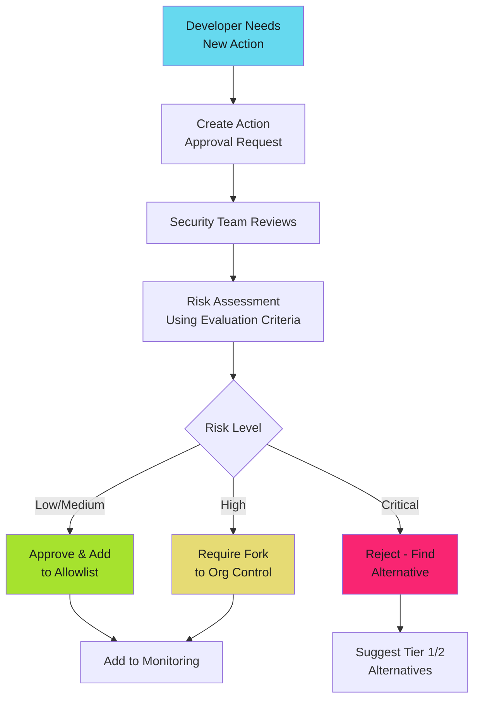

# Action Allowlisting and Organizational Governance

Enforce what actions can run in your organization. Allowlisting transforms action security from individual developer decisions into centralized policy enforcement.

!!! tip "Enforcement Over Trust"

    Allowlisting prevents unauthorized actions from executing in your workflows. Combine with approval workflows for a defense-in-depth approach to action governance.

## Why Action Governance Matters

Without organizational controls, any developer can add any third-party action to workflows. One compromised action can access all repository secrets, cloud credentials, and source code across your organization.

**Key risks without governance**:

- Decentralized security decisions with inconsistent standards
- No visibility into action usage across repositories
- Unvetted code execution with broad permissions
- Cannot quickly disable compromised actions org-wide

**Solution**: Organizational action policies with allowlisting, approval workflows, and compliance monitoring.

## GitHub Enterprise Action Policies

GitHub Enterprise provides organization-level action policy enforcement.

### Policy Levels

```mermaid
flowchart TD
    Policy["Organization Action Policy"] --> Level1["Allow All Actions"]
    Policy --> Level2["Allow Select Actions"]
    Policy --> Level3["Allow Local Actions Only"]

    Level1 --> L1Desc["✓ Any action from any source<br/>⚠ Maximum risk"]
    Level2 --> L2Desc["✓ Actions matching allowlist patterns<br/>⚙ Recommended for most orgs"]
    Level3 --> L3Desc["✓ Only actions defined in org repos<br/>🔒 Maximum control"]

    Level2 --> Patterns["Pattern Matching"]
    Patterns --> P1["actions/*<br/>github/*"]
    Patterns --> P2["verified creators<br/>(AWS, GCP, etc.)"]
    Patterns --> P3["specific repos<br/>(owner/repo@*)"]
    Patterns --> P4["org actions<br/>(my-org/*)")

    %% Ghostty Hardcore Theme
    style Policy fill:#66d9ef,color:#1b1d1e
    style Level2 fill:#a6e22e,color:#1b1d1e
    style Level3 fill:#e6db74,color:#1b1d1e
    style Level1 fill:#f92572,color:#1b1d1e

```

### Recommended Policy Configuration

**Configure via**: Organization Settings → Actions → General → Actions permissions

Select **"Allow select actions and reusable workflows"**:

- ✓ Allow actions created by GitHub (Tier 1)
- ✓ Allow actions by Marketplace verified creators (Tier 2)
- Add specific patterns for approved actions

**Pattern syntax examples**:

```text
# Tier 1: GitHub-maintained
actions/*
github/*

# Tier 2: Verified publishers
aws-actions/*
google-github-actions/*
docker/*
aquasecurity/*

# Organization actions
my-org/*

# Specific community actions with SHA pinning
codecov/codecov-action@e0b68c6749509c5f83f984dd99a76a1c1a231044
```

### Pattern Matching Reference

```text
# Allow all versions of specific action
owner/repo@*

# Allow specific version only (SHA or tag)
owner/repo@a1b2c3d4e5f6...

# Allow all actions from owner
owner/*

# Allow reusable workflows
my-org/workflows/.github/workflows/deploy.yml@*
```

## Organization-Level Restrictions

Configure policies to enforce across all repositories.

### Configuration Steps

1. Navigate to **Organization Settings** → **Actions** → **General**
2. Under **Actions permissions**, select **Allow select actions and reusable workflows**
3. Enable **Allow actions created by GitHub** (Tier 1)
4. Enable **Allow actions by Marketplace verified creators** (Tier 2)
5. Add patterns in **Allow specified actions and reusable workflows** text box

### Policy Enforcement

**Disable repository overrides**: Under same settings page, disable "Allow repository administrators to override organization policy" to prevent bypasses.

**Best practice**: All exceptions handled through org policy updates with security review. No repository-level overrides.

## Approval Workflows for New Actions

Implement security review process for adding actions to allowlist.

### Approval Process



### Action Approval Request Template

Create `.github/ISSUE_TEMPLATE/action-approval.yml` in org `.github` repo:

```yaml
name: Action Approval Request
description: Request approval to use a new third-party GitHub Action
title: "[ACTION APPROVAL] "
labels: ["action-approval", "security-review"]
assignees:
  - security-team

body:
  - type: input
    id: action-name
    attributes:
      label: Action Name
      placeholder: "example-org/example-action"
    validations:
      required: true

  - type: input
    id: action-version
    attributes:
      label: Version or SHA
      placeholder: "v2.1.0 or a1b2c3d4e5f6..."
    validations:
      required: true

  - type: textarea
    id: use-case
    attributes:
      label: Use Case
      description: Why is this action needed?
    validations:
      required: true

  - type: dropdown
    id: trust-tier
    attributes:
      label: Trust Tier
      options:
        - Tier 1 (GitHub-maintained)
        - Tier 2 (Verified publisher)
        - Tier 3 (Community)
        - Tier 4 (Unknown)
    validations:
      required: true

  - type: checkboxes
    id: evaluation
    attributes:
      label: Evaluation Checklist
      options:
        - label: Maintainer trust evaluated
        - label: Repository health checked
        - label: Source code reviewed
        - label: Security posture assessed
        - label: Dependencies audited
        - label: Permissions analyzed
        - label: Alternatives considered
        - label: Operational risk assessed

  - type: input
    id: risk-score
    attributes:
      label: Risk Score (0.0-10.0)
      placeholder: "7.5"
```

### Security Team Review Checklist

- [ ] Verify evaluation completeness
- [ ] Validate risk score using [Evaluation Criteria](evaluation.md)
- [ ] Review source code (Tier 3/4)
- [ ] Check for Tier 1/2 alternatives
- [ ] Make approval decision
- [ ] Update org allowlist if approved
- [ ] Document decision with monitoring plan

**Review SLA**:

| Trust Tier | Review Time | Review Depth |
| ---------- | ----------- | ------------ |
| Tier 1 | 1 business day | Light |
| Tier 2 | 3 business days | Moderate |
| Tier 3 | 5 business days | Full audit |
| Tier 4 | 10 business days | Deep audit |

## Compliance Monitoring

Detect and remediate policy violations.

### Audit Action Usage Across Organization

```bash
#!/bin/bash
# scan-org-actions.sh - Audit all actions used across organization
ORG="my-org"
OUTPUT="action-usage-report.csv"

echo "Repository,Workflow,Action" > "$OUTPUT"

gh repo list "$ORG" --limit 1000 --json name -q '.[].name' | while read -r REPO; do
  TEMP_DIR=$(mktemp -d)
  gh repo clone "$ORG/$REPO" "$TEMP_DIR" -- --depth 1 --quiet 2>/dev/null || continue

  find "$TEMP_DIR/.github/workflows" -name "*.yml" -o -name "*.yaml" 2>/dev/null | while read -r WORKFLOW; do
    WORKFLOW_NAME=$(basename "$WORKFLOW")
    grep "uses:" "$WORKFLOW" | sed -E 's/.*uses:[[:space:]]*(.*)/\1/' | tr -d '"'"'" | while read -r ACTION; do
      echo "$REPO,$WORKFLOW_NAME,$ACTION" >> "$OUTPUT"
    done
  done

  rm -rf "$TEMP_DIR"
done

echo "Report: $OUTPUT"
```

### Continuous Compliance Workflow

Run in organization `.github` repository:

```yaml
# .github/workflows/action-compliance.yml
name: Action Compliance Check
on:
  schedule:
    - cron: '0 2 * * 1'  # Weekly
  workflow_dispatch:

permissions:
  contents: read
  issues: write

jobs:
  scan:
    runs-on: ubuntu-latest
    steps:
      - uses: actions/checkout@b4ffde65f46336ab88eb53be808477a3936bae11  # v4.1.1

      - name: Scan organization
        run: bash ./scripts/scan-org-actions.sh

      - name: Check violations
        run: |
          grep -Fvxf approved-actions.txt action-usage-report.csv > violations.txt || true

      - name: Report violations
        if: hashFiles('violations.txt') != ''
        env:
          GH_TOKEN: ${{ secrets.GITHUB_TOKEN }}
        run: |
          gh issue create \
            --title "Action Compliance Violations" \
            --body-file violations.txt \
            --label "security,compliance"
```

## Best Practices

**Start strict, expand deliberately**: Begin with "Allow local only", add Tier 1, then carefully expand.

**Maintain approved action registry**: Keep `approved-actions.txt` in version control with approval dates and rationale.

**Require SHA pinning**: Pattern `owner/repo@v1` allows tag mutation. Require full SHA for Tier 3 actions.

**Periodic re-review**: Quarterly audit of approved actions. Remove unused, re-assess active.

**Monitor policy changes**: Alert on organization action policy modifications. Require change control.

**Emergency response**: Define process to quickly remove compromised action from allowlist org-wide.

**Automate compliance**: Run weekly scans to detect violations before strict enforcement.

## Quick Reference

### Configuration Checklist

- [ ] Org policy: "Allow select actions"
- [ ] Enable GitHub-maintained actions (Tier 1)
- [ ] Enable verified creators (Tier 2)
- [ ] Add org-specific patterns (`my-org/*`)
- [ ] Disable repository overrides
- [ ] Create approval issue template
- [ ] Configure compliance scanning
- [ ] Maintain approved action registry

### Common Patterns

| Pattern | Matches | Use Case |
| ------- | ------- | -------- |
| `actions/*` | All GitHub actions | Tier 1 approval |
| `github/*` | GitHub tools (CodeQL) | Tier 1 approval |
| `aws-actions/*` | All AWS actions | Tier 2 cloud |
| `my-org/*` | All org actions | Internal actions |
| `owner/repo@*` | All versions | Approved community |
| `owner/repo@SHA` | Specific version | Highest security |

## Next Steps

- **[Risk Assessment Framework](index.md)**: Understand trust tiers before creating allowlists
- **[Evaluation Criteria](evaluation.md)**: Assess actions before approval
- **[Common Actions Review](common-actions.md)**: Reference pre-approved actions

---

!!! warning "Policy Enforcement Gaps"

    Action allowlisting prevents workflow execution but doesn't prevent workflow file commits. Use compliance scanning to detect violations and pre-commit hooks to catch before merge. Educate teams on approved action usage.
