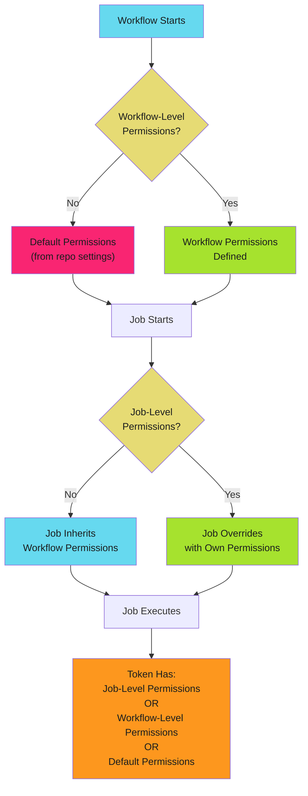

# Job-Level Permission Scoping

Scope permissions to the job that needs them. Workflow-level permissions apply to all jobs. Job-level permissions override for specific tasks. This is least privilege in practice.

!!! danger "The Risk"

    Workflow-level `contents: write` grants every job the ability to modify code. A compromised test job can push backdoors. Job-level scoping limits blast radius to single job.

## Workflow-Level vs Job-Level Permissions

### Workflow-Level Permissions

Declared at the top level. Apply to all jobs unless overridden.

```yaml
permissions:
  contents: read
  pull-requests: write

jobs:
  test:
    # Inherits: contents: read, pull-requests: write
    runs-on: ubuntu-latest
    steps:
      - run: echo "Has both permissions"
```

**Use When**: All jobs need the same permissions.

**Risk**: Every job has full permission set, even if not required.

### Job-Level Permissions

Declared inside specific job. Override workflow-level permissions.

```yaml
permissions:
  contents: read

jobs:
  test:
    # Inherits: contents: read
    runs-on: ubuntu-latest
    steps:
      - run: echo "Read-only"

  comment:
    permissions:
      contents: read
      pull-requests: write  # Escalate only for this job
    runs-on: ubuntu-latest
    steps:
      - run: gh pr comment --body "Tests passed"
```

**Use When**: Different jobs need different permissions.

**Benefit**: Minimizes blast radius. Compromised test job cannot modify PRs.

## Permission Inheritance Rules



### Rule 1: Job-Level Overrides Completely

Job-level permissions **replace** workflow-level permissions. They do not merge.

```yaml
permissions:
  contents: read
  issues: write

jobs:
  comment:
    permissions:
      pull-requests: write
    # Token has: pull-requests: write
    # Token does NOT have: contents: read, issues: write
```

**Critical**: Job-level permissions replace workflow-level entirely. Specify all required permissions at job level.

### Rule 2: Explicit Workflow-Level Blocks Defaults

Workflow-level permissions prevent repository defaults from applying.

### Rule 3: No Workflow-Level Uses Repository Defaults

Missing workflow-level permissions uses repository configuration. **Never Do This**: Always specify explicit workflow-level permissions.

### Rule 4: Empty Permissions Block Denies All

Empty permissions block grants no permissions except `metadata: read`.

```yaml
permissions: {}

jobs:
  test:
    # Token has: metadata: read only
```

## Multi-Job Permission Patterns

### Pattern 1: Read-Only Default with Single Write Job

Most common pattern. All jobs read-only except one that needs write access.

```yaml
name: CI with PR Comment
on:
  pull_request:
    branches: [main]

permissions:
  contents: read

jobs:
  test:
    runs-on: ubuntu-latest
    steps:
      - uses: actions/checkout@b4ffde65f46336ab88eb53be808477a3936bae11  # v4.1.1
      - run: npm test

  comment:
    needs: test
    runs-on: ubuntu-latest
    permissions:
      contents: read
      pull-requests: write
    steps:
      - run: gh pr comment ${{ github.event.number }} --body "All checks passed"
        env:
          GH_TOKEN: ${{ github.token }}
```

**Pattern**: Default to `contents: read`. Escalate single job to `pull-requests: write`.

**Security**: Test job cannot modify PRs. Compromised test cannot post malicious comments.

### Pattern 2: Parallel Jobs with Different Permissions

Jobs run in parallel with different permission requirements.

```yaml
permissions:
  contents: read

jobs:
  codeql:
    runs-on: ubuntu-latest
    permissions:
      contents: read
      security-events: write
    steps:
      - uses: actions/checkout@b4ffde65f46336ab88eb53be808477a3936bae11  # v4.1.1
      - uses: github/codeql-action/analyze@e8893c57a1f3a2b659b6b55564fdfdbbd2982911  # v3.24.0

  dependency-check:
    runs-on: ubuntu-latest
    permissions:
      contents: read
      pull-requests: write
    steps:
      - uses: actions/checkout@b4ffde65f46336ab88eb53be808477a3936bae11  # v4.1.1
      - run: npm audit && gh pr comment --body "Audit complete"
```

**Pattern**: Each job declares only permissions it needs.

### Pattern 3: Conditional Escalation

Escalate permissions only when specific condition met.

```yaml
permissions:
  contents: read

jobs:
  test:
    runs-on: ubuntu-latest
    steps:
      - uses: actions/checkout@b4ffde65f46336ab88eb53be808477a3936bae11  # v4.1.1
      - run: npm test

  release:
    needs: test
    if: startsWith(github.ref, 'refs/tags/v')
    runs-on: ubuntu-latest
    permissions:
      contents: write
    steps:
      - uses: actions/checkout@b4ffde65f46336ab88eb53be808477a3936bae11  # v4.1.1
      - run: npm run build
      - uses: softprops/action-gh-release@de2c0eb89ae2a093876385947365aca7b0e5f844  # v0.1.15
```

**Pattern**: Test runs for all pushes with `contents: read`. Release runs only for tags with `contents: write`.

**Security**: Regular commits cannot create releases. Attacker must create tag, which requires protection.

### Pattern 4: Reusable Workflow Permissions

Caller workflow sets permissions for called workflow. Reusable workflow cannot escalate beyond caller's grant.

## Common Permission Scenarios

### Test + Comment Pattern

Test job reads code. Comment job posts results.

```yaml
permissions:
  contents: read

jobs:
  test:
    runs-on: ubuntu-latest
    outputs:
      result: ${{ steps.test.outputs.result }}
    steps:
      - uses: actions/checkout@b4ffde65f46336ab88eb53be808477a3936bae11  # v4.1.1
      - id: test
        run: npm test && echo "result=passed" >> $GITHUB_OUTPUT

  comment:
    needs: test
    runs-on: ubuntu-latest
    permissions:
      pull-requests: write
    steps:
      - run: gh pr comment ${{ github.event.number }} --body "Result: ${{ needs.test.outputs.result }}"
        env:
          GH_TOKEN: ${{ github.token }}
```

### Deploy with OIDC Pattern

Deploy job uses `id-token: write` for cloud authentication. Build jobs remain read-only. See [Permission Templates](templates.md) for complete examples.

## Troubleshooting

| Issue | Cause | Fix |
| ----- | ----- | --- |
| **"Resource not accessible"** | Job-level override forgot permission | Add all required permissions to job-level block |
| **Job has too many permissions** | Workflow-level too broad | Move broad permissions to specific job |
| **Matrix needs different permissions** | Cannot vary per matrix entry | Split into separate jobs |

## Security Best Practices

- **Default minimal**: Set `contents: read` at workflow level
- **Escalate per job**: Add permissions at job level only when required
- **Document escalations**: Comment why job needs additional permissions
- **Conditional elevation**: Require specific trigger (environment, branch) before granting write permissions
- **Review dependencies**: Job depending on elevated-permission job does not inherit permissions

## Next Steps

- **[Permission Templates](templates.md)**: Copy-paste workflows with pre-configured permissions
- **[Permissions Overview](index.md)**: Complete permissions matrix and inheritance rules
- **[Complete Examples](../examples/index.md)**: Production workflows demonstrating job-level scoping

---

!!! success "Principle of Least Privilege"

    Set minimal workflow-level permissions. Escalate only for specific jobs that need additional access. Document every permission escalation. Review job permissions in every pull request that modifies workflows.
