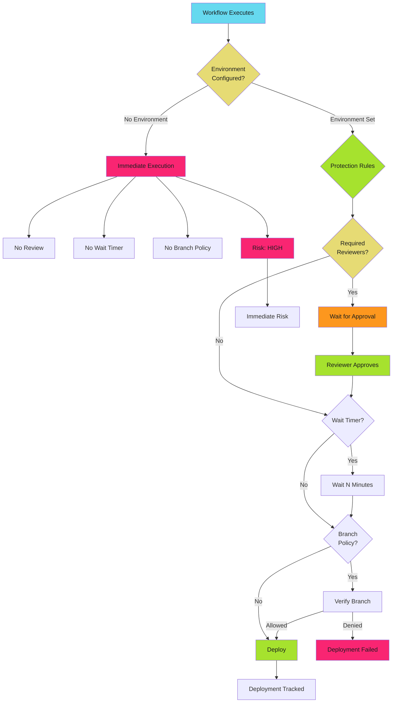

# Environment Protection Patterns

Environments add approval gates, wait timers, and deployment controls to GitHub Actions workflows. Production deployments should never execute without human review.

!!! danger "The Risk"

    Workflows without environment protection can deploy malicious code to production in seconds. A compromised PR or workflow modification can push backdoors, exfiltrate data, or take down services before security teams detect the breach.

## Environment Security Model

GitHub Environments provide deployment protection through approval gates, wait timers, branch policies, and deployment tracking.



## Environment Protection Rules

Environments support four protection mechanisms.

### Required Reviewers

Require manual approval from designated reviewers before deployment.

**Configuration**: Settings → Environments → Environment name → Required reviewers

**Reviewers**: Up to 6 users or teams

**Use Case**: Production deployments, security-sensitive operations

**Example**:

```yaml
name: Production Deploy
on:
  push:
    branches: [main]

permissions:
  contents: read
  id-token: write

jobs:
  deploy:
    runs-on: ubuntu-latest
    environment: production
    steps:
      - uses: actions/checkout@b4ffde65f46336ab88eb53be808477a3936bae11  # v4.1.1

      - uses: google-github-actions/auth@55bd3a7c6e2ae7cf1877fd1ccb9d54c0503c457c  # v2.1.2
        with:
          workload_identity_provider: ${{ secrets.WIF_PROVIDER }}
          service_account: ${{ secrets.WIF_SERVICE_ACCOUNT }}

      - name: Deploy to production
        run: ./scripts/deploy.sh production
```

**Protection Behavior**:

1. Workflow reaches environment job
2. Workflow pauses, pending approval
3. GitHub notifies required reviewers
4. At least one reviewer must approve
5. Workflow resumes after approval

### Wait Timer

Delay deployment execution for a fixed period. Gives security teams time to detect malicious deployments.

**Configuration**: Settings → Environments → Environment name → Wait timer

**Duration**: 0-43200 minutes (up to 30 days)

**Use Case**: Detect malicious commits before production deployment, compliance requirements

**Example Production Pattern**:

```yaml
name: Production Deploy with Wait Timer
on:
  push:
    branches: [main]

permissions:
  contents: read
  id-token: write

jobs:
  deploy:
    runs-on: ubuntu-latest
    environment:
      name: production
      url: https://app.example.com
    steps:
      - uses: actions/checkout@b4ffde65f46336ab88eb53be808477a3936bae11  # v4.1.1

      - uses: google-github-actions/auth@55bd3a7c6e2ae7cf1877fd1ccb9d54c0503c457c  # v2.1.2
        with:
          workload_identity_provider: ${{ secrets.WIF_PROVIDER }}
          service_account: ${{ secrets.WIF_SERVICE_ACCOUNT }}

      - run: ./scripts/deploy.sh production
```

Configure wait timer in Settings → Environments → production → Wait timer: 15 minutes.

**Recommended Wait Times**:

| Environment | Wait Time | Rationale |
| ----------- | --------- | --------- |
| Development | 0 minutes | Fast feedback |
| Staging | 5 minutes | Brief security scan window |
| Production | 15-30 minutes | Security team review, monitoring alerts |
| Critical Infrastructure | 60 minutes | Extended review, compliance validation |

### Deployment Branch Policy

Restrict deployments to specific branches or tags.

**Configuration**: Settings → Environments → Environment name → Deployment branches

**Policy Types**:

1. **Protected branches only**: Only branches with protection rules
2. **Selected branches and tags**: Explicit allow-list with wildcard support
3. **All branches**: No restrictions (dangerous for production)

**Example Branch Policy Configuration**:

**Pattern**: `main`, `release/*`, `hotfix/*`

**Use Case**: Production environment only deploys from main, release, or hotfix branches

**Workflow**:

```yaml
name: Multi-Environment Deploy
on:
  push:
    branches: [main, 'release/**', 'hotfix/**']

permissions:
  contents: read
  id-token: write

jobs:
  deploy-production:
    runs-on: ubuntu-latest
    environment: production
    if: github.ref == 'refs/heads/main'
    steps:
      - uses: actions/checkout@b4ffde65f46336ab88eb53be808477a3936bae11  # v4.1.1
      - uses: google-github-actions/auth@55bd3a7c6e2ae7cf1877fd1ccb9d54c0503c457c  # v2.1.2
        with:
          workload_identity_provider: ${{ secrets.WIF_PROVIDER }}
          service_account: ${{ secrets.WIF_SERVICE_ACCOUNT }}
      - run: ./scripts/deploy.sh production

  deploy-staging:
    runs-on: ubuntu-latest
    environment: staging
    if: startsWith(github.ref, 'refs/heads/release/')
    steps:
      - uses: actions/checkout@b4ffde65f46336ab88eb53be808477a3936bae11  # v4.1.1
      - uses: google-github-actions/auth@55bd3a7c6e2ae7cf1877fd1ccb9d54c0503c457c  # v2.1.2
        with:
          workload_identity_provider: ${{ secrets.WIF_PROVIDER }}
          service_account: ${{ secrets.WIF_SERVICE_ACCOUNT }}
      - run: ./scripts/deploy.sh staging
```

**Recommended Policies**:

| Environment | Policy | Branches/Tags |
| ----------- | ------ | ------------- |
| Development | All branches | Any branch |
| Staging | Selected branches | `main`, `release/*`, `develop` |
| Production | Protected branches only | `main` (with protection rules) |
| Hotfix | Selected branches | `main`, `hotfix/*` |

### Environment Secrets

Store deployment credentials scoped to specific environments.

**Configuration**: Settings → Environments → Environment name → Environment secrets

**Scope**: Only available to workflows using the environment

**Use Case**: Separate production and staging credentials, minimize secret exposure

**Example**:

```yaml
name: Multi-Environment Deploy
on:
  workflow_dispatch:
    inputs:
      environment:
        required: true
        type: choice
        options:
          - staging
          - production

permissions:
  contents: read
  id-token: write

jobs:
  deploy:
    runs-on: ubuntu-latest
    environment: ${{ github.event.inputs.environment }}
    steps:
      - uses: actions/checkout@b4ffde65f46336ab88eb53be808477a3936bae11  # v4.1.1

      - uses: google-github-actions/auth@55bd3a7c6e2ae7cf1877fd1ccb9d54c0503c457c  # v2.1.2
        with:
          workload_identity_provider: ${{ secrets.WIF_PROVIDER }}
          service_account: ${{ secrets.WIF_SERVICE_ACCOUNT }}

      - run: ./scripts/deploy.sh ${{ github.event.inputs.environment }}
```

Environment secrets `WIF_PROVIDER` and `WIF_SERVICE_ACCOUNT` are scoped to `staging` and `production` environments with different values.

## Deployment Gates

Combine protection rules for defense-in-depth.

### Pattern 1: Production Triple Gate

**Protection**: Required reviewers + Wait timer + Branch policy

**Configuration**:

- Required reviewers: 2 platform team members
- Wait timer: 15 minutes
- Deployment branches: Protected branches only (`main`)

**Workflow**:

```yaml
name: Production Triple Gate
on:
  push:
    branches: [main]

permissions:
  contents: read
  id-token: write

jobs:
  security-scan:
    runs-on: ubuntu-latest
    permissions:
      contents: read
      security-events: write
    steps:
      - uses: actions/checkout@b4ffde65f46336ab88eb53be808477a3936bae11  # v4.1.1
      - uses: aquasecurity/trivy-action@84384bd6e777ef152729993b8145ea352e9dd3ef  # 0.17.0
        with:
          scan-type: 'fs'
          format: 'sarif'
          output: 'trivy-results.sarif'
      - uses: github/codeql-action/upload-sarif@cdcdbb579706841c47f7063dda365e292e5cad7a  # v2.13.4
        with:
          sarif_file: 'trivy-results.sarif'

  deploy:
    runs-on: ubuntu-latest
    needs: security-scan
    environment:
      name: production
      url: https://app.example.com
    steps:
      - uses: actions/checkout@b4ffde65f46336ab88eb53be808477a3936bae11  # v4.1.1

      - uses: google-github-actions/auth@55bd3a7c6e2ae7cf1877fd1ccb9d54c0503c457c  # v2.1.2
        with:
          workload_identity_provider: ${{ secrets.WIF_PROVIDER }}
          service_account: ${{ secrets.WIF_SERVICE_ACCOUNT }}

      - name: Deploy to production
        run: ./scripts/deploy.sh production

      - name: Notify deployment
        if: always()
        run: |
          curl -X POST https://slack.com/api/chat.postMessage \
            -H "Authorization: Bearer ${{ secrets.SLACK_BOT_TOKEN }}" \
            -d "channel=deployments" \
            -d "text=Production deployment ${{ job.status }} for ${{ github.sha }}"
```

**Protection Flow**:

1. Security scan completes
2. Workflow waits 15 minutes (wait timer)
3. Two reviewers must approve
4. Branch policy verified (`main` only)
5. Deployment executes
6. Slack notification sent

### Pattern 2: Fork PR Preview with Approval

**Protection**: Required reviewers + OIDC + Minimal permissions

**Configuration**:

- Required reviewers: 1 maintainer
- Deployment branches: All branches (for PR previews)
- OIDC federation: No stored secrets

**Workflow**:

```yaml
name: PR Preview
on:
  pull_request_target:
    branches: [main]

permissions:
  contents: read
  pull-requests: write
  id-token: write

jobs:
  deploy-preview:
    runs-on: ubuntu-latest
    environment: pr-previews
    steps:
      - uses: actions/checkout@b4ffde65f46336ab88eb53be808477a3936bae11  # v4.1.1
        with:
          ref: ${{ github.event.pull_request.head.sha }}

      - uses: google-github-actions/auth@55bd3a7c6e2ae7cf1877fd1ccb9d54c0503c457c  # v2.1.2
        with:
          workload_identity_provider: ${{ secrets.WIF_PROVIDER }}
          service_account: ${{ secrets.WIF_SERVICE_ACCOUNT }}

      - name: Deploy preview
        id: deploy
        run: |
          PREVIEW_URL=$(./scripts/deploy-preview.sh pr-${{ github.event.pull_request.number }})
          echo "url=$PREVIEW_URL" >> $GITHUB_OUTPUT

      - uses: actions/github-script@60a0d83039c74a4aee543508d2ffcb1c3799cdea  # v7.0.1
        with:
          script: |
            await github.rest.issues.createComment({
              issue_number: context.payload.pull_request.number,
              owner: context.repo.owner,
              repo: context.repo.repo,
              body: `Preview deployed: ${{ steps.deploy.outputs.url }}`
            });
```

**Protection Behavior**:

1. Fork PR triggers `pull_request_target`
2. Workflow pauses for maintainer approval
3. Maintainer reviews PR, approves deployment
4. Preview deploys with OIDC credentials
5. Preview URL posted as PR comment

### Pattern 3: Canary Deployment with Wait Timer

**Protection**: Wait timer + Health checks + Rollback

**Configuration**:

- Wait timer: 10 minutes
- Deployment branches: `main`
- Health check validation

**Workflow**:

```yaml
name: Canary Deploy
on:
  push:
    branches: [main]

permissions:
  contents: read
  id-token: write

jobs:
  deploy-canary:
    runs-on: ubuntu-latest
    environment:
      name: production-canary
      url: https://canary.example.com
    steps:
      - uses: actions/checkout@b4ffde65f46336ab88eb53be808477a3936bae11  # v4.1.1

      - uses: google-github-actions/auth@55bd3a7c6e2ae7cf1877fd1ccb9d54c0503c457c  # v2.1.2
        with:
          workload_identity_provider: ${{ secrets.WIF_PROVIDER }}
          service_account: ${{ secrets.WIF_SERVICE_ACCOUNT }}

      - name: Deploy to canary
        run: ./scripts/deploy.sh canary

      - name: Wait for metrics
        run: sleep 600

      - name: Validate canary health
        id: health
        run: |
          HEALTH=$(./scripts/check-canary-health.sh)
          if [ "$HEALTH" != "healthy" ]; then
            echo "::error::Canary health check failed"
            exit 1
          fi

  deploy-production:
    runs-on: ubuntu-latest
    needs: deploy-canary
    environment:
      name: production
      url: https://app.example.com
    steps:
      - uses: actions/checkout@b4ffde65f46336ab88eb53be808477a3936bae11  # v4.1.1

      - uses: google-github-actions/auth@55bd3a7c6e2ae7cf1877fd1ccb9d54c0503c457c  # v2.1.2
        with:
          workload_identity_provider: ${{ secrets.WIF_PROVIDER }}
          service_account: ${{ secrets.WIF_SERVICE_ACCOUNT }}

      - name: Deploy to production
        run: ./scripts/deploy.sh production

      - name: Monitor deployment
        run: ./scripts/monitor-deployment.sh production 300
```

**Protection Flow**:

1. Deploy to canary environment
2. Wait timer delays 10 minutes
3. Health checks validate canary
4. If healthy, proceed to production environment
5. Production wait timer and reviewers apply
6. Production deployment executes with monitoring

## Environment Configuration via API

Automate environment configuration using GitHub CLI or REST API.

### Create Environment with Protection Rules

```bash
#!/bin/bash
# scripts/create-environment.sh

REPO="org/repo"
ENVIRONMENT="production"

# Create environment
gh api \
  --method PUT \
  -H "Accept: application/vnd.github+json" \
  "/repos/$REPO/environments/$ENVIRONMENT"

# Add required reviewers
gh api \
  --method PUT \
  -H "Accept: application/vnd.github+json" \
  "/repos/$REPO/environments/$ENVIRONMENT" \
  -f "reviewers[][type]=User" \
  -f "reviewers[][id]=12345" \
  -f "reviewers[][type]=Team" \
  -f "reviewers[][id]=67890" \
  -f "wait_timer=900" \
  -f "deployment_branch_policy[protected_branches]=true" \
  -f "deployment_branch_policy[custom_branch_policies]=false"
```

### Bulk Environment Setup

```bash
#!/bin/bash
# scripts/setup-environments.sh

REPO="org/repo"

# Development environment
gh api \
  --method PUT \
  -H "Accept: application/vnd.github+json" \
  "/repos/$REPO/environments/development" \
  -f "deployment_branch_policy[protected_branches]=false" \
  -f "deployment_branch_policy[custom_branch_policies]=true"

# Add custom branch policy for development
gh api \
  --method POST \
  -H "Accept: application/vnd.github+json" \
  "/repos/$REPO/environments/development/deployment-branch-policies" \
  -f "name=*"

# Staging environment
gh api \
  --method PUT \
  -H "Accept: application/vnd.github+json" \
  "/repos/$REPO/environments/staging" \
  -f "wait_timer=300" \
  -f "deployment_branch_policy[protected_branches]=false" \
  -f "deployment_branch_policy[custom_branch_policies]=true"

# Add branch policies for staging
for branch in main develop 'release/*'; do
  gh api \
    --method POST \
    -H "Accept: application/vnd.github+json" \
    "/repos/$REPO/environments/staging/deployment-branch-policies" \
    -f "name=$branch"
done

# Production environment
gh api \
  --method PUT \
  -H "Accept: application/vnd.github+json" \
  "/repos/$REPO/environments/production" \
  -f "wait_timer=900" \
  -f "deployment_branch_policy[protected_branches]=true" \
  -f "deployment_branch_policy[custom_branch_policies]=false"

# Add required reviewers (replace IDs)
gh api \
  --method PUT \
  -H "Accept: application/vnd.github+json" \
  "/repos/$REPO/environments/production" \
  -F "reviewers[][type]=User" \
  -F "reviewers[][id]=12345" \
  -F "reviewers[][type]=Team" \
  -F "reviewers[][id]=67890"
```

## Deployment Tracking

Environments provide deployment history and status tracking.

### Deployment Status API

```bash
#!/bin/bash
# scripts/check-deployment-status.sh

REPO="org/repo"
ENVIRONMENT="production"

# Get recent deployments
gh api \
  -H "Accept: application/vnd.github+json" \
  "/repos/$REPO/deployments?environment=$ENVIRONMENT&per_page=10" \
  --jq '.[] | {sha: .sha, environment: .environment, status: .statuses_url}'

# Get deployment status
DEPLOYMENT_ID="123456"
gh api \
  -H "Accept: application/vnd.github+json" \
  "/repos/$REPO/deployments/$DEPLOYMENT_ID/statuses" \
  --jq '.[] | {state: .state, created_at: .created_at, description: .description}'
```

### Monitor Active Deployments

```yaml
name: Deployment Monitor
on:
  schedule:
    - cron: '*/5 * * * *'

permissions:
  deployments: read

jobs:
  monitor:
    runs-on: ubuntu-latest
    steps:
      - name: Check active deployments
        env:
          GH_TOKEN: ${{ github.token }}
        run: |
          ACTIVE=$(gh api \
            -H "Accept: application/vnd.github+json" \
            "/repos/${{ github.repository }}/deployments?environment=production&per_page=5" \
            --jq '[.[] | select(.updated_at > (now - 3600 | todate))] | length')

          if [ "$ACTIVE" -gt 2 ]; then
            echo "::warning::Multiple active deployments detected"
          fi

      - name: Alert on pending approvals
        env:
          GH_TOKEN: ${{ github.token }}
        run: |
          PENDING=$(gh api \
            -H "Accept: application/vnd.github+json" \
            "/repos/${{ github.repository }}/actions/runs?status=waiting&per_page=10" \
            --jq '[.workflow_runs[] | select(.updated_at < (now - 1800 | todate))] | length')

          if [ "$PENDING" -gt 0 ]; then
            echo "::warning::Deployments pending approval for >30 minutes"
          fi
```

## Security Best Practices

1. **Always use environments for production**: Never deploy to production without approval gates
2. **Combine multiple protections**: Use required reviewers AND wait timers AND branch policies
3. **Separate environment secrets**: Production credentials should never be in repository or organization secrets
4. **Prefer OIDC over stored secrets**: Use environment-scoped OIDC federation for cloud deployments
5. **Enforce branch policies**: Restrict production to protected branches only
6. **Monitor deployment history**: Alert on unusual deployment patterns or approval bypasses
7. **Document approval process**: Clear SLA for deployment approvals (e.g., 15 minutes for production)
8. **Review environment access**: Audit which teams and users can approve deployments
9. **Test environment protection**: Verify approval gates work before production use
10. **Automate rollback**: Include rollback procedures in deployment workflows

## Common Mistakes

### Mistake 1: No Environment Protection

**Problem**: Production deployment without approval gates

```yaml
# DANGEROUS - No environment protection
name: Production Deploy
on:
  push:
    branches: [main]

jobs:
  deploy:
    runs-on: ubuntu-latest
    steps:
      - run: ./scripts/deploy.sh production
```

**Fix**: Add environment with protection rules

```yaml
name: Production Deploy
on:
  push:
    branches: [main]

jobs:
  deploy:
    runs-on: ubuntu-latest
    environment: production
    steps:
      - run: ./scripts/deploy.sh production
```

Configure protection rules in Settings → Environments → production.

### Mistake 2: Environment Secrets Without Branch Policy

**Problem**: Any branch can access production secrets

**Fix**: Restrict environment to protected branches

Settings → Environments → production → Deployment branches → Protected branches only

### Mistake 3: Fork PR Access to Production

**Problem**: `pull_request_target` with production environment

```yaml
# DANGEROUS - Fork PRs can trigger production deployment
name: Deploy Preview
on:
  pull_request_target:

jobs:
  deploy:
    runs-on: ubuntu-latest
    environment: production
    steps:
      - uses: actions/checkout@b4ffde65f46336ab88eb53be808477a3936bae11  # v4.1.1
        with:
          ref: ${{ github.event.pull_request.head.sha }}
      - run: ./scripts/deploy.sh production
```

**Fix**: Use dedicated preview environment

```yaml
name: Deploy Preview
on:
  pull_request_target:

jobs:
  deploy:
    runs-on: ubuntu-latest
    environment: pr-previews
    steps:
      - uses: actions/checkout@b4ffde65f46336ab88eb53be808477a3936bae11  # v4.1.1
        with:
          ref: ${{ github.event.pull_request.head.sha }}
      - run: ./scripts/deploy-preview.sh
```

### Mistake 4: Single Reviewer

**Problem**: Only one reviewer required for production

**Fix**: Require multiple reviewers for production

Settings → Environments → production → Required reviewers → Add 2-3 platform team members

### Mistake 5: No Wait Timer for Critical Systems

**Problem**: Immediate production deployment without security review window

**Fix**: Add wait timer for security team monitoring

Settings → Environments → production → Wait timer → 15-30 minutes

## Troubleshooting

| Issue | Cause | Solution |
| ----- | ----- | -------- |
| Deployment pending indefinitely | Missing required reviewers | Add at least one active reviewer to environment |
| Branch policy blocks deployment | Branch not in allow-list | Add branch pattern to deployment branch policy |
| Environment secret not available | Workflow not using environment | Add `environment: name` to job configuration |
| Approval notification not sent | Reviewer email notifications disabled | Enable notifications in GitHub settings |
| Wait timer too long | Misconfigured wait timer | Reduce wait timer in environment settings |
| Fork PR cannot deploy preview | `pull_request` trigger used | Use `pull_request_target` with environment protection |

## Quick Reference

### Environment Protection Decision Matrix

| Environment | Required Reviewers | Wait Timer | Branch Policy | OIDC |
| ----------- | ------------------ | ---------- | ------------- | ---- |
| Development | No | 0 min | All branches | Optional |
| Staging | Optional | 5 min | Selected branches | Recommended |
| Production | Yes (2+) | 15-30 min | Protected only | Required |
| PR Previews | Yes (1) | 0 min | All branches | Required |

### Protection Rule Combinations

| Use Case | Protection Rules |
| -------- | ---------------- |
| Fast iteration | No protection |
| Staging deployment | Wait timer (5 min) + Branch policy |
| Production deployment | Required reviewers (2) + Wait timer (15 min) + Branch policy |
| Fork PR preview | Required reviewers (1) + OIDC |
| Critical infrastructure | Required reviewers (3) + Wait timer (30 min) + Branch policy + Audit logging |

### Environment Configuration Checklist

- [ ] Environment created for each deployment target
- [ ] Production requires 2+ reviewers
- [ ] Production wait timer configured (15-30 minutes)
- [ ] Production restricted to protected branches
- [ ] Environment secrets scoped to environment, not repository
- [ ] OIDC federation configured for cloud deployments
- [ ] Deployment tracking monitored
- [ ] Approval SLA documented
- [ ] Rollback procedures tested
- [ ] Security team has reviewer access

## Related Pages

- [Workflow Trigger Security](./triggers.md) - Fork PR security, `pull_request_target` patterns
- [Reusable Workflow Security](./reusable.md) - Environment inheritance in reusable workflows
- [OIDC Federation Patterns](../secrets/oidc.md) - Secretless authentication with environment-scoped trust
- [GITHUB_TOKEN Permissions](../token-permissions/index.md) - Minimal permissions for deployment workflows
- [Secret Management](../secrets/index.md) - Environment secret scoping
