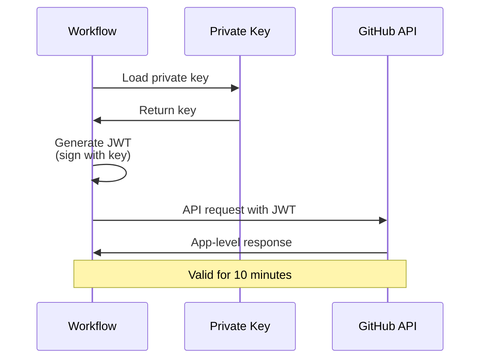
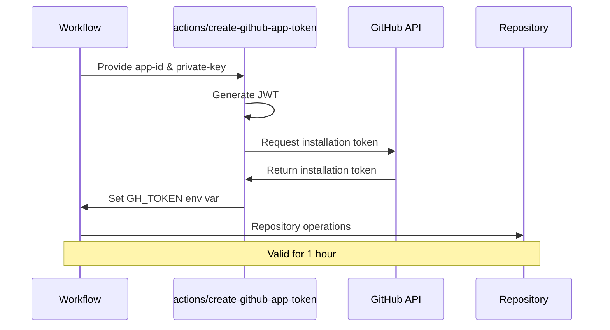
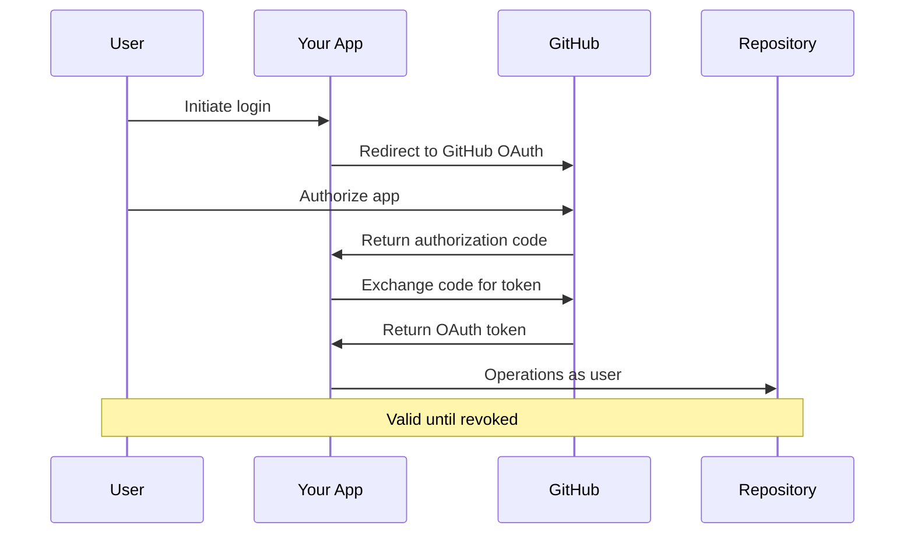

# GitHub App Authentication Flows

Visual sequence diagrams showing how each GitHub App authentication method works.

!!! info "Flow Selection Guide"
    Choose based on who initiates the action and what scope is needed. JWT for app management, Installation Token for automation, OAuth for user-driven operations.

## JWT Flow

**Use case**: App management operations (list installations, retrieve app metadata)

**Key points**:

- Signed with private key
- 10-minute expiration
- App-level permissions only
- Cannot access repository contents

## Installation Token Flow

**Use case**: Automation workflows (CI/CD, cross-repo operations)

**Key points**:

- Generated via GitHub API or actions/create-github-app-token
- 1-hour expiration (default)
- Repository/organization-scoped permissions
- Most common method for GitHub Actions

## OAuth Flow

**Use case**: User-driven operations (web apps, CLI tools)

**Key points**:

- Requires user authorization
- Valid until revoked
- User-context permissions
- Preserves user identity in audit logs

## Flow Selection Quick Reference

| Flow Type | Initiator | Lifespan | Typical Use |
|-----------|-----------|----------|-------------|
| **JWT** | System | 10 minutes | App management, bootstrap |
| **Installation Token** | System | 1 hour | CI/CD, automation |
| **OAuth** | User | Until revoked | Web apps, CLI tools |

## Related Content

- **[Authentication Decision Guide](authentication-decision-guide.md)** - Choose the right authentication method
- **[JWT Authentication](../../patterns/github-actions/actions-integration/jwt-authentication/index.md)** - Detailed JWT guide
- **[Token Generation](../../patterns/github-actions/actions-integration/token-generation/index.md)** - Installation token patterns
- **[OAuth Authentication](../../patterns/github-actions/actions-integration/oauth-authentication/index.md)** - OAuth implementation

*Three flows. Three purposes. Choose based on who initiates and what scope is needed.*
