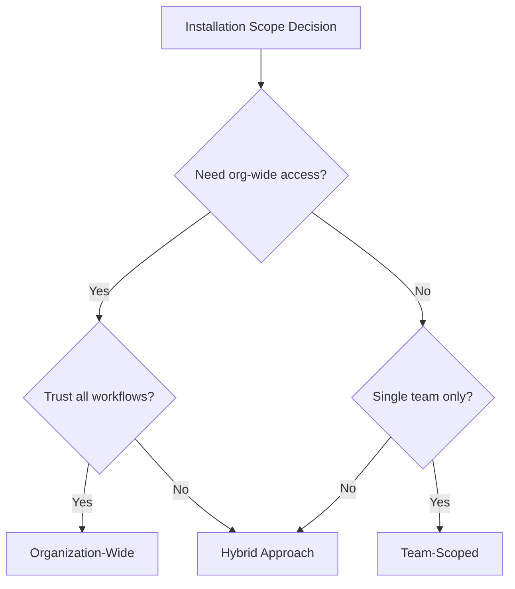

# Installation Scopes

Choosing the right installation scope for your GitHub Core App.

## Organization-Wide Installation

**Configuration**: All repositories

### Advantages

- New repositories automatically included
- No maintenance overhead
- Consistent access across organization

### Considerations

- Requires trust in workflows
- Broader attack surface if compromised
- More careful permission design needed

!!! tip "When to Use"

    Best for infrastructure teams with org-wide automation needs.

## Team-Scoped Installation

**Configuration**: Selected repositories (team members)

### Advantages

- Limited blast radius
- Team-level isolation
- Granular control

### Considerations

- Manual maintenance as teams change
- Complexity managing multiple apps
- GraphQL queries still require Members permission

!!! tip "When to Use"

    Best for team-specific automation with limited scope requirements.

## Hybrid Approach

**Pattern**: Organization-wide installation + workflow-level filtering

```yaml
# Workflow only operates on specific team
- name: Fetch team repositories
  run: |
    gh api graphql -f query='
    {
      organization(login: "$ORG") {
        team(slug: "platform") {
          repositories { ... }
        }
      }
    }'
```

### Advantages

- Central app management
- Team-scoped operations
- No repository selection maintenance
- Flexible filtering in workflows

!!! success "Recommended"

    The hybrid approach provides the best balance of manageability and control.

## Comparison Matrix

| Aspect | Org-Wide | Team-Scoped | Hybrid |
| -------- | ---------- | ------------- | -------- |
| **Setup Complexity** | Low | Medium | Low |
| **Maintenance** | None | High | None |
| **Blast Radius** | Large | Small | Controlled |
| **Flexibility** | High | Low | High |
| **New Repo Support** | Automatic | Manual | Automatic |

## Decision Flowchart



## Implementation Examples

### Organization-Wide

1. Install app on "All repositories"
2. Use workflow-level logic to filter targets:

```yaml
- name: Get target repos
  run: |
    # Filter by naming convention
    gh repo list $ORG --json name -q '.[].name' | grep "^platform-"
```

### Team-Scoped

1. Install app on "Selected repositories"
2. Manually add team repositories
3. Update selection when team repos change

### Hybrid

1. Install app on "All repositories"
2. Query team membership for targeting:

```yaml
- name: Get team repos
  run: |
    gh api graphql -f query='
    {
      organization(login: "'"$ORG"'") {
        team(slug: "'"$TEAM"'") {
          repositories(first: 100) {
            nodes { name }
          }
        }
      }
    }' --jq '.data.organization.team.repositories.nodes[].name'
```

## Next Steps

- [Common permission requirements](common-permissions.md)
- [Troubleshooting](troubleshooting.md)
