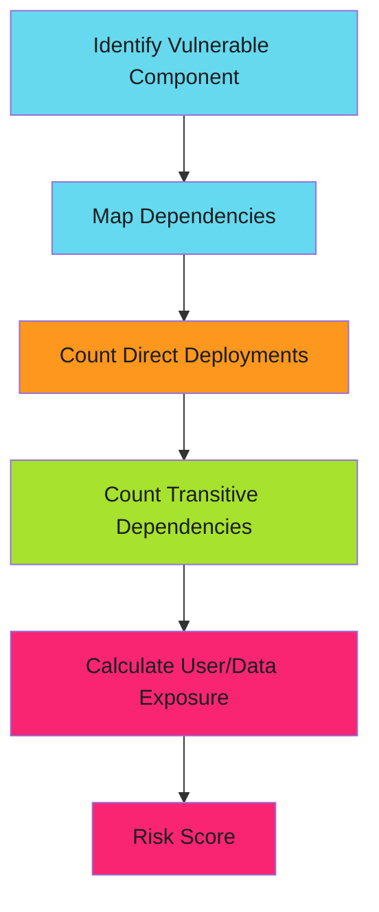

# Blast Radius Calculation

Impact isn't uniform across your infrastructure. A vulnerability that affects 1% of servers is lower risk than one affecting 80%.

!!! tip "Map Dependencies Before Vulnerabilities"
    Don't wait for a CVE to map your dependency tree. Automate dependency scanning now. When the next Log4Shell drops, you'll know your blast radius in minutes, not days.

## Blast Radius Matrix

Calculate what percentage of your systems/users are exposed:



## Blast Radius Multipliers

| Coverage | Multiplier | Example |
|----------|-----------|---------|
| **One-off system** | 0.2 | Internal-only tooling used by 3 people |
| **Team system** | 0.5 | Shared service for internal team |
| **Business-critical** | 2.0 | Customer-facing API, payment processing |
| **Infrastructure layer** | 3.0 | Kubernetes, load balancer, TLS library |
| **Universal dependency** | 5.0 | Log4j-style transitive dependency in everything |

## Real Example: OpenSSL CVE

1. **Component**: OpenSSL in production systems
2. **Direct**: 12 services using OpenSSL
3. **Transitive**: 47 services via language standard library
4. **Users affected**: 50,000 active users
5. **Data exposure**: Customer PII + payment tokens
6. **Multiplier**: 5.0 (infrastructure layer)
7. **Base Risk**: 8 (CVSS) × 5.0 = **40 (HIGH)**

## Blast Radius Examples

### Example 1: Python Library in Microservice

**Vulnerable Package**: `pillow` (image processing)

```text
Direct systems: Payment service, content server
Transitive: 8 services via shared dependencies
Users affected: 80% of customer base
Data exposure: Profile images, invoice PDFs
Blast radius multiplier: 2.0 (business-critical)

Risk calculation:
- Base CVSS: 7.2
- Exploitability: 2 (requires upload + processing)
- Impact: 3 (DoS on image processing)
- Likelihood: 2 (needs specific image file)
- Score: (3 × 2 × 2) = 12 × 2.0 = 24 (MEDIUM)
- Timeline: 30 days acceptable
```

### Example 2: Internal Go Tool

**Vulnerable Package**: `gopkg.in/yaml.v2` (YAML parsing)

```text
Direct systems: DevOps tools, 3 engineers use it
Transitive: 0 (pure internal)
Users affected: Team only
Data exposure: None (CI/CD configs only)
Blast radius multiplier: 0.2 (one-off system)

Risk calculation:
- Base CVSS: 8.1
- Exploitability: 1 (requires crafted YAML + local access)
- Impact: 4 (RCE if triggered)
- Likelihood: 1 (engineer would have to intentionally run malicious config)
- Score: (4 × 1 × 1) = 4 × 0.2 = 0.8 (MINIMAL)
- Timeline: 90 days acceptable, lower priority
```

### Example 3: Kubernetes Container Runtime

**Vulnerable Package**: `containerd` (runtime)

```text
Direct systems: Every container in production runs on this
Transitive: All services depend on it
Users affected: 100% of customers
Data exposure: All workloads (compute, storage, network)
Blast radius multiplier: 5.0 (universal infrastructure)

Risk calculation:
- Base CVSS: 9.1
- Exploitability: 3 (requires container access first)
- Impact: 4 (escape to host)
- Likelihood: 3 (active research, may be weaponized)
- Score: (4 × 3 × 3) = 36 × 5.0 = 180 (CRITICAL - IMMEDIATE)
- Timeline: 4-hour response target
```

## References

- [Dependency Analysis Tools](https://owasp.org/www-community/Component_Analysis)

---

*Blast radius determines impact. Universal dependencies demand immediate action.*
