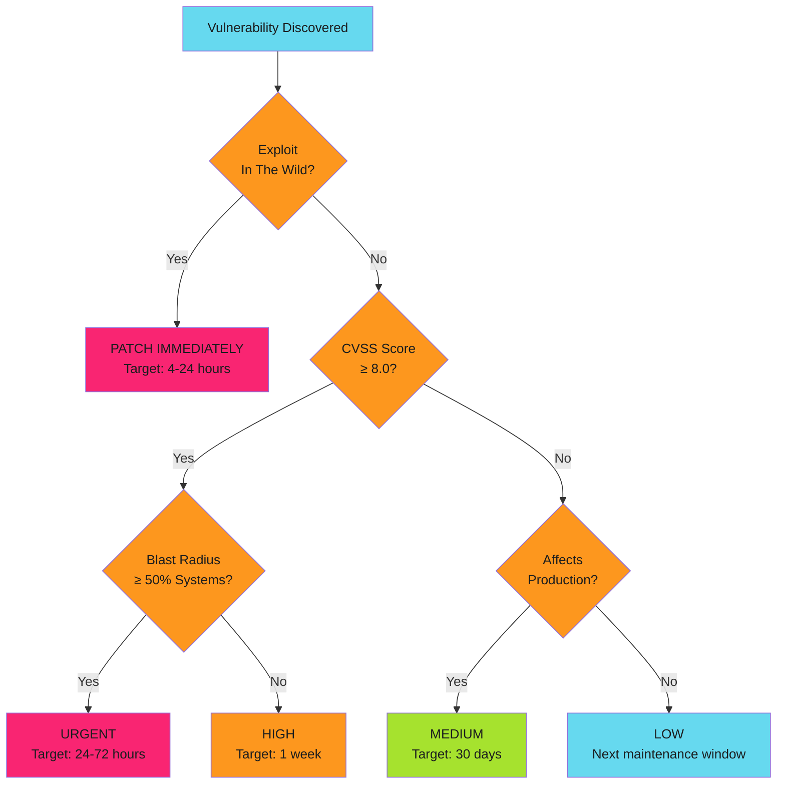
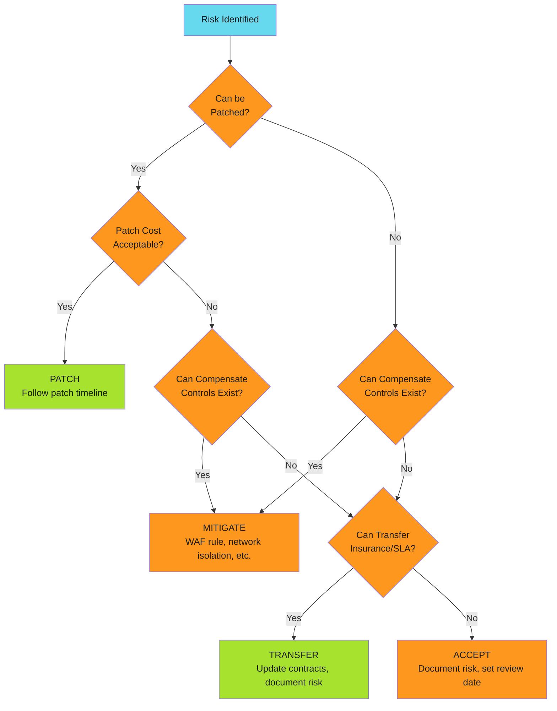
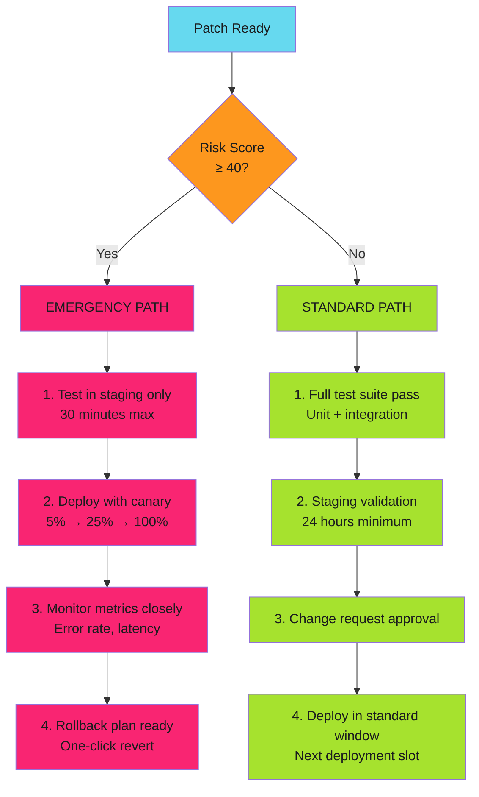

---
tags:
  - risk-management
  - decision-framework
  - patch-management
description: >-
  Decision trees for vulnerability remediation. Patch-now vs. later, mitigate vs. accept vs. transfer, and emergency vs. standard patching workflows.
---

# Decision Trees

!!! tip "Use Decision Trees to Avoid Analysis Paralysis"
    When a CVE drops at 2am, you don't have time for debate. Pre-made decision trees eliminate decision fatigue. Follow the flowchart. Document exceptions later.

## Decision Tree 1: Patch Now vs. Later

**Implementation Checklist for IMMEDIATE**:

- [ ] Alert all on-call engineers
- [ ] Start remediation in parallel environments
- [ ] Identify rollback plan
- [ ] Do NOT wait for change request approval (this is the exception)
- [ ] Notify leadership once mitigation is in progress
- [ ] Write incident report post-patch

## Decision Tree 2: Mitigate vs. Accept vs. Transfer

## Decision Tree 3: Emergency vs. Standard Patching

---

*Fast decisions save time. Use decision trees to avoid analysis paralysis.*
