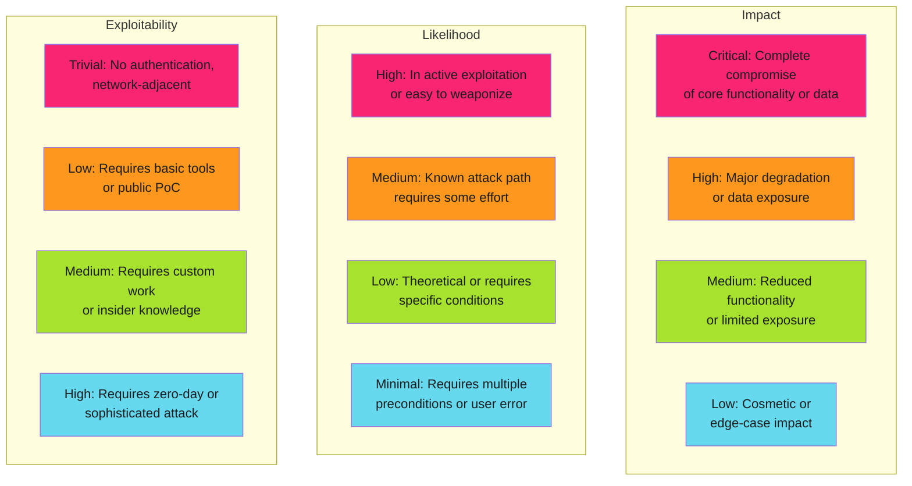

---
tags:
  - risk-management
  - risk-assessment
  - vulnerability-management
description: >-
  Risk assessment matrix for vulnerability prioritization. Impact, likelihood, and exploitability scoring with real-world examples and decision frameworks.
---

# Risk Assessment Matrix

Start by establishing baseline risk across three dimensions: impact, likelihood, and exploitability.

!!! tip "Assess All Three Dimensions"
    High impact with low likelihood is different risk than low impact with high likelihood. All three dimensions matter. Don't optimize for a single number.

## Risk Dimensions



## Scoring Table

| Factor | 4 (Critical) | 3 (High) | 2 (Medium) | 1 (Low) |
|--------|-----------|----------|-----------|---------|
| **Impact** | Complete system failure, auth bypass, data loss | Major service degradation, sensitive data exposure | Partial functionality loss, limited exposure | Denial of service on rare path, information disclosure |
| **Likelihood** | Active exploits in wild, trivial to execute | Known exploitation path, tool availability | Proof of concept exists, requires effort | Theoretical only, multiple preconditions |
| **Exploitability** | No auth, network-adjacent, <5 minute PoC | Public PoC, basic tools needed | Custom work required, insider knowledge | Zero-day equivalent, extreme complexity |

## Risk Score Calculation

```text
Risk Score = (Impact × Likelihood × Exploitability) / 27 × Blast Radius
```

Where:

- Each factor: 1–4 points
- Result: 1–64 before blast radius adjustment
- **Blast Radius**: multiplier 0.2 to 5.0 based on affected systems

### Risk Score Interpretation

| Score | Label | Action |
|-------|-------|--------|
| 45+ | **CRITICAL** | Patch immediately, within 24 hours |
| 30-44 | **HIGH** | Patch this sprint, within 1 week |
| 15-29 | **MEDIUM** | Schedule for next planning cycle, within 30 days |
| 5-14 | **LOW** | Plan for regular maintenance, no urgency |
| <5 | **MINIMAL** | Track, monitor, address opportunistically |

## References

- [OWASP Risk Rating](https://owasp.org/www-project-risk-rating-manager/)
- [NIST Security Controls](https://csrc.nist.gov/publications/detail/sp/800-53/rev-5)

---

*Risk = Impact × Likelihood × Exploitability. Prioritize ruthlessly based on exposure.*
