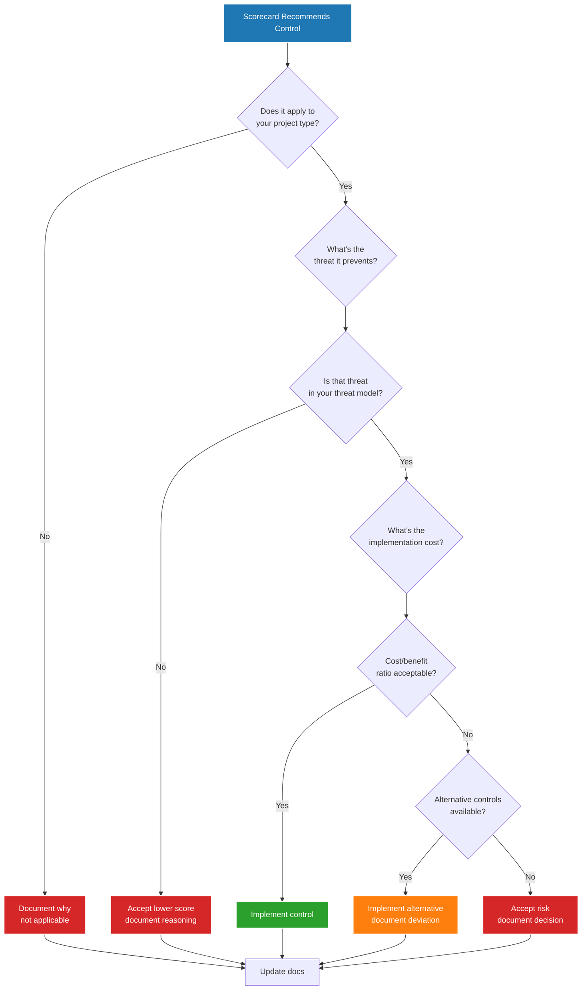

# Decision Framework

OpenSSF Scorecard gives you a score, not a prescription. Some recommendations are controversial. Some don't apply to your project. Some create more problems than they solve.

**This guide helps you decide when to follow recommendations and when to deviate.**

!!! warning "Scores Are Not Security"

    A 10/10 Scorecard result doesn't guarantee security. A 7/10 with intentional exceptions might be more secure than blindly chasing perfection. Make informed decisions based on your threat model and context.

---

## Decision Philosophy

### The Wrong Approach

```text
❌ Goal: Achieve 10/10 Scorecard score
❌ Method: Implement all recommendations regardless of context
❌ Result: Cargo cult security, wasted effort, potential functionality breaks
```

### The Right Approach

```text
✅ Goal: Improve security posture measurably
✅ Method: Evaluate each recommendation against threat model
✅ Result: Intentional security decisions, documented exceptions, real protection
```

**Core principle**: Every security control has a cost. Your job is to evaluate whether the security benefit exceeds the cost for your specific context.

---

## General Decision Framework

When Scorecard recommends something, use this framework:



**Key questions to ask:**

1. **Applicability**: Does this check apply to my project type?
2. **Threat model**: Is this threat realistic for my context?
3. **Cost/benefit**: Does the security improvement justify the effort?
4. **Alternatives**: Can I achieve the same security outcome differently?

---

## Controversial Check: Pinned-Dependencies

**Recommendation**: Pin all dependencies to immutable SHA digests.

**Controversy**: Breaks some legitimate use cases and creates maintenance overhead.

### Decision Matrix

| Scenario | Follow Recommendation | Deviate | Rationale |
|----------|----------------------|---------|-----------|
| GitHub Actions in production workflows | ✅ Pin to SHA | ❌ | Immutable references prevent supply chain attacks |
| `ossf/scorecard-action` | ❌ | ✅ Use version tag | Action validates its own identity via version tags |
| `slsa-framework/slsa-github-generator` | ❌ | ✅ Use version tag | SLSA verifier checks builder identity against version tags |
| Container base images | Depends | Depends | See detailed analysis below |
| Language version selectors (`node-version: '20'`) | ❌ | ✅ Use version number | Not a downloaded dependency, just a version selector |
| Third-party installation scripts | ✅ Pin with checksum | ❌ | Prevents malicious script injection |

### Container Images: Detailed Analysis

**The trade-off**:

```dockerfile
# Option 1: Version tag (mutable)

FROM node:20-alpine

# ✅ Automatic security patches from registry

# ✅ Low maintenance overhead

# ❌ Lower Scorecard score

# ❌ Unexpected behavior changes possible

```

```dockerfile
# Option 2: SHA pin (immutable)

FROM node:20-alpine@sha256:a1b2c3d4e5f6...

# ✅ Higher Scorecard score

# ✅ Reproducible builds

# ❌ Manual or automated update process required

# ❌ Delayed security patches unless Renovate is configured

```

**Decision criteria**:

| Your Context | Recommended Approach | Why |
|--------------|---------------------|-----|
| **Production containers**, CI/CD managed | SHA pin + Renovate | Security + automation = best of both worlds |
| **Development containers**, local use | Version tag | Simplicity over security, not in threat path |
| **Official images** (node, golang, python) | SHA pin + Renovate | High supply chain risk, good registry support |
| **Internal registry**, controlled updates | Version tag | You control the registry, risk is lower |
| **No automated updates** available | Version tag | Manual SHA updates create stale images with CVEs |

### Documentation Template: Pinned-Dependencies Exceptions

Create `.github/SCORECARD-EXCEPTIONS.md`:

```markdown
# Scorecard Exceptions

## Pinned-Dependencies: Version Tag Exceptions

### ossf/scorecard-action

**Status**: Intentional deviation
**Check**: Pinned-Dependencies
**Score impact**: -1 point (9/10 instead of 10/10)

**Reason**:
The `ossf/scorecard-action` validates its own workflow identity using version tags.
SHA pinning causes workflow verification to fail.

**Mitigation**:
- Action is maintained by OpenSSF (trusted source)
- Renovate monitors for updates
- Version tags reviewed in PR process

**References**:
- https://github.com/ossf/scorecard-action/issues/123
- Decision documented: 2026-01-02

### Container Base Images

**Status**: Intentional deviation
**Check**: Pinned-Dependencies
**Score impact**: -2 points (8/10 instead of 10/10)

**Reason**:
We use version tags for container base images to receive automatic security
patches from the container registry. Our threat model prioritizes timely CVE patches over
protection against registry compromise.

**Mitigation**:
- Only official Docker images (node, golang, python)
- Renovate creates PRs for major/minor version bumps
- CI runs full test suite before merging
- Registry compromise detected by SLSA provenance validation

**Alternative considered**:
SHA pinning + Renovate automation was evaluated but rejected due to:
- 24-48 hour delay for Renovate to detect and PR new patches
- Manual override process complexity for critical CVEs
- Team capacity to review 50+ Renovate PRs/month

**References**:
- Threat model: docs/security/threat-model.md#registry-trust
- Decision review date: 2026-04-01
```

---

## Controversial Check: Branch-Protection (Admin Bypass)

**Recommendation**: Enforce branch protection on admins (`enforce_admins = true`).

**Controversy**: Small teams where everyone is an admin need escape hatches.

### Decision Matrix

| Team Structure | Follow Recommendation | Deviate | Rationale |
|----------------|----------------------|---------|-----------|
| **Large team** (10+ developers) | ✅ Enforce on admins | ❌ | Separation of duties achievable |
| **Medium team** (5-10 developers) | ✅ Enforce on admins | ❌ | Some admins shouldn't bypass |
| **Small team** (2-4 developers, all admins) | ❌ | ✅ Allow bypass | Emergency access needed |
| **Solo developer** (1 person) | ❌ | ✅ Allow bypass | Can't review own PRs |
| **Enterprise** (audit requirements) | ✅ Enforce on admins | ❌ | Compliance mandate |

### Small Team Pattern: Document Emergency Procedures

If you allow admin bypass, document the emergency process:

```markdown
# SECURITY.md

## Branch Protection Policy

### Standard Process

All changes to `main` require:
- Pull request with review
- All status checks passing
- At least 1 approval from CODEOWNERS

### Emergency Bypass Procedure

Admins may bypass branch protection for:
- Critical security patches (CVE with active exploit)
- Production outages blocking customer access
- Infrastructure failures

**Process**:
1. Document reason in commit message: `EMERGENCY BYPASS: [reason]`
2. Create PR retroactively within 4 hours
3. Request review from other team members
4. Document in incident log: `.github/EMERGENCY-BYPASSES.md`

**Audit**:
- Monthly review of all bypasses
- Bypass log reviewed in quarterly security meetings

**Last bypass**: 2025-12-15 (Production database outage)
**Bypass count (last 12 months)**: 3
```

### Large Team Pattern: No Bypass Allowed

```hcl
# terraform/github_repositories.tf

resource "github_branch_protection" "main" {
  repository_id  = github_repository.repo.node_id
  pattern        = "main"

  enforce_admins = true  # No bypass, even for emergencies

  required_pull_request_reviews {
    dismiss_stale_reviews           = true
    require_code_owner_reviews      = true
    required_approving_review_count = 2
    restrict_dismissals             = true
  }

  required_status_checks {
    strict   = true
    contexts = ["ci/tests", "security/sast", "security/dependency-scan"]
  }
}
```

**Emergency procedure**: Use GitHub support to temporarily disable protection, document in audit log.

---

## Controversial Check: Fuzzing

**Recommendation**: Integrate fuzzing into CI/CD pipeline.

**Controversy**: High effort, unclear benefit for many project types.

### Decision Matrix

| Project Type | Fuzz Recommended | Skip Fuzzing | Rationale |
|--------------|------------------|--------------|-----------|
| **Parsers** (JSON, XML, protocol buffers) | ✅ Yes | ❌ | High value - finds edge case crashes |
| **Network services** (APIs, servers) | ✅ Yes | ❌ | High value - discovers input validation bugs |
| **Cryptography** libraries | ✅ Yes | ❌ | Critical - security-sensitive code |
| **CLI tools** with file input | ⚠️ Maybe | ⚠️ Maybe | Moderate value - depends on threat model |
| **Web frontends** (React, Vue) | ❌ | ✅ Skip | Low value - UI doesn't process untrusted binary input |
| **Documentation sites** | ❌ | ✅ Skip | No value - no code execution |
| **Infrastructure as code** (Terraform) | ❌ | ✅ Skip | Low value - use validation tools instead |
| **Internal tools** (single user) | ❌ | ✅ Skip | Low value - no untrusted input |

### When to Skip Fuzzing

**Legitimate reasons to accept 0/10**:

1. **No untrusted input**: Application doesn't process user-supplied data
2. **Deterministic logic**: Business logic without parsing or complex state
3. **Cost exceeds benefit**: Setup time (days) vs. likelihood of finding issues (low)
4. **Better alternatives exist**: Property-based testing, static analysis, manual testing

### Fuzzing Alternatives

If you skip fuzzing, document alternative security measures:

```markdown
# SECURITY.md
