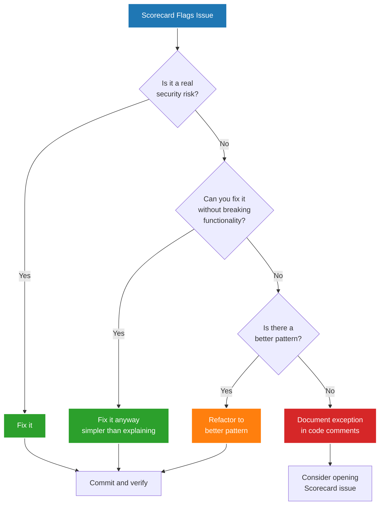

# False Positives Guide

OpenSSF Scorecard uses heuristics, not perfect knowledge. This creates false positives where the tool flags secure patterns as problems, and false negatives where it misses real issues.

**This guide helps you**:

- Identify false positive patterns for each check
- Decide between fixing and documenting exceptions
- Understand when deviations are legitimate
- Know when to open issues with the Scorecard project

!!! warning "Heuristics Have Limits"

    Scorecard cannot understand context. It flags patterns, not intent. Your job is to distinguish real security gaps from tool limitations.

---

## Decision Framework

When Scorecard flags something, follow this decision tree:



**General principles**:

1. **Fix when easy**: Simpler than documenting exceptions
2. **Document when necessary**: Explain legitimate deviations
3. **Report when widespread**: Help improve Scorecard heuristics
4. **Don't chase perfection**: Some scores won't reach 10/10

---

## Supply Chain Security Checks

### Pinned-Dependencies

#### False Positive: Actions That Require Version Tags

**Pattern**: Scorecard flags version tags, but some actions fail with SHA pins.

**Affected actions**:

```yaml
# These MUST use version tags

- uses: ossf/scorecard-action@v2.4.0
- uses: slsa-framework/slsa-github-generator/.github/workflows/generator_generic_slsa3.yml@v2.1.0
```

**Why false positive**:

- `ossf/scorecard-action`: Validates its own workflow identity using version tags
- `slsa-framework/slsa-github-generator`: Verifier checks builder identity against known version tags

**Resolution**:

Configure Renovate to exclude these from SHA pinning:

```json
{
  "packageRules": [
    {
      "description": "Auto-pin GitHub Actions to SHA digests",
      "matchManagers": ["github-actions"],
      "pinDigests": true
    },
    {
      "description": "Exceptions that require version tags",
      "matchManagers": ["github-actions"],
      "matchPackageNames": [
        "ossf/scorecard-action",
        "slsa-framework/slsa-github-generator"
      ],
      "pinDigests": false,
      "rangeStrategy": "pin"
    }
  ]
}
```

**Expected score**: 8/10 to 9/10 (Scorecard still penalizes exceptions)

#### False Positive: Docker Official Images

**Pattern**: Scorecard flags Docker official images like `node:20` as unpinned.

```dockerfile
# Scorecard flags this

FROM node:20

# Scorecard wants this

FROM node:20@sha256:a1b2c3d4...
```

**Why sometimes false positive**:

- Official images are regularly rebuilt with security patches
- SHA pinning defeats automated security updates
- Version tags like `node:20-alpine` provide stability + patches

**Resolution options**:

#### Option 1: Accept lower score (recommended)

```dockerfile
# Keep semantic version for security updates

FROM node:20-alpine

# Document in commit message:

# "Using version tag for automated security patches from container registry"

```

#### Option 2: Pin with automated updates

```dockerfile
# Pin to SHA but let Renovate update it

FROM node:20-alpine@sha256:a1b2c3d4e5f6...
```

Configure Renovate:

```json
{
  "packageRules": [
    {
      "matchDatasources": ["docker"],
      "pinDigests": true
    }
  ]
}
```

**Trade-off**:

- Version tag: Automatic security patches, lower Scorecard score
- SHA pin + Renovate: Higher score, depends on automation

**When legitimate**: Production containers where you control the update schedule and test updates before deployment.

#### False Positive: Language Version Managers

**Pattern**: Scorecard flags installation scripts using version managers.

```yaml
# Scorecard flags this

- uses: actions/setup-node@v4
  with:
    node-version: '20'  # Not SHA-pinned

- uses: actions/setup-go@v5
  with:
    go-version: '1.21'  # Not SHA-pinned
```

**Why false positive**: The action itself is SHA-pinned. The language version is not a dependency download, it's a version selector.

**Resolution**: Ignore this signal. The security risk is in the action itself, not the version number.

```yaml
# This is sufficiently secure

- uses: actions/setup-node@b4ffde65f46336ab88eb53be808477a3936bae11  # v4.1.1
  with:
    node-version: '20'  # Version selector, not a download
```

**Expected score**: Should be 10/10 if all actions are SHA-pinned

**If Scorecard still flags it**: Open an issue with Scorecard project. This is a heuristic limitation.

---

### Dangerous-Workflow

#### False Positive: Safe pull_request_target Patterns

**Pattern**: Scorecard flags `pull_request_target` even when used safely.

```yaml
# Scorecard flags this

on:
  pull_request_target:
    types: [labeled]

jobs:
  label-check:
    runs-on: ubuntu-latest
    steps:
      # Only reads PR metadata, doesn't check out code
      - name: Check label
        if: contains(github.event.pull_request.labels.*.name, 'safe-to-test')
        run: echo "Label found"
```

**Why false positive**: `pull_request_target` is dangerous when:

1. It checks out PR code: `uses: actions/checkout@v4 with: ref: ${{ github.event.pull_request.head.sha }}`
2. It executes PR scripts: `run: ./script-from-pr.sh`

**When it's safe**:

- Only reading PR metadata
- Only writing comments
- Only running trusted code from default branch

**Resolution**:

Document the safe pattern in your PR description or workflow comments:

```yaml
# Safe: Only reads PR metadata, doesn't execute PR code

on:
  pull_request_target:
    types: [labeled]

jobs:
  label-check:
    runs-on: ubuntu-latest
    steps:
      - name: Check label (safe - no PR code execution)
        run: echo "Label: ${{ github.event.pull_request.labels }}"
```

**Expected score**: Scorecard will still flag this. Accept 8/10 or 9/10.

**When to report**: If you have a clearly safe pattern that's documented in industry best practices, open an issue with Scorecard showing your pattern.

#### False Positive: Controlled script injection

**Pattern**: Scorecard flags expressions in `run:` statements.

```yaml
# Scorecard flags this as potential script injection

- name: Set version
  run: echo "VERSION=${{ github.event.inputs.version }}" >> $GITHUB_ENV
```

**Why flagged**: Untrusted input in bash context can inject commands.

**Why sometimes false positive**: Workflow dispatch inputs are controlled by repository maintainers.

**Resolution**:

Use intermediate environment variables to avoid injection:

```yaml
# Better: Expression in env, not run

- name: Set version
  env:
    INPUT_VERSION: ${{ github.event.inputs.version }}
  run: echo "VERSION=${INPUT_VERSION}" >> $GITHUB_ENV
```

This eliminates the theoretical injection vector and satisfies Scorecard.

**When legitimate**: If refactoring is too complex, document the control mechanism:

```yaml
# Only triggered by maintainers with write access

on:
  workflow_dispatch:
    inputs:
      version:
        description: 'Release version'
        required: true
```

---

### Binary-Artifacts

#### False Positive: Test Fixtures

**Pattern**: Scorecard flags binary test fixtures.

```text
tests/
  fixtures/
    sample.pdf       # Flagged
    test-image.png   # Flagged
    mock-binary.exe  # Flagged
```

**Why flagged**: Scorecard cannot distinguish test fixtures from production binaries.

**Resolution options**:

#### Option 1: Generate fixtures in CI (recommended)

```yaml
# .github/workflows/test.yml

- name: Generate test fixtures
  run: |
    python scripts/generate-test-pdf.py
    python scripts/create-test-image.py
```

Removes binaries from git, improves security.

#### Option 2: Move to external storage

```bash
# Download fixtures during test setup

wget https://example.com/test-fixtures/sample.pdf
```

#### Option 3: Accept the score

If fixtures are small and regeneration is complex, document:

```markdown
# tests/fixtures/README.md
