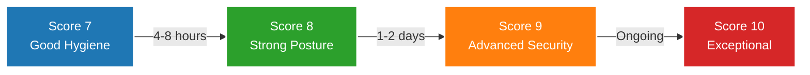

# Score Progression Guide

Systematic approach to improving your OpenSSF Scorecard score. Prioritized fixes from 7 to 8 to 9 to 10.

!!! tip "Don't Chase the Score"

    Fix security gaps, not numbers. A high score is the byproduct of good security engineering, not the goal itself.

---

## Overview: The Journey to 10/10

Each tier represents a meaningful improvement in security posture. Not just a higher number.

---

## Effort Summary

| Tier | Score Jump | Time Investment | Key Focus |
| ---- | ---------- | --------------- | --------- |
| 1 | 7 → 8 | 4 to 8 hours | Quick wins with high security impact |
| 2 | 8 → 9 | 1 to 2 days | Build provenance and comprehensive pinning |
| 3 | 9 → 10 | Ongoing + selective | Edge cases and community certification |

**Total to 9/10**: 2 to 3 days of focused work

**Total to 10/10**: Add 2 to 4 hours for CII badge, plus selective improvements based on project context

---

## Tier Guides

### [Tier 1: Score 7 to 8 (Good Hygiene → Strong Posture)](score-progression/tier-1.md)

**Estimated effort**: 4 to 8 hours of focused work

Quick wins with high security impact:

- **Token-Permissions** (0 to 2 hours) - Job-level permission scoping
- **Security-Policy** (0.5 hours) - Add SECURITY.md
- **Dependency-Update-Tool** (1 hour) - Enable Renovate/Dependabot
- **Basic Branch Protection** (1 to 2 hours) - Repository settings
- **Binary-Artifacts** (1 to 2 hours) - Remove binaries from git

**Result**: Strong security hygiene. Ready for advanced supply chain protections.

**[Read full Tier 1 guide →](score-progression/tier-1.md)**

### [Tier 2: Score 8 to 9 (Strong Posture → Advanced Security)](score-progression/tier-2.md)

**Estimated effort**: 1 to 2 days

Build provenance and comprehensive dependency pinning:

- **SLSA Provenance** (4 to 6 hours) - Signed-Releases 8/10 → 10/10
- **Source Archive Signing** (1 hour) - Sign GitHub auto-generated archives
- **Pinned-Dependencies** (2 to 4 hours) - SHA pin GitHub Actions
- **SAST** (1 to 2 hours) - Static analysis in CI
- **Advanced Branch Protection** (1 hour) - Increase review requirements

**Result**: Advanced supply chain security. Build provenance cryptographically proves artifact origins.

**[Read full Tier 2 guide →](score-progression/tier-2.md)**

### [Tier 3: Score 9 to 10 (Advanced → Exceptional)](score-progression/tier-3.md)

**Estimated effort**: Ongoing maintenance and selective improvements

Edge cases, community certification, and continuous monitoring:

- **CII Best Practices Badge** (2 to 4 hours) - Community certification
- **Fuzzing** (8+ hours, selective) - For security-critical code only
- **Perfect Branch Protection** (Variable, selective) - Evaluate based on team size
- **Vulnerabilities** (Ongoing) - Active CVE monitoring and patching
- **Maintenance** (Ongoing) - Automated monitoring and regression prevention

**Result**: Exceptional security posture. Continuous monitoring and maintenance.

**[Read full Tier 3 guide →](score-progression/tier-3.md)**

---

## Strategic Trade-offs by Tier

### Tier 1 (7 → 8): All Fixes Are Worth It

Every fix in this tier:

- ✅ Takes less than 2 hours
- ✅ Has clear security benefit
- ✅ Applies to nearly all projects

**Recommendation**: Implement all Priority 1-5 fixes. No exceptions.

### Tier 2 (8 → 9): High Value, Higher Effort

Fixes in this tier:

- ✅ Significant security improvements
- ⚠️ Require deeper understanding
- ⚠️ May need workflow redesign

**Recommendation**: Prioritize SLSA provenance and dependency pinning. These are the breakthrough improvements.

### Tier 3 (9 → 10): Diminishing Returns

Fixes in this tier:

- ⚠️ High implementation cost
- ⚠️ Low value for many projects
- ⚠️ May not apply to your context

**Recommendation**: Implement selectively. CII badge is quick and valuable. Fuzzing and perfect branch protection should be evaluated case-by-case.

---

## Common Blockers and Solutions

### "Token-Permissions alerts won't clear"

**Check**: Are permissions defined at workflow level?

**Fix**: Move to job level. Set workflow level to `permissions: {}`

**Details**: [16 Alerts Overnight](../../blog/posts/2025-12-20-sixteen-alerts-overnight.md) | [Tier 1 Guide](score-progression/tier-1/part-1.md)

### "Signed-Releases stuck at 8/10"

**Check**: Is `.intoto.jsonl` file uploaded to release?

**Fix**: Ensure `upload-assets: true` in SLSA workflow

**Details**: [Stuck at 8: The Journey to 10/10](../../blog/posts/2025-12-18-scorecard-stuck-at-eight.md) | [Tier 2 Guide](score-progression/tier-2/part-1.md)

### "Pinned-Dependencies flagging required version tags"

**Expected**: Some tools require version tags (documented exceptions)

- `ossf/scorecard-action@v2.4.0` requires version tags for internal verification
- `slsa-framework/slsa-github-generator@v2.1.0` requires version tags for verifier validation

**Action**: Document in Renovate config with clear reasoning

**Details**: [Tier 2 Guide](score-progression/tier-2/part-1.md)

### "CII Best Practices taking too long"

**Check**: Do you already meet the criteria?

Most projects with good CI/CD already pass. The badge is documentation, not implementation.

**Fast-track**: [Badge in 2 Hours](../../blog/posts/2025-12-17-openssf-badge-two-hours.md) | [Tier 3 Guide](score-progression/tier-3/part-1.md)

### "Fuzzing seems like overkill"

**Evaluate context**:

- Security-critical code (parsers, crypto): Implement fuzzing
- Simple CRUD apps: Skip it. Document the decision.

**Remember**: Scorecard measures best practices. Not all practices fit all contexts.

**Details**: [Tier 3 Guide](score-progression/tier-3/part-1.md)

---

## Related Content

### Detailed Guides

- **[Scorecard Compliance](scorecard-compliance.md)** - Job-level permissions, dependency pinning, source archive signing
- **[Scorecard Workflow Examples](scorecard-workflow-examples.md)** - Production-ready workflows for 10/10 compliance
- **[SLSA Provenance](../../enforce/slsa-provenance/slsa-provenance.md)** - Build attestations for Signed-Releases 10/10

### Real-World Experiences

- **[Stuck at 8: The Journey to 10/10](../../blog/posts/2025-12-18-scorecard-stuck-at-eight.md)** - SLSA provenance breakthrough
- **[16 Alerts Overnight](../../blog/posts/2025-12-20-sixteen-alerts-overnight.md)** - Job-level permissions fix
- **[OpenSSF Best Practices Badge in 2 Hours](../../blog/posts/2025-12-17-openssf-badge-two-hours.md)** - Fast-track CII certification

---

## Next Steps

**Starting at 7?** Focus on [Tier 1 fixes](score-progression/tier-1.md). 4 to 8 hours gets you to 8/10 with solid security hygiene.

**At 8 and ready for more?** Implement SLSA provenance and dependency pinning from [Tier 2](score-progression/tier-2.md). This is the breakthrough.

**Approaching 9?** Evaluate [Tier 3 improvements](score-progression/tier-3.md) based on project context. Not all apply universally.

**Already at 10?** Maintain it. Set up automated monitoring. Keep dependencies updated.

**Remember**: The score measures security practices. Don't game the number. Fix real gaps.

---

*Start with quick wins. Build to provenance. Maintain with automation. The journey from 7 to 10 is systematic, not heroic.*
